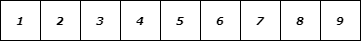
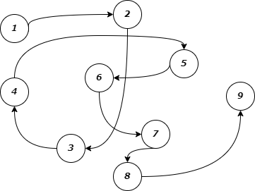

数据结构与算法相关概念阐述。

<!--more-->

## 数据结构概述

**数据结构是一门研究非数值计算的程序设计问题中的操作对象，以及他们之间的关系和操作等相关问题的学科。**

简而言之：*数据结构就是把数据元素按照一定的关系组织起来的集合，用来组织和存储数据。*

## 数据结构分类

传统上，我们可以把数据结构分为**逻辑结构**和**物理结构**两大类。

### 逻辑结构分类

逻辑结构是从具体问题中抽象出来的模型，是抽象意义上的结构，按照对象中数据元素之间的相互关系分类。

+ 集合结构：集合结构中数据元素除了属于同一个集合外，他们之间没有任何其他的关系。
  ```mermaid
  flowchart LR
    subgraph A
        1((1))
        2((2))
        3((3))
        4((4))
    end
  ```
+ 线性结构：线性结构中的数据元素之间存在一对一的关系。
  ```mermaid
  flowchart LR
  1((1)) --> 2((2)) --> 3((3)) --> 5((5)) --> 6((6)) --> 7((7)) --> 8((8)) --> 9((9))
  ```
+ 树形结构：树形结构中的数据元素之间存在一对多的层次关系。
  ```mermaid
  flowchart TB
  A((A))
  B((B))
  C((C))
  D((D))
  E((E))
  F((F))
  G((G))
  H((H))
  I((I))
  J((J))

  A --> B & C & D
  B --> E & F & G
  C --> H
  D --> I & J
  ```
  
+ 图形结构：图形结构的数据元素是多对多的关系。
  ```mermaid
  flowchart LR
  1((1))
  2((2))
  3((3))
  4((4))
  5((5))
  6((6))
  7((7))
  8((8))
  9((9))

  1 --- 2 & 3
  2 --- 4 & 5 & 8
  3 --- 5 & 6
  4 --- 8 & 9
  5 --- 7 & 9
  6 --- 7 & 9
  7 --- 9
  8 --- 4 & 9
  ```
  
### 物理结构分类

逻辑结构在计算机中真正的表示方式（又称为映像）称为物理结构，也可以叫做存储结构。常见的物理结构有**顺序存储结构**、**链式存储结构**。

+ 顺序存储结构：把数据元素放到地址连续的存储单元里面，其数据间的逻辑关系和物理关系是一致的，比如：数组就是顺序存储结构。顺序存储结构存在一定的弊端，就像生活中排时也会有人插队也可能有人有特殊情况突然离开，这时候整个结构都处于变化中，此时就需要链式存储结构。
  
+ 链式存储结构：是把数据元素存放在任意的存储单元里面，这组存储单元可以是连续的也可以是不连续的。此时，数据元素之间并不能反映元素间的逻辑关系，因此在链式存储结构中引进了一个指针存放数据元素的地址，这样通过地址就可以找到相关联数据元素的位置。
  

## 算法概述

**算法是指解题方案的准确而完整的描述，是一系列解决问题的清晰指令，算法代表着用系统的方法解决问题的策略机制。也就是说，能够对一定规范的输入，在有限时间内获得所要求的输出。**

简而言之：*根据一定的条件，对一些数据进行计算，得到需要的结果。*

## 算法初识

在生活中，如果遇到某个问题，常常解决方案不是唯一的。

例如从西安到北京，如何去？会有不同的解决方案，我们可以坐飞机，可以坐火车，可以坐汽车，甚至可以步行，不同的解决方案带来的时间成本和金钱成本是不一样的，比如坐飞机用的时间最少，但是费用最高，步行费用最低，但时间最长。

再例如在北京二环内买一套四合院，如何付款？也会有不同的解决方案，可以一次性现金付清，也可以通过银行做按揭。这两种解决方案带来的成本也不一样，一次性付清，虽然当时出的钱多，压力大，但是没有利息，按揭虽当时出的钱少，压力比较小，但是会有利息，而且 `30` 年的总利息几乎是贷款额度的一倍，需要多付钱。

在程序中虽然也可以用不同的算法解决相同的问题，但不同的算法的成本也是不相同的。总体上，一个优秀的算法追求以下两个目标：

1. 花最少的时间完成需求；
2. 占用最少的内存空间完成需求；

下面用一些实际案例体验一些算法。

### 需求1

计算 `1` 到 `100` 的和。

解法一：

```java
public static void main(String[] args) {
    int sum = 0, n = 100;

    for (int i = 1; i <= n; i++) {
        sum += i;
    }

    System.out.println("sum = " + sum);
}
```

该解法完成需求要处理下几个动作：

1. 定义两个整型变量；
2. 执行 `100` 次加法运算；
3. 打印结果到控制台；

解法二：

```java
public static void main(String[] args) {
    int sum = 0, n = 100;

    // 高斯算法：首项 + 末项）* 项数 / 2
    sum = (n + 1) * n / 2;

    System.out.println("sum = " + sum);
}
```

该解法完成需求要处理下几个动作：

1. 定义两个整型变量；
2. 执行 `1` 次加法运算，`1` 次乘法运算，`1` 次除法运算，总共 `3` 次运算；
3. 打印结果到控制台；

很明显，第二种算法完成需求，花费的**时间**更少一些。

### 需求2

计算10的阶乘。

解法一：

```java
public class Requirement2Solution1 {
    public static void main(String[] args) {
        int n = 10;
        System.out.println("fun(" + n + ") = " + fun(n));
    }

    public static long fun(long n) {
        return n == 1 ? 1 : n * fun(n - 1);
    }
}
```

该解法使用递归完成需求，`fun` 方法会执行 `10` 次，并且第一次执行未完毕，调用第二次执行，第二次执行未完毕，调用第三次执行...最终，最多的时候，需要在栈内存同时开辟 `10` 块内存分别执行 `10` 个 `fun` 方法。

解法二：

```java
public class Requirement2Solution2 {
    public static void main(String[] args) {
        int n = 10;
        System.out.println("fun(" + n + ") = " + fun(n));
    }

    public static long fun(long n) {
        long r = 1;

        for (long i = 1; i <= n; i++) {
            r *= i;
        }

        return r;
    }
}
```

该解法使用 `for` 循环完成需求，`fun` 方法只会执行一次，最终，只需要在栈内存开辟一块内存执行 `fun` 方法即可。

很明显，第二种算法完成需求，占用的内存**空间**更小。