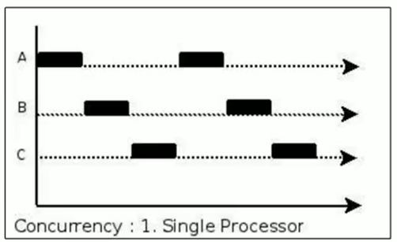
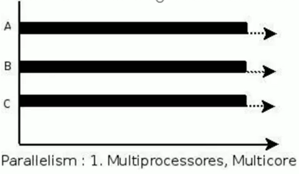

Erlang 之父  Joe Armstrong 用一张5岁小孩都能看懂的图解释了并发与并行的区别：

## 并发

在单核 CPU 下，线程实际还是**串行执行**的。操作系统中有一个组件叫做任务调度器，将 CPU 的时间片（ Windows 下时间片最小约为 15 毫秒）分给不同的程序使用，只是由于 CPU 在线程间（时间片很短）的切换非常快，人类感 觉是**同时运行**的 。总结为一句话就是：微观串行，宏观并行。

一般会将这种线程轮流使用 CPU 的做法称为并发（**Concurrent**）。

## 并行

多核 CPU下，每个核（core） 都可以调度运行线程，这时候线程可以是并行的，不同的线程同时使用不同的 CPU 在执行。

## 对比

引用 [Rob Pike](https://baike.baidu.com/item/罗布·派克)（golang语言创始人） 的一段描述：

- 并发（**Concurrent**）是同一时间应对（dealing with）多件事情的能力。
- 并行（**Parallel**）是同一时间动手做（doing）多件事情的能力。

## 例子

- 家庭主妇做饭、打扫卫生、给孩子喂奶，她一个人轮流交替做这多件事，这时就是并发。
- 家庭主妇雇了3个保姆，一个专做饭、一个专打扫卫生、一个专喂奶，互不干扰，这时是并行。

- 家庭主妇雇了个保姆，她们一起这些事，这时既有并发，也有并行（这时会产生竞争，例如锅只有一口，一 个人用锅时，另一个人就得等待）。
