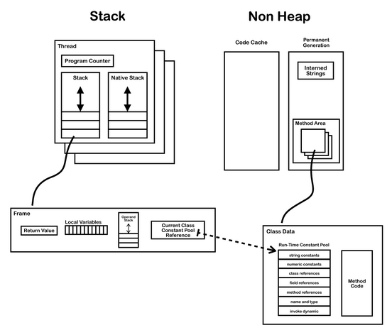
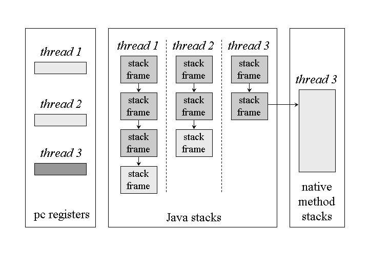
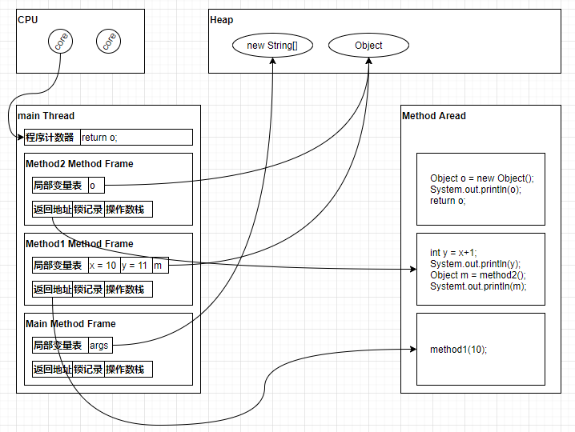
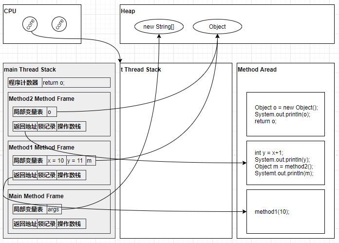
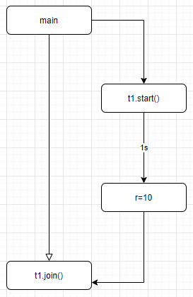
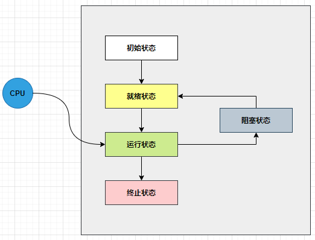
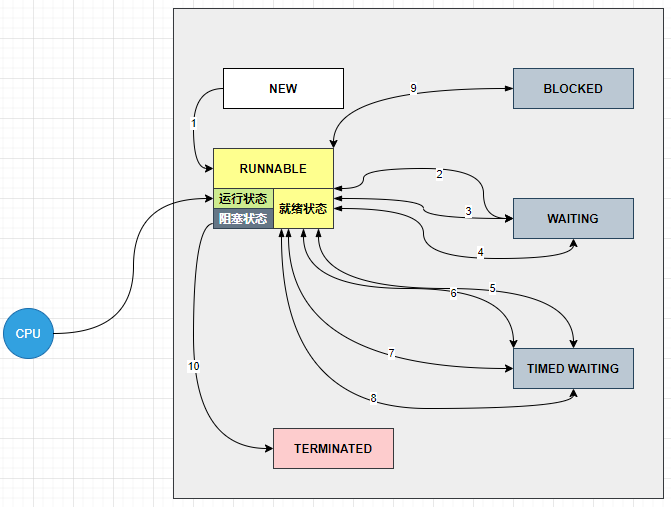
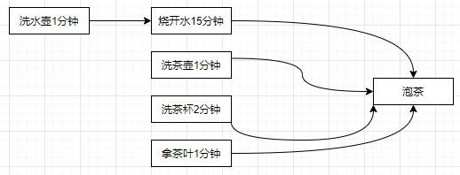
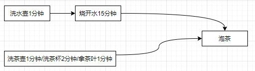

本文包含以下内容：

- 如何在爪哇中创建和运行线程
- 如何在爪哇中查看线程

- 爪哇线程  API 
- 爪哇中的线程状态

## 创建和运行线程

### 使用 Thread 创建线程

直接使用 `Thread ` 创建线程，这种属于继承`Thread ` 类方式的使用，把线程和任务合并在了一起。

```java
@Slf4j(topic = "d04.NewAndRunThread1")
public class NewAndRunThread1 {
    public static void main(String[] args) {
        /*
        1. 创建 Thread
         */
        Thread t = new Thread() {
            @Override
            public void run() {
                if (log.isDebugEnabled()) {
                    log.debug("开始运行...");
                }
            }
        };

        /*
        注：养成为线程设置名称的良好习惯 源码中默认线程名称"Thread-" + nextThreadNum() 辨识度极低
         */
        t.setName("爪哇测试线程1");

        /*
        2. 启动 Thread
         */
        t.start();
    }
}
```

### 使用 Runnable 配合 Thread 创建线程（推荐）

把线程和任务（要执行的代码）分开：

- `Thread` 代表线程
- `Runable ` 代表可运行的任务（线程要执行的代码）

把线程和任务分开，用 `Runnable` 更容易与线程池等高级 API 配合， `Runnable ` 让任务脱离了 `Thread` 继承体系，更灵活，解耦，通过查看源码可以发现，这种方式最终与第一种方式相同，最终调用`run()`方法。

```java
@Slf4j(topic = "d04.NewAndRunThread2")
public class NewAndRunThread2 {
    public static void main(String[] args) {
        /*
        1. 创建 Runnable 对象
         */
        Runnable r = new Runnable() {
            @Override
            public void run() {
                if (log.isDebugEnabled()) {
                    log.debug("开始运行...");
                }
            }
        };

        /*
        2. 创建 Thread
         */
        Thread t = new Thread(r, "爪哇测试线程2");

        /*
        3. 启动 Thread
         */
        t.start();
    }
}
```

### 使用 FutureTask 配合 Thread

`FutureTask` 能够接收 `Callable` 类型的参数，用来处理有返回结果的情况：

```java
@Slf4j(topic = "d04.NewAndRunThread3")
public class NewAndRunThread3 {
    public static void main(String[] args) throws ExecutionException, InterruptedException {
        /*
        1. 创建 FutureTask
         */
        FutureTask<Integer> ft = new FutureTask<Integer>(new Callable<Integer>() {
            @Override
            public Integer call() throws Exception {
                if (log.isDebugEnabled()) {
                    log.debug("开始运行...");
                }

                Thread.sleep(5000);//模拟耗时5秒执行任务

                return 100;
            }
        });

        /*
        2. 创建 Thread
         */
        Thread t = new Thread(ft, "爪哇测试线程3");

        /*
        3. 启动 Thread
         */
        t.start();

        if (log.isDebugEnabled()) {
            log.debug("继续执行");
        }

        /*
        4. 主线程获取结果（阻塞）
         */

        Integer result = ft.get();

        if (log.isDebugEnabled()) {
            log.debug("获取到任务执行完毕结果：{}", result);
        }
    }
}
```

`Future` 就是对于具体的 `Runnable` 或者 `Callable` 任务的执行结果进行取消、查询是否完成、获取结果。必要时可以通过 `get()` 方法获取执行结果，该方法会阻塞直到任务返回结果。

```java
public interface Future<V> {
    boolean cancel(boolean mayInterruptIfRunning);
    boolean isCancelled();
    boolean isDone();
    V get() throws InterruptedException, ExecutionException;
    V get(long timeout, TimeUnit unit)
        throws InterruptedException, ExecutionException, TimeoutException;
}
```

`Future` 提供了三种功能：

1. 判断任务是否完成
2. 能够中断任务
3. 能够获取任务执行结果

[FutureTask是Future和Runable的实现](https://mp.weixin.qq.com/s/RX5rVuGr6Ab0SmKigmZEag)

### 创建线程到底有几种方式

网上的面试题和各大博客对创建线程有几种方式一直存在争议，我这里贴出了两篇文章，无论是哪种说法，只要能描述清楚我觉得都是正确的。

- 知乎：https://zhuanlan.zhihu.com/p/196789486
- 甲骨文（官方）：https://docs.oracle.com/javase/tutorial/essential/concurrency/runthread.html

### 多线程运行现象

- 交替执行
- 执行先后顺序无法人为干预，不受控制

```java
@Slf4j(topic = "d04.RunningMultiThread")
public class RunningMultiThread {
    public static void main(String[] args) {
        new Thread(() -> {
            while (true) {
                log.debug("开始运行...");
            }
        }, "线程A").start();

        new Thread(() -> {
            while (true) {
                log.debug("开始运行...");
            }
        }, "线程B").start();
    }
}
```

执行结果：

```shell
15:00:05.758 d04.RunningMultiThread [线程A] - 开始运行...
15:00:05.758 d04.RunningMultiThread [线程B] - 开始运行...
15:00:05.758 d04.RunningMultiThread [线程B] - 开始运行...
15:00:05.758 d04.RunningMultiThread [线程B] - 开始运行...
15:00:05.758 d04.RunningMultiThread [线程B] - 开始运行...
15:00:05.758 d04.RunningMultiThread [线程B] - 开始运行...
15:00:05.758 d04.RunningMultiThread [线程B] - 开始运行...
15:00:05.758 d04.RunningMultiThread [线程B] - 开始运行...
15:00:05.758 d04.RunningMultiThread [线程B] - 开始运行...
15:00:05.758 d04.RunningMultiThread [线程B] - 开始运行...
15:00:05.758 d04.RunningMultiThread [线程B] - 开始运行...
15:00:05.758 d04.RunningMultiThread [线程A] - 开始运行...
15:00:05.758 d04.RunningMultiThread [线程A] - 开始运行...
15:00:05.758 d04.RunningMultiThread [线程A] - 开始运行...
15:00:05.758 d04.RunningMultiThread [线程A] - 开始运行...
15:00:05.758 d04.RunningMultiThread [线程B] - 开始运行...
15:00:05.758 d04.RunningMultiThread [线程B] - 开始运行...
15:00:05.758 d04.RunningMultiThread [线程B] - 开始运行...
15:00:05.758 d04.RunningMultiThread [线程B] - 开始运行...
```

## 查看线程的方法

### Windows

- 任务管理器可以查看进程和线程数，也可以用来杀死进程
- `tasklist` 查看进程

- `taskkill` 杀死进程

### Linux

- `ps -ef` 查看所有进程
- `ps -fT -p <PID>` 查看某个进程 PID 的所有线程

- `kill <singal>`杀死进程
- `top` 按大写 H 切换是否显示线程

- `top -H -p <PID>` 查看某个进程 PID 的所有线程

### Java

- `jps` 查看所有 Java 进程
- `jstack <PID>` 查看某个 Java 进程 PID 的所有线程状态

- `jconsole` 图形界面工具，可查看某个 Java 进程中的线程运行状况

## 线程运行原理

### 虚拟机栈与栈帧




Java Virtual Machine Stacks （Java 虚拟机栈）。

我们都知道 JVM 中由堆、栈、方法区所组成，其中栈内存是给谁用的呢？其实就是线程，每个线程启动后，虚拟机就会为其分配一块栈内存。

- 每个栈由多个栈帧 Frame 组成，对应着每次方法调用时所占用的内存（用于存储局部变量表、操作数栈、动态链接、方法出口等信息，是属于线程的私有的）。

- 每个线程都会维护它自己的栈帧，每个线程只能有一个活动栈帧，对应着当前正在执行的那个方法。

  



示例代码:

```java
public class DebugSingleThreadStackFrames {
    public static void main(String[] args) {
        method1(10);
    }

    private static void method1(int x) {
        int y = x + 1;
        System.out.println(y);
        Object m = method2();
        System.out.println(m);
    }

    private static Object method2() {
        Object o = new Object();
        System.out.println(o);
        return o;
    }
}
```

示例代码 DEBUG 图解：



### 线程上下文切换（Thread Context Switch）

因为以下一些原因导致 CPU 不再执行当前的线程，转而执行另一个线程的代码：

- 线程的 CPU 时间片用完(每个线程轮流执行，看前面并行的概念)。
- 垃圾回收（垃圾回收将暂停所有当前所有工作线程， 只剩垃圾回收线程进行垃圾回收，而工作线程暂停则会发生上下文切换）。

- 有更高优先级的线程需要运行。
- 线程自己调用了 `sleep`、`yield`、`wait`、`join`、`park`、`synchronized`、`lock` 等方法。

当 Context Switch 发生时，需要由操作系统保存当前线程的状态，并恢复另一个线程的状态，Java 中对应的概念 就是程序计数器（Program Counter Register），它的作用是记住下一条 JVM 指令的执行地址，是线程私有的：

- 状态包括程序计数器，虚拟机栈中的每个栈帧的信息，如局部变量、操作数栈、返回地址等。
- Context Switch 频繁发生会影响性能（因此并不是线程数越多越好，当线程数量大于 CPU 核心数时，CPU 必然会进行轮流调度发生线程上下文切换，切换的越频繁越影响性能，如何设置合适的线程数）。

示例代码：

```java
public class DebugMultiThreadStackFrames {
    public static void main(String[] args) {
        Thread t = new Thread(() -> method1(20));
        t.setName("t");
        t.start();
        method1(10);
    }

    private static void method1(int x) {
        int y = x + 1;
        System.out.println(y);
        Object m = method2();
        System.out.println(m);
    }

    private static Object method2() {
        return new Object();
    }
}
```

示例代码 DEBUG 图解：



发生上下文切换时，main线程程序计数器保存切换时的main线程状后，CPU 再开始调度执行 `t` 线程。

## 线程常见方法

| 方法名             | static   | 功能说明                                                     | 注意                                                         |
| ------------------ | -------- | ------------------------------------------------------------ | ------------------------------------------------------------ |
| `start()`          |          | 启动一个新线程，在新的线程运行 `run()` 方法中的代码。        | start 方法只是让线程进入就绪，里面代码不一定立刻运行（CPU 的时间片还没分给它）。每个线程对象的start方法只能调用一次，如果调用了多次会出现`IllegalThreadStateException`。 |
| `run()`            |          | 新线程启动后会调用的方法                                     | 如果在构造 Thread 对象时传递了 Runnable 参数，则线程启动后会调用 Runnable 中的 run 方法，否则默认不执行任何操作。但可以创建 Thread 的子类对象，来覆盖默认行为。 |
| `join()`           |          | 等待线程运行结束                                             |                                                              |
| `join(long n)`     |          | 等待线程运行结束，最多等待 n 毫秒。                          |                                                              |
| `getId(`)          |          | 获取线程长整型的 id。                                        | id 唯一。                                                    |
| `getName()`        |          | 获取线程名                                                   |                                                              |
| `setName(String)`  |          | 修改线程名                                                   |                                                              |
| `getPriority()`    |          | 获取线程优先级                                               |                                                              |
| `setPriority(int)` |          | 修改线程优先级                                               | Java 中规定线程优先级是1~10 的整数，较大的优先级能提高该线程被 CPU 调度的机率。 |
| `getState()`       |          | 获取线程状态                                                 | Java 中线程状态是用 6 个 `enum` 表示，分别为：`NEW`, `RUNNABLE`, `BLOCKED`, `WAITING`,`TIMED_WAITING`, `TERMINATED`。 |
| `isInterrupted()`  |          | 判断是否被打断                                               | 不会清除 **打断标记**。                                      |
| `isAlive()`        |          | 线程是否存活（还没有运行完毕）                               |                                                              |
| `interrupt()`      |          | 打断线程                                                     | 如果被打断线程正在 `sleep`，`wait` ，`join` 会导致被打断的线程抛出 `InterruptedException`，并清除 **打断标记** ；如果打断的正在运行的线程，则会设置 **打断标记** ；park 的线程被打断，也会设置 **打断标记**。 |
| `interrupted()`    | `static` | 判断当前线程是否被打断                                       | 会清除**打断标记**。                                         |
| `currentThread()`  | `static` | 获取当前正在执行的线程                                       |                                                              |
| `sleep(long n)`    | `static` | 让当前执行的线程休眠n毫秒，休眠时让出 CPU 的时间片给其它线程。 |                                                              |
| `yield()`          | `static` | 提示线程调度器让出当前线程对 CPU 的使用                      | 主要是为了测试和调试。                                       |

### start 与 run

直接调用 `run()` 方法：

```java
@Slf4j(topic = "d04.ThreadStartAndRun")
public class ThreadStartAndRun {
    public static void main(String[] args) {
        Thread t1 = new Thread("t1") {
            @Override
            public void run() {
                if (log.isDebugEnabled()) {
                    log.debug("开始运行...");
                }
                ResourceReadUtil.read(Constants.ULTRA_MAN_MP4_RES_PATH);
            }
        };

        t1.run();

        if (log.isDebugEnabled()) {
            log.debug("做其他事情...");
        }
    }
}
```

执行结果：

```shell
15:45:55.597 d04.ThreadStartAndRun [main] - 开始运行...
15:45:55.599 d04.ResourceReadUtil [main] - 开始读取资源 - /d04/ultra_man.mp4
15:45:55.600 d04.ResourceReadUtil [main] - 结束读取文件 - /d04/ultra_man.mp4 - 总计花费时间 - 1毫秒
15:45:55.600 d04.ThreadStartAndRun [main] - 做其他事情...

Process finished with exit code 0
```

错误的使用方式！直接调用`run()`方法将被主线程作为 `t1` 对象的普通方法调，而不是通过新创建的线程调用，程序仍在 `main` 线程运行，`ResourceReadUtil.read()` 方法调用还是同步的，将上述代码的`t1.run()`改为：

```java
t1.start();
```

输出结果：

```shell
15:47:48.466 d04.ThreadStartAndRun [main] - 做其他事情...
15:47:48.466 d04.ThreadStartAndRun [t1] - 开始运行...
15:47:48.470 d04.ResourceReadUtil [t1] - 开始读取资源 - /d04/ultra_man.mp4
15:47:48.472 d04.ResourceReadUtil [t1] - 结束读取文件 - /d04/ultra_man.mp4 - 总计花费时间 - 1毫秒

Process finished with exit code 0
```

读取文件的操作在 `t1` 线程运行， `ResourceReadUtil.read()` 方法调用是异步的。

### sleep 与 yield

#### sleep

1. 调用 `Thread.sleep(long millis)` 会让当前线程从 `Running `进入 `Timed Waiting` 状态（阻塞）。
2. 其它线程可以使用 `Thread.interrupt()`方法打断正在睡眠的线程，这时 `Thread.sleep(long millis)` 方法会抛出 `InterruptedException`。
3. 睡眠结束后的线程未必会立刻得到执行（若 CPU 此时在调度其他线程，则需其他线程调度完毕才能继续执行当前睡眠结束后的线程）。
4. 建议用  `TimeUnit `的 `sleep(long timeout)` 代替  `Thread.sleep(long millis)` 来获得更好的可读性，如：`TimeUnit.SECONDS.sleep(1)`。

示例代码：

```java
@Slf4j(topic = "d04.ThreadSleep")
public class ThreadSleep {
    public static void main(String[] args) {
        Thread t1 = new Thread("t1") {
            @Override
            public void run() {
                try {
                    Thread.sleep(2000);
                } catch (InterruptedException e) {
                    e.printStackTrace();
                }
            }
        };

        t1.start();

        if (log.isDebugEnabled()) {
            log.debug("线程t1状态: {}", t1.getState());
        }

        try {
            /*
            主线程短暂睡眠后再去获取t1线程状态 避免主线程执行过快 t1线程还未进入睡眠状态 获取到的t1线程状态不正确
             */
            Thread.sleep(500);
        } catch (InterruptedException e) {
            e.printStackTrace();
        }

        if (log.isDebugEnabled()) {
            log.debug("线程t1状态: {}", t1.getState());
        }
    }
}
```

执行结果：

```shell
16:02:04.418 d04.ThreadSleep [main] - 线程t1状态: RUNNABLE
16:02:04.934 d04.ThreadSleep [main] - 线程t1状态: TIMED_WAITING

Process finished with exit code 0
```

示例代码：

```java
@Slf4j(topic = "d04.ThreadSleepWithTimeUnit")
public class ThreadSleepWithTimeUnit {
    public static void main(String[] args) throws InterruptedException {
        if (log.isDebugEnabled()) {
            log.debug("开始睡眠...");
        }
        /*
        可读性差的写法
         */
        Thread.sleep(1000);
        /*
        良好的可读性 JDK1.5后新增
         */
        TimeUnit.SECONDS.sleep(1);
        if (log.isDebugEnabled()) {
            log.debug("结束睡眠...");
        }
    }
}
```

执行结果：

```shell
16:03:40.177 d04.ThreadSleepWithTimeUnit [main] - 开始睡眠...
16:03:42.195 d04.ThreadSleepWithTimeUnit [main] - 结束睡眠...

Process finished with exit code 0
```

#### yield

1. 调用 `Thread.yield()` （单词字面意思为让出）会让当前线程从  `Running ` 进入  `Runnable` 就绪状态，然后调度执行其它线程。
2. 具体的实现依赖于操作系统的任务调度器。

示例代码：

```java
public class ThreadYield {
    public static void main(String[] args) {
        Runnable task1 = () -> {
            int count = 0;
            for (; ; ) {
                System.out.println("---->线程1 " + count++);
            }
        };

        Runnable task2 = () -> {
            int count = 0;
            for (; ; ) {
                Thread.yield();
                System.out.println("              ---->线程2 " + count++);
            }
        };

        Thread t1 = new Thread(task1, "线程1");
        Thread t2 = new Thread(task2, "线程2");
        
        t1.start();
        t2.start();
    }
}
```

执行结果：

```shell
---->线程1 437656
---->线程1 437657
---->线程1 437658
---->线程1 437659
---->线程1 437660
---->线程1 437661
---->线程1 437662
---->线程1 437663
---->线程1 437664
---->线程1 437665
---->线程1 437666
---->线程1 437667
---->线程1 437668
---->线程1 437669
---->线程1 437670
---->线程1 437671
---->线程1 437672
---->线程1 437673
---->线程1 437674
---->线程1 437675
---->线程1 437676
---->线程1 437677
---->线程1 437678
---->线程1 437679
---->线程1 437680
---->线程1 437681
---->线程1 437682
---->线程1 437683
              ---->线程2 154125
              ---->线程2 154126
              ---->线程2 154127
---->线程1 437684
---->线程1 437685
---->线程1 437686
---->线程1 437687
---->线程1 437688
---->线程1 437689
---->线程1 437690
---->线程1 437691
---->线程1 437692
```

通过设置线程的优先级能达到相同的效果：

```java
public class ThreadPriority {
    public static void main(String[] args) {
        Runnable task1 = () -> {
            int count = 0;
            for (; ; ) {
                System.out.println("---->线程1 " + count++);
            }
        };

        Runnable task2 = () -> {
            int count = 0;
            for (; ; ) {
                System.out.println("              ---->线程2 " + count++);
            }
        };

        Thread t1 = new Thread(task1, "t1");
        Thread t2 = new Thread(task2, "t2");

        t1.setPriority(Thread.MIN_PRIORITY);
        t2.setPriority(Thread.MAX_PRIORITY);
        t1.start();
        t2.start();
    }
}
```

执行结果：

```shell
---->线程1 165616
              ---->线程2 207421
              ---->线程2 207422
              ---->线程2 207423
              ---->线程2 207424
              ---->线程2 207425
              ---->线程2 207426
              ---->线程2 207427
              ---->线程2 207428
              ---->线程2 207429
              ---->线程2 207430
              ---->线程2 207431
              ---->线程2 207432
              ---->线程2 207433
              ---->线程2 207434
              ---->线程2 207435
              ---->线程2 207436
              ---->线程2 207437
              ---->线程2 207438
              ---->线程2 207439
              ---->线程2 207440
              ---->线程2 207441
              ---->线程2 207442
              ---->线程2 207443
              ---->线程2 207444
              ---->线程2 207445
              ---->线程2 207446
---->线程1 165617
---->线程1 165618
---->线程1 165619
---->线程1 165620
              ---->线程2 207447
              ---->线程2 207448
              ---->线程2 207449
              ---->线程2 207450
              ---->线程2 207451
              ---->线程2 207452
              ---->线程2 207453
              ---->线程2 207454
              ---->线程2 207455
---->线程1 165621
---->线程1 165622
---->线程1 165623
---->线程1 165624
              ---->线程2 207456
              ---->线程2 207457
              ---->线程2 207458
---->线程1 165625
---->线程1 165626
---->线程1 165627
---->线程1 165628
              ---->线程2 207459
              ---->线程2 207460
              ---->线程2 207461
              ---->线程2 207462
              ---->线程2 207463
              ---->线程2 207464
              ---->线程2 207465
              ---->线程2 207466
              ---->线程2 207467
              ---->线程2 207468
              ---->线程2 207469
              ---->线程2 207470
              ---->线程2 207471
              ---->线程2 207472
              ---->线程2 207473
              ---->线程2 207474
              ---->线程2 207475
              ---->线程2 207476
              ---->线程2 207477
              ---->线程2 207478
              ---->线程2 207479
              ---->线程2 207480
              ---->线程2 207481
              ---->线程2 207482
              ---->线程2 207483
              ---->线程2 207484
              ---->线程2 207485
---->线程1 165629
---->线程1 165630
---->线程1 165631
---->线程1 165632
---->线程1 165633
```

#### 区别

- 调用`Thread.sleep(long millis)`使线程进从从 `Running `进入 `Timed Waiting` 状态（阻塞），`Timed Waiting`不会被 CPU 调度。
- 调用 `Thread.yield()` 会让当前线程从  `Running ` 进入  `Runnable` 就绪状态，处于 `Runnable` 就绪状态的线程仍有机会被 CPU 调度。

#### 应用

[并发实战（一）优化与应用](/e01-optimize-use/)

- 使用多线程充分利用处理器
- 限制对 CPU 的使用

### join

#### join 使用

`join()` 的作用，为什么要使用 `join()` ？执行下面的代码，`r` 的结果是什么?

```java
@Slf4j(topic = "d04.ThreadJoin")
public class ThreadJoin {
    static int r = 0;

    public static void main(String[] args) throws InterruptedException {
        if (log.isDebugEnabled()) {
            log.debug("{}线程开始运行..", Thread.currentThread().getName());
        }

        Thread t1 = new Thread(() -> {
            String threadName = Thread.currentThread().getName();

            if (log.isDebugEnabled()) {
                log.debug("{}线程开始运行..", threadName);
            }

            try {
                TimeUnit.SECONDS.sleep(1);
            } catch (InterruptedException e) {
                e.printStackTrace();
            }

            if (log.isDebugEnabled()) {
                log.debug("{}线程结束运行..", threadName);
            }

            r = 10;
        }, "t1");

        t1.start();
        
        //t1.join();

        if (log.isDebugEnabled()) {
            log.debug("结果为：{}", r);
            log.debug("{}线程结束运行..", Thread.currentThread().getName());
        }
    }
}
```

执行结果：

```shell
16:56:05.623 d04.ThreadJoin [main] - main线程开始运行..
16:56:05.655 d04.ThreadJoin [main] - 结果为：0
16:56:05.655 d04.ThreadJoin [main] - main线程结束运行..
16:56:05.655 d04.ThreadJoin [t1] - t1线程开始运行..
16:56:06.671 d04.ThreadJoin [t1] - t1线程结束运行..

Process finished with exit code 0
```

代码分析：



- 因为主线程和线程 `t1` 是并行执行的，`t1` 线程需要 `1` 秒之后才能算出 `r=10`。
- 而主线程一开始就要打印 `r` 的结果，所以只能打印出 `r=0`。

使用 `Thread.sleep(long millis)`行不行？为什么？答：不行，假设 `t1` 线程运行时间不确定，此时 `Thread.sleep(long millis)`方法的睡眠时长参数将无法确定。

解决方案：使用 `Thread` 对象的 `join()` 方法，加在 `t1.start()` 之后即可。

上面的示例代码在线程启动后调用`Thread` 对象的 `join()` 方法，执行结果如下：

```shell
16:57:52.718 d04.ThreadJoin [main] - main线程开始运行..
16:57:52.750 d04.ThreadJoin [t1] - t1线程开始运行..
16:57:53.765 d04.ThreadJoin [t1] - t1线程结束运行..
16:57:53.765 d04.ThreadJoin [main] - 结果为：10
16:57:53.765 d04.ThreadJoin [main] - main线程结束运行..
    
Process finished with exit code 0
```

#### join 多个

问，下面代码大约花费多少秒？

```java
@Slf4j(topic = "d04.ThreadJoinMulti")
public class ThreadJoinMulti {
    static int r1 = 0;
    static int r2 = 0;

    public static void main(String[] args) throws InterruptedException {
        Thread t1 = new Thread(() -> {
            try {
                TimeUnit.SECONDS.sleep(1);
            } catch (InterruptedException e) {
                e.printStackTrace();
            }
            r1 = 10;
        });
        Thread t2 = new Thread(() -> {
            try {
                TimeUnit.SECONDS.sleep(2);
            } catch (InterruptedException e) {
                e.printStackTrace();
            }
            r2 = 20;
        });

        t1.start();
        t2.start();

        long start = System.currentTimeMillis();

        if (log.isDebugEnabled()) {
            log.debug("开始join线程t1");
        }
        t1.join();
        if (log.isDebugEnabled()) {
            log.debug("结束join线程t1");
        }

        if (log.isDebugEnabled()) {
            log.debug("开始join线程t2");
        }
        t2.join();
        if (log.isDebugEnabled()) {
            log.debug("结束join线程t2");
        }

        long end = System.currentTimeMillis();

        if (log.isDebugEnabled()) {
            log.debug("r1:{}, r2:{}, 花费时间:{}", r1, r2, (end - start));
        }
    }
}
```

执行结果：

```shell
17:16:49.848 d04.ThreadJoinMulti [main] - 开始join线程t1
17:16:50.858 d04.ThreadJoinMulti [main] - 结束join线程t1
17:16:50.858 d04.ThreadJoinMulti [main] - 开始join线程t2
17:16:51.852 d04.ThreadJoinMulti [main] - 结束join线程t2
17:16:51.852 d04.ThreadJoinMulti [main] - r1:10, r2:20, 花费时间:2005

Process finished with exit code 0
```

分析如下

- 第一个 `join` ：主线程等待 `t1` 时, `t2`在继续运行。
- 第二个 `join` ：`1s` 后, 主线程执行到此, `t2` 运行了 `1s`, 因此只需再等待 `1s`。

如果颠倒两个 `join` 呢？

```shell
17:21:50.710 d04.ThreadJoinMulti [main] - 开始join线程t2
17:21:52.715 d04.ThreadJoinMulti [main] - 结束join线程t2
17:21:52.715 d04.ThreadJoinMulti [main] - 开始join线程t1
17:21:52.715 d04.ThreadJoinMulti [main] - 结束join线程t1
17:21:52.715 d04.ThreadJoinMulti [main] - r1:10, r2:20, 花费时间:2006

Process finished with exit code 0
```

结果仍为 `2` 秒，因为 `sleep` 方法不占用 CPU 时间片,无论是单核还是多核 CPU 结果都一样。

#### join 时效

`Thread`提供了一个有时效的 `join(long millis)`方法，其效果为：

当等待时间小于被等待线程执行时间时，将结束等待（未等够执行时间）。

```java
@Slf4j(topic = "d04.ThreadJoinTimeout")
public class ThreadJoinTimeout {
    static int r1 = 0;
    static int r2 = 0;
    public static void main(String[] args) throws InterruptedException {
        Thread t1 = new Thread(() -> {
            try {
                TimeUnit.SECONDS.sleep(2);
            } catch (InterruptedException e) {
                e.printStackTrace();
            }
            r1 = 10;
        });

        long start = System.currentTimeMillis();
        t1.start();


        if(log.isDebugEnabled()){
            log.debug("开始join...");
        }

        t1.join(1500);

        long end = System.currentTimeMillis();
        log.debug("r1: {} r2: {} ,花费时间: {}", r1, r2, end - start);
    }
}
```

执行结果：

```shell
17:31:32.612 d04.ThreadJoinTimeout [main] - 开始join...
17:31:34.119 d04.ThreadJoinTimeout [main] - r1: 0 r2: 0 ,花费时间: 15

Process finished with exit code 0
```

当等待时间大于被等待线程执行时间时，被等待的线程执行结束会导致调用 `join` 的线程提前结束等待（已等够执行时间）。

```java
@Slf4j(topic = "d04.ThreadJoinTimeout")
public class ThreadJoinTimeout {
    static int r1 = 0;
    static int r2 = 0;
    public static void main(String[] args) throws InterruptedException {
        Thread t1 = new Thread(() -> {
            try {
                TimeUnit.SECONDS.sleep(2);
            } catch (InterruptedException e) {
                e.printStackTrace();
            }
            r1 = 10;
        });

        long start = System.currentTimeMillis();
        t1.start();


        if(log.isDebugEnabled()){
            log.debug("开始join...");
        }

        t1.join(3000);

        long end = System.currentTimeMillis();
        log.debug("r1: {} r2: {} ,花费时间: {}", r1, r2, end - start);
    }
}
```

执行结果：

```shell
17:33:44.380 d04.ThreadJoinTimeout [main] - 开始join...
17:33:46.383 d04.ThreadJoinTimeout [main] - r1: 10 r2: 0 ,花费时间: 2004

Process finished with exit code 0
```

### interrupt

这里根据线程运行状态，将`interrupt()` 的使用归纳为以下两种场景：

1. 打断处于阻塞状态的线程：`sleep`，`wait`，`join`这几个方法都会让线程进入阻塞状态，`interrupt()`这种状态下的线程会抛出`InterruptedException`，并清空线程的打断标记。
2. 打处于正常运行的线程断：不会清空打断标记，并且不会打断要被打断的线程，只是设定打断标记为`true`，被`interrupt()`线程根据打断标记自行处理是否继续执行。

注：线程打断标记被清空后其值为 `fasle` ，被设置时其值为 `true` 。

#### 打断阻塞状态线程

示例代码：

```java
@Slf4j(topic = "d04.ThreadBlockedInterrupt")
public class ThreadBlockedInterrupt {
    public static void main(String[] args) {
        Thread t1 = new Thread(() -> {
            if (log.isDebugEnabled()) {
                log.debug("开始睡眠");
            }
            try {
                TimeUnit.SECONDS.sleep(5); // sleep, wait, join
            } catch (InterruptedException e) {
                e.printStackTrace();
            }
        }, "t1");

        t1.start();
        try {
            /*
            主线程睡眠1秒后再执行打断 避免执行过快 t1 线程未进入睡眠
             */
            TimeUnit.SECONDS.sleep(1);
        } catch (InterruptedException e) {
            e.printStackTrace();
        }
        if (log.isDebugEnabled()) {
            log.debug("执行打断");
        }

        t1.interrupt();

        if (log.isDebugEnabled()) {
            log.debug("{}线程打断标记：{}", t1.getName(), t1.isInterrupted());
        }
    }
}
```

执行结果：

```shell
17:42:19.030 d04.ThreadBlockedInterrupt [t1] - 开始睡眠
17:42:20.033 d04.ThreadBlockedInterrupt [main] - 执行打断
17:42:20.033 d04.ThreadBlockedInterrupt [main] - t1线程打断标记：false
java.lang.InterruptedException: sleep interrupted
	at java.lang.Thread.sleep(Native Method)
	at java.lang.Thread.sleep(Thread.java:340)
	at java.util.concurrent.TimeUnit.sleep(TimeUnit.java:386)
	at d04.ThreadBlockedInterrupt.lambda$main$0(ThreadBlockedInterrupt.java:15)
	at java.lang.Thread.run(Thread.java:748)
	
Process finished with exit code 0
```

#### 打断正常运行线程

示例代码：

```java
@Slf4j(topic = "d04.ThreadNonBlockedInterrupt")
public class ThreadNonBlockedInterrupt {
    public static void main(String[] args) throws InterruptedException {
        if (log.isDebugEnabled()) {
            log.debug("开始执行");
        }

        Thread t1 = new Thread(() -> {
            if (log.isDebugEnabled()) {
                log.debug("开始执行");
            }
            while (true) {
                boolean interrupted = Thread.currentThread().isInterrupted();
                if (interrupted) {
                    if (log.isDebugEnabled()) {
                        log.debug("检测到打断标记退出循环");
                    }
                    break;
                }
            }
            if (log.isDebugEnabled()) {
                log.debug("结束执行");
            }
        }, "t1");
        t1.start();

        TimeUnit.SECONDS.sleep(1);

        if (log.isDebugEnabled()) {
            log.debug("执行打断");
        }

        /*
        interrupt方法并不会打断正常运行的线程，只会设置线程的打断标记为true
        被打断线程根据打断标记来自行决定是否停止运行，这是一种优雅的方式
         */
        t1.interrupt();
        if (log.isDebugEnabled()) {
            log.debug("结束执行");
        }
    }
}
```

执行结果：

```
17:43:03.777 d04.ThreadNonBlockedInterrupt [main] - 开始执行
17:43:03.811 d04.ThreadNonBlockedInterrupt [t1] - 开始执行
17:43:04.822 d04.ThreadNonBlockedInterrupt [main] - 执行打断
17:43:04.822 d04.ThreadNonBlockedInterrupt [main] - 结束执行
17:43:04.822 d04.ThreadNonBlockedInterrupt [t1] - 检测到打断标记退出循环
17:43:04.822 d04.ThreadNonBlockedInterrupt [t1] - 结束执行

Process finished with exit code 0
```

#### interrupt 和 interrupted

- `interrupt()`：不会清除打断标记。
- `interrupted()`：会清除打断标记。

使用时要特别注意这两个方法对打断标记的作用效果。

####  interrupt 和 park

当`interrupt()`打断 `LockSupport.park()` 的线程时， 不会清空该线程的打断标记。

示例代码：

```java
@Slf4j(topic = "d04.ThreadParkInterrupt1")
public class ThreadParkInterrupt1 {
    public static void main(String[] args) throws InterruptedException {
        Thread t = new Thread(() -> {
            if (log.isDebugEnabled()) {
                log.debug("park...");
            }

            LockSupport.park();

            if (log.isDebugEnabled()) {
                log.debug("unpark by interrupt");
                log.debug("打断状态：{}", Thread.currentThread().isInterrupted());
            }
        });

        t.start();

        TimeUnit.SECONDS.sleep(1);

        t.interrupt();
    }
}
```

执行结果：

```shell
17:55:29.839 d04.ThreadParkInterrupt1 [Thread-0] - park...
17:55:30.853 d04.ThreadParkInterrupt1 [Thread-0] - unpark
17:55:30.853 d04.ThreadParkInterrupt1 [Thread-0] - 打断状态：true

Process finished with exit code 0
```

如果打断标记已经是 `true`, 则 `park()`会失效：

```java
@Slf4j(topic = "d04.ThreadParkInterrupt2")
public class ThreadParkInterrupt2 {
    public static void main(String[] args) throws InterruptedException {
        Thread t = new Thread(() -> {
            if (log.isDebugEnabled()) {
                log.debug("park...");
            }

            LockSupport.park();

            if (log.isDebugEnabled()) {
                log.debug("unpark by interrupt");
                log.debug("打断状态：{}", Thread.currentThread().isInterrupted());
            }

            LockSupport.park();

            if (log.isDebugEnabled()) {
                log.debug("invalid park");
            }
        });

        t.start();

        TimeUnit.SECONDS.sleep(1);

        t.interrupt();
    }
}
```

执行结果：

```shell
18:05:01.862 d04.ThreadParkInterrupt2 [Thread-0] - park...
18:05:02.863 d04.ThreadParkInterrupt2 [Thread-0] - unpark by interrupt
18:05:02.863 d04.ThreadParkInterrupt2 [Thread-0] - 打断状态：true
18:05:02.864 d04.ThreadParkInterrupt2 [Thread-0] - invalid park

Process finished with exit code 0
```

此时应该使用之前提到过的`Thread.interruped()`清空打断标记使`LockSupport.park()`重新生效：

```java
@Slf4j(topic = "d04.ThreadParkInterrupt3")
public class ThreadParkInterrupt3 {
    public static void main(String[] args) throws InterruptedException {
        Thread t = new Thread(() -> {
            if (log.isDebugEnabled()) {
                log.debug("park...");
            }

            LockSupport.park();

            if (log.isDebugEnabled()) {
                log.debug("unpark by interrupt");
                log.debug("打断状态：{}", Thread.interrupted());
            }

            LockSupport.park();

            if (log.isDebugEnabled()) {
                log.debug("unpark");
            }
        });

        t.start();

        TimeUnit.SECONDS.sleep(1);

        t.interrupt();
    }
}
```

执行结果：

```shell
18:06:20.091 d04.ThreadParkInterrupt3 [Thread-0] - park...
18:06:21.105 d04.ThreadParkInterrupt3 [Thread-0] - unpark by interrupt
18:06:21.105 d04.ThreadParkInterrupt3 [Thread-0] - 打断状态：true
```

从执行结果可以看出程序仍在继续执行，日志中未输出 `unpark`。

#### 两阶段终止模式

[并发实战（二）模式与应用](/e02-pattern-use/)

- 两阶段终止模式

## 过时不推荐使用的方法

还有一些不推荐使用的方法，这些方法已过时，容易破坏同步代码块，造成线程死锁，使用的时候需谨慎：

| 方法名      | static | 功能说明             | 替代           |
| ----------- | ------ | -------------------- | -------------- |
| `stop()`    |        | 停止线程运行         | 两阶段终止模式 |
| `suspend()` |        | 挂起（暂停）线程运行 | `wait()`       |
| `resume()`  |        | 恢复线程运行         | `notify()`     |

## 非守护线程与守护线程

默认情况下，Java 进程需要等待所有非守护线程都运行结束，才会结束。

示例代码：

```java
/**
 * 只要有一个前台（非守护）线程还在运行，Java进程就不会结束
 */
@Slf4j(topic = "d04.ThreadDaemonNon")
public class ThreadDaemonNon {
    public static void main(String[] args) throws InterruptedException {
        Thread t1 = new Thread(() -> {
            while (true) {
                if (Thread.currentThread().isInterrupted()) {
                    break;
                }
            }
            if (log.isDebugEnabled()) {
                log.debug("非守护子线程结束运行..");
            }
        }, "t1");
        t1.start();

        Thread.sleep(1000);

        if (log.isDebugEnabled()) {
            log.debug("主线程结束运行..");
        }
    }
}
```

执行结果:

```
18:10:12.347 d04.ThreadDaemonNon [main] - 主线程结束运行..
```

从执行结果可以看出主线程执行完毕后程序仍在继续执行。

有一种特殊的线程叫做守护线程，**只要其它非守护线程运行结束了，即使守护线程的代码没有执行完，也会强制结束**。

示例代码：

```java
@Slf4j(topic = "d04.ThreadDaemon")
public class ThreadDaemon {
    public static void main(String[] args) throws InterruptedException {
        if (log.isDebugEnabled()) {
            log.debug("开始运行...");
        }

        Thread t1 = new Thread(() -> {
            if (log.isDebugEnabled()) {
                log.debug("开始运行...");
            }
            try {
                TimeUnit.SECONDS.sleep(2);
            } catch (InterruptedException e) {
                e.printStackTrace();
            }
            log.debug("运行结束...");
        }, "daemon");

        /*
        设置该线程为守护线程
         */
        t1.setDaemon(true);//
        t1.start();
        /*
        若在线程启动后再设置为守护线程会抛出IllegalThreadStateException
         */
        //t1.setDaemon(true);

        TimeUnit.SECONDS.sleep(1);

        if (log.isDebugEnabled()) {
            log.debug("结束运行...");
        }
    }
}
```

执行结果:

```shell
18:12:46.623 d04.ThreadDaemon [main] - 开始运行...
18:12:46.653 d04.ThreadDaemon [daemon] - 开始运行...
18:12:47.655 d04.ThreadDaemon [main] - 结束运行...

Process finished with exit code 0
```

**注意**

- JVM垃圾回收器线程就是一种守护线程
- Tomcat 中的 Acceptor 和 Poller 线程都是守护线程，所以 Tomcat 接收到 shutdown 命令后，不会等待它们处理完当前请求

## 线程五大状态

从操作系统层面来看，线程有以下五大状态：



- **初始状态**：仅是在语言层面创建了线程对象，还未与操作系统线程关联。
- **就绪状态**：指该线程已经被创建（与操作系统线程关联），可以由 CPU 调度执行。

- **运行状态**：指获取了 CPU 时间片运行中的状态。

  - 当 CPU 时间片用完，会从**运行状态**转换至**就绪状态**，会导致线程的上下文切换。

- **阻塞状态**：

  - 如果调用了阻塞 API，如 BIO 读写文件，这时该线程实际不会用到 CPU，会导致线程上下文切换，进入**阻塞状态**。
  - 等 BIO 操作完毕，会由操作系统唤醒阻塞的线程，转换至**就绪状态**。

  - 与**就绪状态**的区别是，对**阻塞状态**的线程来说只要它们一直不唤醒，调度器就一直不会考虑调度它们。

- **终止状态:** 表示线程已经执行完毕，生命周期已经结束，不会再转换为其它状态。

## 线程六大状态

从 Java API 层面来讲，根据 `Thread.State` 枚举，分为六种状态：



- `NEW `线程刚被创建，但是还没有调用 `start()` 方法。
- `RUNNABLE`当调用了 `start()` 方法之后，注意，Java API 层面的 `RUNNABLE`状态涵盖了 操作系统 层面的**就绪状态**、**运行状态**和**阻塞状态**（由于 BIO 导致的线程阻塞，在 Java 里无法区分，仍然认为是可运行）。

- `BLOCKED`， `WAITING `， `TIMED_WAITING `都是 Java API 层面对**阻塞状态**的细分，后面会在状态转换一节详述。
- `TERMINATED`当线程代码运行结束。

示例代码：

```java
@Slf4j(topic = "d04.ThreadState")
public class ThreadState {
    public static void main(String[] args) throws IOException {

        /*
        t1线程初始化之后但一直未启动，状态为NEW
         */
        Thread t1 = new Thread("t1") {
            @Override
            public void run() {
                if (log.isDebugEnabled()) {
                    log.debug("开始执行...");
                }
            }
        };

        /*
        t2线程处于一直运行中，状态为RUNNABLE
         */
        Thread t2 = new Thread("t2") {
            @Override
            public void run() {
                while (true) {
                    // RUNNABLE
                }
            }
        };
        t2.start();

        /*
        t3线程将正常运行完毕，状态为TERMINATED
         */
        Thread t3 = new Thread("t3") {
            @Override
            public void run() {
                if (log.isDebugEnabled()) {
                    log.debug("开始执行...");
                }
            }
        };
        t3.start();

        /*
        t4线程调用sleep方法，状态为TIMED_WAITING，即有时限的等待
         */
        Thread t4 = new Thread("t4") {
            @Override
            public void run() {
                synchronized (ThreadState.class) {
                    try {
                        Thread.sleep(1000000); // TIMED_WAITING
                    } catch (InterruptedException e) {
                        e.printStackTrace();
                    }
                }
            }
        };
        t4.start();

        /*
        t5线程中调用了t2的无参join方法，由于没有传入时间，t5的状态为WAITING，即无时限等待
        若调用带时间参数的join方法，状态为TIMED_WAITING，即有时限的等待
         */
        Thread t5 = new Thread("t5") {
            @Override
            public void run() {
                try {
                    t2.join(); // WAITING
                    //t2.join(100000); // TIMED_WAITING
                } catch (InterruptedException e) {
                    e.printStackTrace();
                }
            }
        };
        t5.start();

        /*
        t6线程和t4线程使用同一个锁对象，但t4线程先获得锁，并一直运行，此时t6将无法获得锁，其状态为 BLOCKED
         */
        Thread t6 = new Thread("t6") {
            @Override
            public void run() {
                synchronized (ThreadState.class) { // BLOCKED
                    try {
                        Thread.sleep(1000000);
                    } catch (InterruptedException e) {
                        e.printStackTrace();
                    }
                }
            }
        };
        
        t6.start();

        try {
            Thread.sleep(500);
        } catch (InterruptedException e) {
            e.printStackTrace();
        }

        log.debug("t1 state {}", t1.getState());
        log.debug("t2 state {}", t2.getState());
        log.debug("t3 state {}", t3.getState());
        log.debug("t4 state {}", t4.getState());
        log.debug("t5 state {}", t5.getState());
        log.debug("t6 state {}", t6.getState());
    }
}
```

执行结果：

```shell
18:25:07.026 d04.ThreadState [t3] - 开始执行...
18:25:07.538 d04.ThreadState [main] - t1 state NEW
18:25:07.539 d04.ThreadState [main] - t2 state RUNNABLE
18:25:07.539 d04.ThreadState [main] - t3 state TERMINATED
18:25:07.539 d04.ThreadState [main] - t4 state TIMED_WAITING
18:25:07.539 d04.ThreadState [main] - t5 state WAITING
18:25:07.539 d04.ThreadState [main] - t6 state BLOCKED
```

##  统筹方法应用

华罗庚《统筹方法》，是一种安排工作进程的数学方法。它的实用范围极广泛，在企业管理和基本建设中，以及关系复杂的科研项目的组织与管理中，都可以应用。怎样应用呢？主要是把工序安排好。

比如，想泡壶茶喝。当时的情况是：开水没有；水壶要洗，茶壶、茶杯要洗；火已生了，茶叶也有了。怎么办？

1. 洗好水壶，灌上凉水，放在火上；在等待水开的时间里，洗茶壶、洗茶杯、拿茶叶；等水开了，泡茶喝。（并行）。
2. 先做好一些准备工作，洗水壶，洗茶壶茶杯，拿茶叶；一切就绪，灌水烧水；坐待水开了，泡茶喝。（串行）。

1. 洗净水壶，灌上凉水，放在火上，坐待水开；水开了之后，急急忙忙找茶叶，洗茶壶茶杯，泡茶喝。（串行）

哪一种办法省时间？我们能一眼看出，第一种办法好，后两种办法都窝了工。这是小事，但这是引子，可以引出生产管理等方面有用的方法来。

水壶不洗，不能烧开水，因而洗水壶是烧开水的前提。没开水、没茶叶、不洗茶壶茶杯，就不能泡茶，因而这些又是泡茶的前提。它们的相互关系，可以用下边的箭头图来表示：



从这个图上可以一眼看出，方法一总共要16分钟（而方法二、三需要20分钟）。如果要缩短工时、提高工作效率，应当主要抓烧开水这个环节，而不是抓拿茶叶等环节。同时，洗茶壶茶杯、拿茶叶总共不过4分钟，大可利用“等水开”的时间来做。

是的，这好像是废话，卑之无甚高论。有如走路要用两条腿走，吃饭要一口一口吃，这些道理谁都懂得。但稍有变化，临事而迷的情况，常常是存在的。在近代工业的错综复杂的工艺过程中，往往就不是像泡茶喝这么简单了。

任务多了，几百几千，甚至有好几万个任务。关系多了，错综复杂，千头万绪，往往出现“万事俱备，只欠东风”的情况。由于一两个零件没完成，耽误了一台复杂机器的出厂时间。或往往因为抓的不是关键，连夜三班，急急忙忙，完成这一环节之后，还得等待旁的环节才能装配。

洗茶壶，洗茶杯，拿茶叶，或先或后，关系不大，而且同是一个人的活儿，因而可以合并成为：



代码实现：

```java
@Slf4j(topic = "d04.ThreadPlanAsAWhole")
public class ThreadPlanAsAWhole {
    public static void main(String[] args) {
        Thread t1 = new Thread(() -> {
            if (log.isDebugEnabled()) {
                log.debug("洗水壶");
            }
            try {
                TimeUnit.SECONDS.sleep(1);
            } catch (InterruptedException e) {
                e.printStackTrace();
            }
            if (log.isDebugEnabled()) {
                log.debug("烧开水");
            }
            try {
                TimeUnit.SECONDS.sleep(15);
            } catch (InterruptedException e) {
                e.printStackTrace();
            }
        }, "老王");

        Thread t2 = new Thread(() -> {
            if (log.isDebugEnabled()) {
                log.debug("洗茶壶");
            }
            try {
                TimeUnit.SECONDS.sleep(1);
            } catch (InterruptedException e) {
                e.printStackTrace();
            }
            if (log.isDebugEnabled()) {
                log.debug("洗茶杯");
            }
            try {
                TimeUnit.SECONDS.sleep(2);
            } catch (InterruptedException e) {
                e.printStackTrace();
            }
            if (log.isDebugEnabled()) {
                log.debug("拿茶叶");
            }
            try {
                TimeUnit.SECONDS.sleep(1);
            } catch (InterruptedException e) {
                e.printStackTrace();
            }
            try {
                t1.join();
            } catch (InterruptedException e) {
                e.printStackTrace();
            }
            if (log.isDebugEnabled()) {
                log.debug("泡茶");
            }
        }, "小王");

        t1.start();
        t2.start();
    }
}
```

执行结果：

```shell
18:30:32.039 d04.ThreadPlanAsAWhole [老王] - 洗水壶
18:30:32.039 d04.ThreadPlanAsAWhole [小王] - 洗茶壶
18:30:33.047 d04.ThreadPlanAsAWhole [小王] - 洗茶杯
18:30:33.047 d04.ThreadPlanAsAWhole [老王] - 烧开水
18:30:35.053 d04.ThreadPlanAsAWhole [小王] - 拿茶叶
18:30:48.058 d04.ThreadPlanAsAWhole [小王] - 泡茶

Process finished with exit code 0
```
