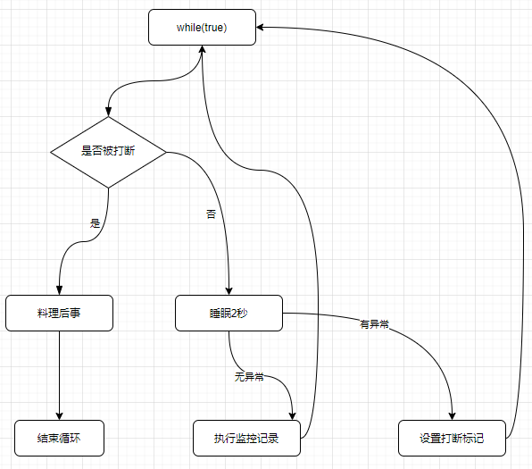

## 两阶段终止模式

两阶段终止模式（Two Phase Termination），就是考虑在一个线程T1中如何优雅地终止另一个线程T2？这里的优雅指的是给T2一个料理后事的机会（如释放锁）。

### 错误思路

- 使用线程对象的`stop()`方法停止线程。

- `stop()`方法会真正杀死线程，如果这时候锁住了共享资源，那么被锁共享资源在线程被杀死后无法释放，其他线程也无法获取这个锁。

- 使用`System.exit(int)方法停止线程`。

- 仅为了停止一个线程而使用这种错误的方法，将导致整个程序都停止。

### 正确姿势

假设要做一个监控程序，每隔2秒监控一次系统状态，设计思路如下：

- 创建监控线程每2秒（睡眠2秒降低CPU占用率）执行一次监控记录，该线程死循环实现。
- 主线程控制何时终止监控，这里主要是向监控线程发送终止信号，通过调用 `interrupt` 实现。

- 监控线程捕获打断异常，无异常则继续执行监控，有异常则。



[two-phase-termination.drawio](e02-pattern-use/two-phase-termination.drawio)

示例代码：

```java
@Slf4j(topic = "e02.TwoPhaseTermination")
public class TwoPhaseTermination {
    public static void main(String[] args) throws InterruptedException {
        TwoPhaseTerminationMonitor monitor = new TwoPhaseTerminationMonitor();

        monitor.start();//开始监控

        TimeUnit.SECONDS.sleep(7);

        monitor.stop();//停止监控
    }
}

@Slf4j(topic = "e02.TwoPhaseTerminationMonitor")
class TwoPhaseTerminationMonitor {
    Thread thread;//监控器线程

    /**
     * 开始监控
     */
    public void start() {
        thread = new Thread(() -> {
            while (true) {
                if (Thread.currentThread().isInterrupted()) {
                    if (log.isDebugEnabled()) {
                        log.debug("料理后事释放资源...");
                    }
                    break;//释放完毕退出
                }

                try {
                    TimeUnit.SECONDS.sleep(2);//被打断情况1：睡眠时被打断，此时若被打断则会清空打断标记，处理异常时需要重新设置打断标记

                    if (log.isDebugEnabled()) {
                        log.debug("执行监控...");//被打断情况2：正常运行时被打断，此时不会清空打断标记，继续执行本次操作，下次循环结束运行
                    }

                } catch (InterruptedException e) {
                    e.printStackTrace();

                    Thread.currentThread().interrupt();//重新设置打断标记 如果不设置则会因为调用阻塞状态线程的interrupt会清空打断标记而无法终止程序
                }
            }
        });

        thread.start();
    }

    /**
     * 停止监控 设置打断标记即可
     */
    public void stop() {
        thread.interrupt();
    }
}
```