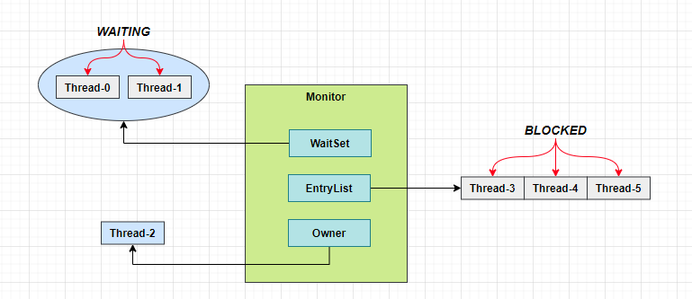

## Monitor 原理

Monitor 被翻译为**监视器**或**管程**，每个 Java 对象都可以关联一个 Monitor 对象，如果使用 synchronized 给对象上锁（重量级）之后，该对象头的 Mark Word 中就被设置指向 Monitor 对象的指针，Monitor 结构如下：



[monitor-struct.drawio](e03-theory-use/monitor-struct.drawio)

- 刚开始 Monitor 中 Owner 为 null
- 当 Thread-2 执行 `synchronized(obj)` 就会将 Monitor 的所有者 Owner 置为 Thread-2，Monitor中只能有一个 Owner

- 在 Thread-2 上锁的过程中，如果 Thread-3，Thread-4，Thread-5 也来执行 `synchronized(obj)`，就会进入EntryList BLOCKED
- Thread-2 执行完同步代码块的内容，然后唤醒 EntryList 中等待的线程来竞争锁，竞争的时是非公平的

- 图中 WaitSet 中的 Thread-0，Thread-1 是之前获得过锁，但条件不满足进入 WAITING 状态的线程，后面讲wait-notify 时会分析

**注意：**

1. `synchronized` 必须是进入同一个对象的 monitor 才有上述的效果
2. 不加 `synchronized` 的对象不会关联监视器，不遵从以上规则

## synchronized 原理

### synchronized 字节码解析

有如下代码：

```java
public class SynchronizedTheory {
    private static final Object LOCK = new Object();

    private static int COUNTER = 0;

    public static void main(String[] args) {
        synchronized (LOCK) {
            COUNTER++;
        }
    }
}
```

对应的main方法部分字节码解析如下：

```shell
 public static void main(java.lang.String[]);
    descriptor: ([Ljava/lang/String;)V
    flags: ACC_PUBLIC, ACC_STATIC
    Code:
      stack=2, locals=3, args_size=1
         0: getstatic     #2                  // <- lock引用 （synchronized开始）
         3: dup                               // 复制lock引用便于解锁时使用
         4: astore_1                          // lock引用 -> slot 1
         5: monitorenter                      // 将 lock对象 MarkWord 置为 Monitor 指针
         6: getstatic     #3                  // Field COUNTER:I
         9: iconst_1                          // 准备常数 1
        10: iadd                              // +1
        11: putstatic     #3                  // Field COUNTER:I
        14: aload_1                           // <- lock引用
        15: monitorexit                       // 将 lock对象 MarkWord 重置, 唤醒 EntryList
        16: goto          24                  // 跳转到24行执行return
        19: astore_2                          // e -> slot 2 将异常存储与slot2
        20: aload_1                           // <- lock引用 获取之前存储的复制的lock引用
        21: monitorexit                       // 将 lock对象 MarkWord 重置, 唤醒 EntryList
        22: aload_2                           // <- slot 2 (e) 获取异常对象
        23: athrow                            // throw e
        24: return
      Exception table:                        // 异常表
         from    to  target type
             6    16    19   any              // 若6到16行发生异常则跳转到19行执行  处理同步代码块可能会产生的异常
            19    22    19   any              // 若19到22行发生异常则跳转到19行执行 处理解锁时发生的异常 避免死锁
      LineNumberTable:
        line 9: 0
        line 10: 6
        line 11: 14
        line 12: 24
      LocalVariableTable:
        Start  Length  Slot  Name   Signature
            0      25     0  args   [Ljava/lang/String;
      StackMapTable: number_of_entries = 2
        frame_type = 255 /* full_frame */
          offset_delta = 19
          locals = [ class "[Ljava/lang/String;", class java/lang/Object ]
          stack = [ class java/lang/Throwable ]
        frame_type = 250 /* chop */
          offset_delta = 4
```

### synchronized 原理小故事

Story Roles List：

- 小宋 - JVM
- 小汪 - 线程
- 小龙 - 线程
- 房间 - 对象
- 房间门上 - 防盗锁 - Monitor
- 房间门上 - 小汪书包 - 轻量级锁
- 房间门上 - 刻上小汪大名 - 偏向锁
- 批量重刻名 - 一个类的偏向锁撤销到达 20 阈值
- 不能刻名字 - 批量撤销该类对象的偏向锁，设置该类不可偏向

小汪要使用房间保证计算不被其它人干扰(原子性)，最初，他用的是防盗锁，当上下文切换时，锁住门。这样，即使他离开了，别人也进不了门，他的工作就是安全的。

但是，很多情况下没人跟他来竞争房间的使用权。小龙是要用房间，但使用的时间上是错开的，小汪白天用，小龙晚上用。每次上锁太麻烦了，有没有更简单的办法呢?

小汪和小龙商量了一下，约定不锁门了，而是谁用房间，谁把自己的书包挂在门口，但他们的书包样式都一样，因此每次进门前得翻翻书包，看课本是谁的，如果是自己的，那么就可以进门，这样省的上锁解锁了。万一书包不是自己的，那么就在门外等，并通知对方下次用锁门的方式。

后来，小龙回老家了，很长一段时间都不会用这个房间。小汪每次还是挂书包，翻书包，虽然比锁门省事了，但仍然觉得麻烦。

于是，小汪干脆在门上刻上了自己的名字：**小汪专属房间，其它人勿用**，下次来用房间时，只要名字还在，那么说明没人打扰，还是可以安全地使用房间。如果这期间有其它人要用这个房间，那么由使用者将小汪刻的名字擦掉，升级为挂书包的方式。

同学们都放假回老家了，小汪就膨胀了，在 20 个房间刻上了自己的名字，想进哪个进哪个。后来他自己放假回老 家了，这时小龙回来了(她也要用这些房间)，结果就是得一个个地擦掉小汪刻的名字，升级为挂书包的方式。老 王觉得这成本有点高，提出了一种批量重刻名的方法，他让小龙不用挂书包了，可以直接在门上刻上自己的名字。

后来，刻名的现象越来越频繁，小宋受不了了：算了，这些房间都不能刻名了，只能挂书包。

多线程同时访问临界区: 使用重量级锁，JDK6之后对 `synchronized` 的优先状态：**偏向锁>轻量级锁>重量级锁。**

### synchronized 原理进阶