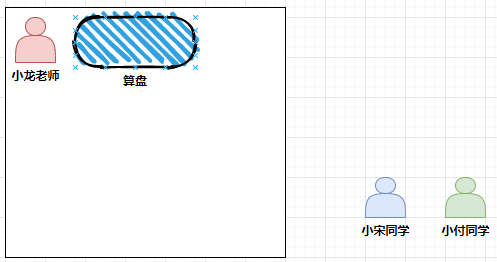
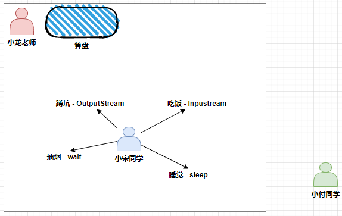
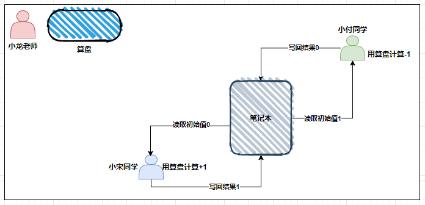
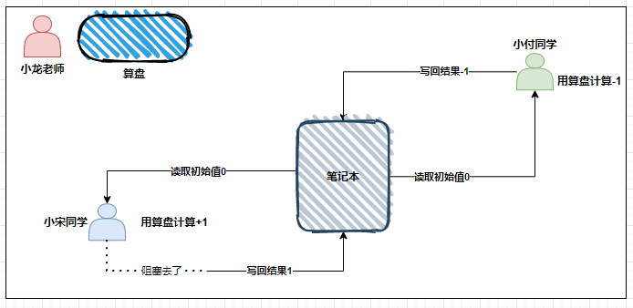
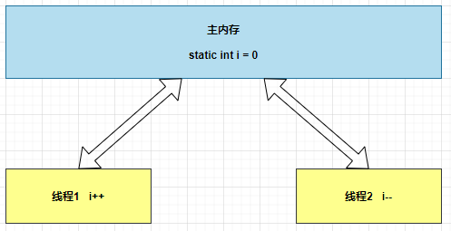
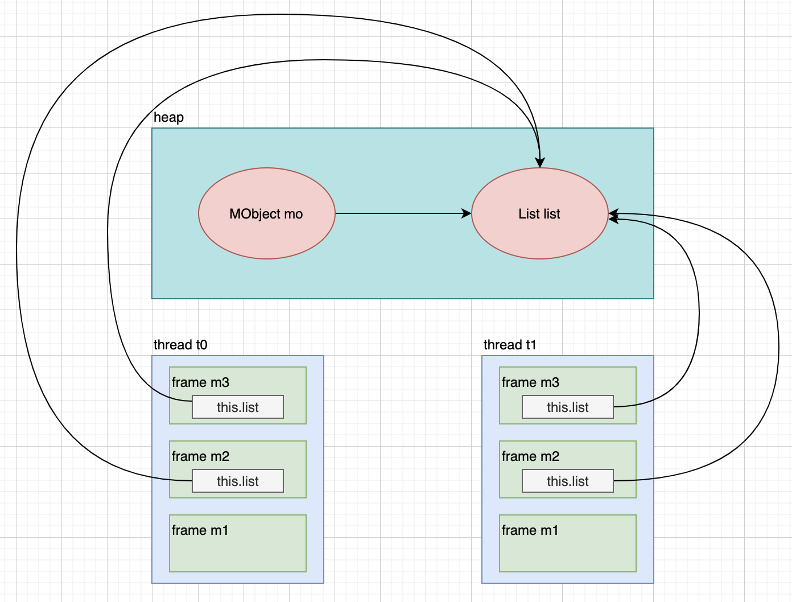
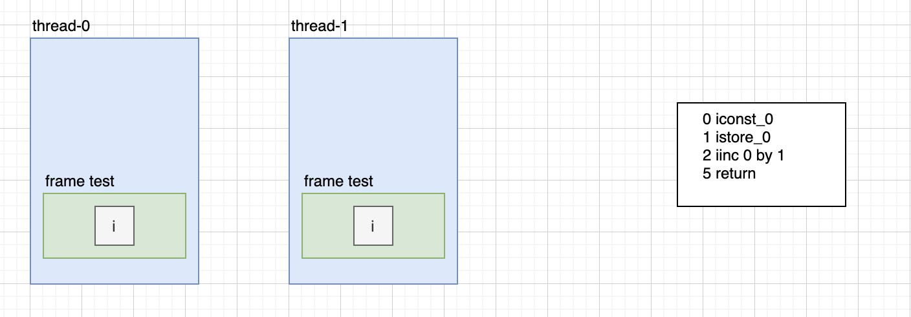
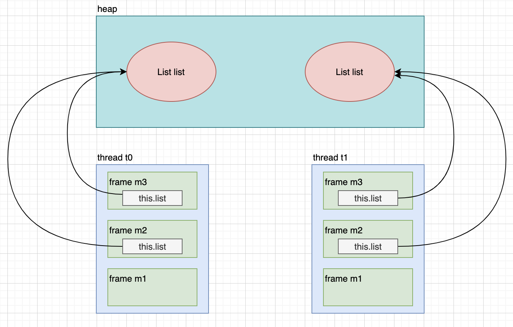
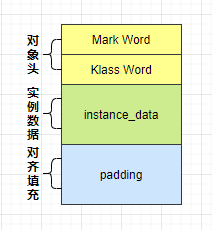

多线程共享问题、synchronized、线程安全分析、管程Monitor、wait/notify、线程状态转换、活跃性、Lock等知识点。

<!--more-->

## 共享造成的问题

### 共享小故事

- 小龙老师（操作系统）有一个功能强大的算盘（CPU），现在想把它租出去，赚一点外快。



- 小宋同学、小付同学（线程）来使用这个算盘来进行一些计算，并按照时间给老小龙老师支付费用。
- 但小宋不能一天24小时使用算盘，他经常要小憩一会（sleep），又或是去吃饭上厕所（阻塞 IO 操作），有时还需要一根烟，没烟时思路全无（wait），这些情况统称为（阻塞）。



- 在这些时候，算盘没利用起来（不能收钱了），小龙觉得有点不划算。
- 另外，小付也想用用算盘，如果总是小宋占着算盘，让小付觉得不公平。
- 于是，小龙老师灵机一动，想了个办法 ，**让他们每人用一会，轮流使用算盘** 。
- 这样，当小宋阻塞的时候，算盘可以分给小付使用，不会浪费，反之亦然。
- 最近执行的计算比较复杂，需要存储一些中间结果，而学生们的脑容量（工作内存）不够，所以小龙申请了一个笔记本（主存），把一些中间结果先记在笔记本上。
- 计算流程是这样的：



- 但是由于分时系统，有一天还是发生了事故。
- 小宋刚读取了初始值 0 做了个 +1 运算，还没来得及写回结果。
- 小龙老师说 ：“小宋，你的时间到了，该别人了，记住结果走吧 ”，于是小宋念叨着 ：“结果是1，结果是1...”， 不甘心地到一边待着去了（上下文切换）。
- 小龙老师说 ：“ 小付，该你了 ”，小付看到了笔记本上还写着 0 做了一个 -1 运算，将结果 -1 写入笔记本。



- 这时小付的时间也用完了，小龙老师又叫醒了小宋：“小宋，把你上次的题目算完吧”，小宋将他脑海中的结果 1 写入了笔记本。
- 小宋和小付都觉得自己没做错，但笔记本里的结果是 1 而不是 0。

### 共享在 Java 中的体现

两个线程对初始值为 0 的静态变量一个做自增，一个做自减，各做 5000 次，结果是 0 吗？

```java
@Slf4j(topic = "d05.ThreadSharedProblem")
public class ThreadSharedProblem {

    static int count = 0;

    public static void main(String[] args) throws InterruptedException {
        Thread t1 = new Thread(() -> {
            for (int i = 0; i < 5000; i++) {
                count++;
            }
        });

        Thread t2 = new Thread(() -> {
            for (int i = 0; i < 5000; i++) {
                count--;
            }
        });

        t1.setName("线程1");
        t1.start();

        t2.setName("线程2");
        t2.start();

        t1.join();

        t2.join();

        if (log.isDebugEnabled()) {
            log.debug("count的值为：{}", count);
        }
    }
}
```

### 问题分析

以上的结果可能是正数、负数、零。为什么呢？因为 Java 中对静态变量的自增，自减并不是原子操作，要彻底理解，必须从字节码来进行分析。

例如:

对于线程1`count++` 而言（`count` 为静态变量），实际会产生如下的 JVM 字节码指令：

```shell
 9 getstatic #14 <d05/ThreadSharedProblem.count : I> // 获取指定类的静态域，并将其值压入栈顶
12 iconst_1                                          // 将int型1推送至栈顶
13 iadd                                              // 将栈顶两int型数值相加并将结果压入栈顶
14 putstatic #14 <d05/ThreadSharedProblem.count : I> // 为指定的类的静态域赋值
```

 对于线程2`count+--` 而言（`count` 为静态变量），实际会产生如下的 JVM 字节码指令：

```shell
 9 getstatic #14 <d05/ThreadSharedProblem.count : I>
12 iconst_1
13 isub
14 putstatic #14 <d05/ThreadSharedProblem.count : I>
```

一行代码实际上对应的是4条 JVM 指令，而 Java 的内存模型如下，完成静态变量的自增，自减需要在主存和工作内存中进行数据交换：



如果是单线程以上 8 行代码是顺序执行（不会交错）没有问题：

```mermaid
sequenceDiagram
autonumber
participant t1 as 线程1
participant m as 主内存 static i
m ->> t1: getstatic i 读取 0
t1 ->> t1:iconst_1 准备常数 1
t1 ->> t1:iadd 加法 线程内 i =1
t1 ->> m:putstatic i 写入 1
m ->> t1:getstatic i 读取 1
t1 ->> t1:iconst_1 准备常数 1
t1 ->> t1:isub减法 线程内 i = 0
t1 ->> m:putstatic i 写入 0
```

但多线程下这 8 行代码可能交错运行：

出现负数的情况：

```mermaid
sequenceDiagram
autonumber
participant t1 as 线程1
participant t2 as 线程2
participant m as 主内存 static i
m ->> t2:getstatic i 读取 0
t2 ->> t2:iconst_1 准备常数 1
t2 ->> t2:isub 减法 线程内 i = -1
t2 -->> t1:线程上下文切换
m ->> t1:getstatic i 读取 0
t1 ->> t1:iconst_1 准备常数 1
t1 ->> t1:iadd 加法 线程内 i =1
t1 ->> m:putstatic i 写入 1
t1 -->> t2:线程上下文切换
t2 ->> m:putstatic i 写入 -1
```

出现正数的情况：

```mermaid
sequenceDiagram
autonumber
participant t1 as 线程1
participant t2 as 线程2
participant m as 主内存 static i
m ->> t1:getstatic i 读取 0
t1 ->> t1:iconst_1 准备常数 1
t1 ->> t1:iadd 加法 线程内 i =1
t1 -->> t2:线程上下文切换
m ->> t2:getstatic i 读取 0
t2 ->> t2:iconst_1 准备常数 1
t2 ->> t2:isub 减法 线程内 i = -1
t2 ->> m:putstatic i 写入 -1
t2 -->> t1:线程上下文切换
t1 ->> m:putstatic i 写入 1
```

### 临界区 Critical Section

- 一个程序运行多个线程本身是没有问题的。
- 问题出在多个线程访问**共享资源**。

- 多个线程读**共享资源**其实也没有问题。
- 在多个线程对**共享资源**读写操作时发生指令交错，就会出现问题。

- 一段代码块内如果存在对**共享资源**的多线程读写操作，称这段代码块为**临界区**，例如，下面代码中的临界区。

```java
@Slf4j(topic = "d05.CriticalSection")
public class CriticalSection {
    static int count = 0;

    static void increment()
    //临界区代码块
    {
        count++;
    }

    static void decrement()
    //临界区代码块
    {
        count--;
    }

    public static void main(String[] args) {
        Thread t1 = new Thread(() -> {
            for (int i = 0; i < 5000; i++) {
                increment();
            }
        }, "线程1");

        t1.start();

        Thread t2 = new Thread(() -> {
            for (int i = 0; i < 5000; i++) {
                decrement();
            }
        }, "线程2");

        t2.start();

        if(log.isDebugEnabled()){
            log.debug("count的值为：{}",count);
        }
    }
}
```

### 竞态条件 Race Condition

多个线程在临界区内执行，由于代码的**执行序列不同**而导致结果无法预测，称之为发生了**竞态条件**。

## synchronized 解决方案

### 应用之互斥

为了避免临界区的竞态条件发生，有多种手段可以达到目的。

- **阻塞式**：`synchronized`，`Lock`
- **非阻塞式**：原子变量

本次使用阻塞式的解决方案：`synchronized`，来解决上述问题，即俗称的**对象锁**，它采用互斥的方式让同一时刻至多只有一个线程能持有**对象锁**，其它线程再想获取这个**对象锁**时就会阻塞住。这样就能保证拥有锁的线程可以安全的执行临界区内的代码，不用担心线程上下文切换

**注意，虽然 Java 中互斥和同步都可以采用 synchronized 关键字来完成，但它们还是有区别的**：

- 互斥是保证临界区的竞态条件发生，同一时刻只能有一个线程执行临界区代码。
- 同步是由于线程执行的先后、顺序不同、需要一个线程等待其它线程运行到某个点。

### synchronized 用法

语法：

```java
synchronized(对象) // 线程1， 线程2(blocked)
{
	临界区代码
}
```

示例代码：

```java
@Slf4j(topic = "d05.ThreadSharedProblemSynchronized")
public class ThreadSharedProblemSynchronized {

    private final static Object room = new Object();
    static int count = 0;

    public static void main(String[] args) throws InterruptedException {
        Thread t1 = new Thread(() -> {
            for (int i = 0; i < 5000; i++) {
                synchronized (room) {
                    count++;
                }
            }
        });

        Thread t2 = new Thread(() -> {
            for (int i = 0; i < 5000; i++) {
                synchronized (room) {
                    count--;
                }
            }
        });

        t1.setName("线程1");
        t1.start();

        t2.setName("线程2");
        t2.start();

        t1.join();

        t2.join();

        if (log.isDebugEnabled()) {
            log.debug("count的值为：{}", count);
        }
    }
}
```

执行结果：

```shell
16:09:28.935 d05.ThreadSharedProblemSynchronized [main] - count的值为：0
```

### synchronized 理解


可以这样理解 `synchronized` ：

- `synchronized(对象)` 中的对象，可以想象为一个房间（room），有唯一入口（门）房间只能一次进入一人进行计算，线程 t1，t2 想象成两个人。
- 当线程 t1 执行到` synchronized(room)` 时就好比 t1 进入了这个房间，并锁住了门拿走了钥匙，在门内执行`count++` 代码。
- 这时候如果 t2 也运行到了` synchronized(room)` 时，它发现门被锁住了，只能在门外等待，发生了上下文切换，阻塞住了。
- 这中间即使 t1 的 CPU 时间片不幸用完，被踢出了门外（不要错误理解为锁住了对象就能一直执行下去哦），这时门还是锁住的，t1 仍拿着钥匙，t2 线程还在阻塞状态进不来，只有下次轮到 t1 自己再次获得时间片时才能开门进入。
- 当 t1 执行完 synchronized{} 块内的代码，这时候才会从 room 房间出来并解开门上的锁，唤醒 t2 线程把钥匙给他。t2 线程这时才可以进入 obj 房间，锁住了门拿上钥匙，执行它的 `count--` 代码。

```mermaid
sequenceDiagram
autonumber
participant t1 as 线程1
participant t2 as 线程2
participant m as 主内存 static i
participant l as 锁对象
t2 ->> l:尝试获取锁
Note over t2,l: 拥有锁
m ->> t2: getstatic i 读取 0
t2 ->> t2:iconst_1 准备常数 1
t2 ->> t2:isub 减法 线程内 i = -1
t2 -->> t1:线程上下文切换
t1 -x l:尝试获取锁，被阻塞（BLOCKED）
t1 -->> t2:线程上下文切换
t2 ->> m:putstatic i 写入 -1
Note over t2,l: 拥有锁
t2 ->> l:释放锁，并唤醒阻塞的线程
Note over t1,l: 拥有锁
m ->> t1:getstatic i 读取 -1
t1 ->> t1:iconst_1 准备常数 1
t1 ->> t1:iadd 加法 线程内 i = 0
t1 ->> m:putstatic i 写入 0
Note over t1,l: 拥有锁
t1 ->> l:释放锁，并唤醒阻塞的线程
```

### synchronized 作用范围思考

1. 如果把 `synchronized(obj)` 放在 `for` 循环的外面，如何理解?

    ```java
    @Slf4j(topic = "d05.ThreadSharedProblemSynchronized1")
    public class ThreadSharedProblemSynchronized1 {

        private final static Object room = new Object();
        static int count = 0;

        public static void main(String[] args) throws InterruptedException {
            Thread t1 = new Thread(() -> {
                synchronized (room) {
                    for (int i = 0; i < 5000; i++) {
                        count++;
                    }
                }
            });

            Thread t2 = new Thread(() -> {
                synchronized (room) {
                    for (int i = 0; i < 5000; i++) {
                        count--;
                    }
                }
            });

            t1.setName("线程1");
            t1.start();

            t2.setName("线程2");
            t2.start();

            t1.join();

            t2.join();

            if (log.isDebugEnabled()) {
                log.debug("count的值为：{}", count);
            }
        }
    }
    ```

	答：整个for循环被锁住，原子性从之前的**4**行虚拟机指令的`count++`或`count--`操作变为`4*5000`行指令的`count++`或`count--`，**原子性的范围增大**。

2. 如果 t1 `synchronized(obj1)` 而 t2 `synchronized(obj2)` 会怎样运作？

    ```java
    @Slf4j(topic = "d05.ThreadSharedProblemSynchronized2")
    public class ThreadSharedProblemSynchronized2 {

        private final static Object room1 = new Object();
        private final static Object room2 = new Object();
        static int count = 0;

        public static void main(String[] args) throws InterruptedException {
            Thread t1 = new Thread(() -> {
                for (int i = 0; i < 5000; i++) {
                    synchronized (room1) {
                        count++;
                    }
                }
            });

            Thread t2 = new Thread(() -> {
                for (int i = 0; i < 5000; i++) {
                    synchronized (room2) {
                        count--;
                    }
                }
            });

            t1.setName("线程1");
            t1.start();

            t2.setName("线程2");
            t2.start();

            t1.join();

            t2.join();

            if (log.isDebugEnabled()) {
                log.debug("count的值为：{}", count);
            }
        }
    }
    ```

	答：由于`synchronized`作用的对象不同，将不能保证临界区中的代码安全性，线程1使用的是room1对象，线程2使用的是room2对象，导致线程2在操作变量`count`时无需等待线程1是否使用完毕`room1`，**因此多线程下操作共享资源，要强调的事锁的对象是否一致**。

3. 如果 t1 `synchronized(obj)`  而 t2 没有加会怎么样？如何理解？

    ```java
    @Slf4j(topic = "d05.ThreadSharedProblemSynchronized3")
    public class ThreadSharedProblemSynchronized3 {
	
        private final static Object room = new Object();
        static int count = 0;
	
        public static void main(String[] args) throws InterruptedException {
            Thread t1 = new Thread(() -> {
                for (int i = 0; i < 5000; i++) {
                    synchronized (room) {
                        count++;
                    }
                }
            });
	
            Thread t2 = new Thread(() -> {
                for (int i = 0; i < 5000; i++) {
                    count--;
                }
            });
	
            t1.setName("线程1");
            t1.start();
	
            t2.setName("线程2");
            t2.start();
	
            t1.join();
	
            t2.join();
	
            if (log.isDebugEnabled()) {
                log.debug("count的值为：{}", count);
            }
        }
    }
    ```
    
	答：也不能保证临界区中的代码安全性。

### synchronized 面向对象改进

把需要保护的共享变量放入一个类，操作共享资源时，通过该类的方法来操作。
```java
@Slf4j(topic = "d05.ThreadSharedProblemSynchronizedObjectOriented")
public class ThreadSharedProblemSynchronizedObjectOriented {

    public static void main(String[] args) throws InterruptedException {

        Room room = new Room();

        Thread t1 = new Thread(() -> {
            for (int i = 0; i < 5000; i++) {
                room.increment();
            }
        });

        Thread t2 = new Thread(() -> {
            for (int i = 0; i < 5000; i++) {
                room.decrement();
            }
        });

        t1.setName("线程1");
        t1.start();

        t2.setName("线程2");
        t2.start();

        t1.join();

        t2.join();

        if (log.isDebugEnabled()) {
            log.debug("count的值为：{}", room.getCount());
        }
    }
}

class Room {
    private int count = 0;

    public void increment() {
        synchronized (this) {
            count++;
        }
    }

    public void decrement() {
        synchronized (this) {
            count--;
        }
    }

    public int getCount() {
        synchronized (this) {
            return count;
        }
    }
}
```

### synchronized 作用于方法上

以下两种**非静态**方式的 `synchronized` 作用效果相同：

```java
public class MethodSynchronized {

    public synchronized void method1() {

    }

    public void method2() {
        synchronized (this) {

        }
    }

}
```

以下两种**静态**方式的 `synchronized` 作用效果相同：

```java
public class MethodSynchronizedStatic {

    public synchronized static void method1() {

    }

    public static void method2() {
        synchronized (MethodSynchronizedStatic.class) {

        }
    }

}
```

注：不加 `synchronzied`的操作共享资源方法就好比不遵守规则的人，不去老实排队（好比翻窗户进去的）。

### synchronized 线程八锁

“线程八锁”是网上常见的一道面试题，其实就是考察 `synchronized` 锁住的是哪个对象，请分析下面的代码的输出结果：

#### 案例1

```java
@Slf4j(topic = "d05.ThreadEightSynchronized1")
public class ThreadEightSynchronized1 {

    public static void main(String[] args) {
        ThreadEightSynchronizedObject1 object1 = new ThreadEightSynchronizedObject1();

        Thread t1 = new Thread(() -> {
            if (log.isDebugEnabled()) {
                log.debug("开始执行..");
            }

            object1.m1();
        }, "线程1");

        Thread t2 = new Thread(() -> {
            if (log.isDebugEnabled()) {
                log.debug("开始执行..");
            }

            object1.m2();
        }, "线程2");

        t1.start();
        t2.start();
    }
}

@Slf4j(topic = "d05.ThreadEightSynchronizedObject1")
class ThreadEightSynchronizedObject1 {
    public synchronized void m1() {
        if (log.isDebugEnabled()) {
            log.debug("1");
        }
    }

    public synchronized void m2() {
        if (log.isDebugEnabled()) {
            log.debug("2");
        }
    }
}
```

可能结果：

+ 12
+ 21

两个线程锁的是同一个this对象，二者互斥，看CPU先调度哪个线程就先执行谁的输出，另一个随后输出，要么先1后2，要么先2后1。

#### 案例2

```java
@Slf4j(topic = "d05.ThreadEightSynchronized2")
public class ThreadEightSynchronized2 {

    public static void main(String[] args) {
        ThreadEightSynchronizedObject2 object2 = new ThreadEightSynchronizedObject2();

        Thread t1 = new Thread(() -> {
            if (log.isDebugEnabled()) {
                log.debug("开始执行..");
            }

            object2.m1();
        }, "线程1");

        Thread t2 = new Thread(() -> {
            if (log.isDebugEnabled()) {
                log.debug("开始执行..");
            }

            object2.m2();
        }, "线程2");

        t1.start();
        t2.start();
    }
}

@Slf4j(topic = "d05.ThreadEightSynchronizedObject2")
class ThreadEightSynchronizedObject2 {
    public synchronized void m1() {
        try {
            TimeUnit.SECONDS.sleep(1);
        } catch (InterruptedException e) {
            e.printStackTrace();
        }
        if (log.isDebugEnabled()) {
            log.debug("1");
        }
    }

    public synchronized void m2() {
        if (log.isDebugEnabled()) {
            log.debug("2");
        }
    }
}
```

可能结果：

- 1s 12
- 2 1s 1

#### 案例3

```java
@Slf4j(topic = "d05.ThreadEightSynchronized3")
public class ThreadEightSynchronized3 {

    public static void main(String[] args) {
        ThreadEightSynchronizedObject3 object3 = new ThreadEightSynchronizedObject3();

        Thread t1 = new Thread(() -> {
            if (log.isDebugEnabled()) {
                log.debug("开始执行..");
            }

            object3.m1();
        }, "线程1");

        Thread t2 = new Thread(() -> {
            if (log.isDebugEnabled()) {
                log.debug("开始执行..");
            }

            object3.m2();
        }, "线程2");

        Thread t3 = new Thread(() -> {
            if (log.isDebugEnabled()) {
                log.debug("开始执行..");
            }

            object3.m3();
        }, "线程3");

        t1.start();
        t2.start();
        t3.start();
    }
}

@Slf4j(topic = "d05.ThreadEightSynchronizedObject3")
class ThreadEightSynchronizedObject3 {
    public synchronized void m1() {
        try {
            TimeUnit.SECONDS.sleep(1);
        } catch (InterruptedException e) {
            e.printStackTrace();
        }
        if (log.isDebugEnabled()) {
            log.debug("1");
        }
    }

    public synchronized void m2() {
        if (log.isDebugEnabled()) {
            log.debug("2");
        }
    }

    public void m3() {
        if (log.isDebugEnabled()) {
            log.debug("3");
        }
    }
}
```

可能结果：

- 3 1s 12
- 32 1s 1

- 23 1s 1

主要区别为`m3`没有加 `synchronized` 。

#### 案例4

```java
@Slf4j(topic = "d05.ThreadEightSynchronized4")
public class ThreadEightSynchronized4 {

    public static void main(String[] args) {
        ThreadEightSynchronizedObject4 object41 = new ThreadEightSynchronizedObject4();
        ThreadEightSynchronizedObject4 object42 = new ThreadEightSynchronizedObject4();

        Thread t1 = new Thread(() -> {
            if (log.isDebugEnabled()) {
                log.debug("开始执行..");
            }

            object41.m1();
        }, "线程1");

        Thread t2 = new Thread(() -> {
            if (log.isDebugEnabled()) {
                log.debug("开始执行..");
            }

            object42.m2();
        }, "线程2");

        t1.start();
        t2.start();
    }
}

@Slf4j(topic = "d05.ThreadEightSynchronizedObject4")
class ThreadEightSynchronizedObject4 {
    public synchronized void m1() {
        try {
            TimeUnit.SECONDS.sleep(1);
        } catch (InterruptedException e) {
            e.printStackTrace();
        }
        if (log.isDebugEnabled()) {
            log.debug("1");
        }
    }

    public synchronized void m2() {
        if (log.isDebugEnabled()) {
            log.debug("2");
        }
    }
}
```

可能结果：

- 2 1s 1

锁的对象不同，没有互斥效果，两个线程并行执行，调用m1的线程会睡眠1秒，因此1始终最后输出。

#### 案例5

```java
@Slf4j(topic = "d05.ThreadEightSynchronized5")
public class ThreadEightSynchronized5 {

    public static void main(String[] args) {
        ThreadEightSynchronizedObject5 object5 = new ThreadEightSynchronizedObject5();

        Thread t1 = new Thread(() -> {
            if (log.isDebugEnabled()) {
                log.debug("开始执行..");
            }

            object5.m1();
        }, "线程1");

        Thread t2 = new Thread(() -> {
            if (log.isDebugEnabled()) {
                log.debug("开始执行..");
            }

            object5.m2();
        }, "线程2");

        t1.start();
        t2.start();
    }
}

@Slf4j(topic = "d05.ThreadEightSynchronizedObject5")
class ThreadEightSynchronizedObject5 {
    public static synchronized void m1() {
        try {
            TimeUnit.SECONDS.sleep(1);
        } catch (InterruptedException e) {
            e.printStackTrace();
        }
        if (log.isDebugEnabled()) {
            log.debug("1");
        }
    }

    public synchronized void m2() {
        if (log.isDebugEnabled()) {
            log.debug("2");
        }
    }
}
```

输出结果：

- 2 1s 1

`m1`方法上加了`static`，锁住的为当前类的字节码对象,因此m1和m2锁的对象不同，线程t1和t2在调用时没有互斥效果，两个线程并行执行，调用m1的线程会睡眠1秒，因此1始终最后输出，这与案例4相同，都是因为锁住的是不同对象。

#### 案例6

```java
@Slf4j(topic = "d05.ThreadEightSynchronized6")
public class ThreadEightSynchronized6 {

    public static void main(String[] args) {
        ThreadEightSynchronizedObject6 object6 = new ThreadEightSynchronizedObject6();

        Thread t1 = new Thread(() -> {
            if (log.isDebugEnabled()) {
                log.debug("开始执行..");
            }

            object6.m1();
        }, "线程1");

        Thread t2 = new Thread(() -> {
            if (log.isDebugEnabled()) {
                log.debug("开始执行..");
            }

            object6.m2();
        }, "线程2");

        t1.start();
        t2.start();
    }
}

@Slf4j(topic = "d05.ThreadEightSynchronizedObject6")
class ThreadEightSynchronizedObject6 {
    public static synchronized void m1() {
        try {
            TimeUnit.SECONDS.sleep(1);
        } catch (InterruptedException e) {
            e.printStackTrace();
        }
        if (log.isDebugEnabled()) {
            log.debug("1");
        }
    }

    public static synchronized void m2() {
        if (log.isDebugEnabled()) {
            log.debug("2");
        }
    }
}
```

输出结果：

- 2 1s 1
- 1s 12

两个方法都加了 `static`，锁的是同一个对象。

#### 案例7

```java
@Slf4j(topic = "d05.ThreadEightSynchronized7")
public class ThreadEightSynchronized7 {

    public static void main(String[] args) {
        ThreadEightSynchronizedObject7 object71 = new ThreadEightSynchronizedObject7();
        ThreadEightSynchronizedObject7 object72 = new ThreadEightSynchronizedObject7();

        Thread t1 = new Thread(() -> {
            if (log.isDebugEnabled()) {
                log.debug("开始执行..");
            }

            object71.m1();
        }, "线程1");

        Thread t2 = new Thread(() -> {
            if (log.isDebugEnabled()) {
                log.debug("开始执行..");
            }

            object72.m2();
        }, "线程2");

        t1.start();
        t2.start();
    }
}

@Slf4j(topic = "d05.ThreadEightSynchronizedObject7")
class ThreadEightSynchronizedObject7 {
    public static synchronized void m1() {
        try {
            TimeUnit.SECONDS.sleep(1);
        } catch (InterruptedException e) {
            e.printStackTrace();
        }
        if (log.isDebugEnabled()) {
            log.debug("1");
        }
    }

    public synchronized void m2() {
        if (log.isDebugEnabled()) {
            log.debug("2");
        }
    }
}
```

输出结果：

- 2 1s 1

锁的对象不同，没有互斥效果，并行执行。

#### 案例8

```java
@Slf4j(topic = "d05.ThreadEightSynchronized8")
public class ThreadEightSynchronized8 {

    public static void main(String[] args) {
        ThreadEightSynchronizedObject8 object81 = new ThreadEightSynchronizedObject8();
        ThreadEightSynchronizedObject8 object82 = new ThreadEightSynchronizedObject8();

        Thread t1 = new Thread(() -> {
            if (log.isDebugEnabled()) {
                log.debug("开始执行..");
            }

            object81.m1();
        }, "线程1");

        Thread t2 = new Thread(() -> {
            if (log.isDebugEnabled()) {
                log.debug("开始执行..");
            }

            object82.m2();
        }, "线程2");

        t1.start();
        t2.start();
    }
}

@Slf4j(topic = "d05.ThreadEightSynchronizedObject87")
class ThreadEightSynchronizedObject8 {
    public static synchronized void m1() {
        try {
            TimeUnit.SECONDS.sleep(1);
        } catch (InterruptedException e) {
            e.printStackTrace();
        }
        if (log.isDebugEnabled()) {
            log.debug("1");
        }
    }

    public static synchronized void m2() {
        if (log.isDebugEnabled()) {
            log.debug("2");
        }
    }
}
```

输出结果：

- 1s 12
- 2 1s 1

虽然创建了两个对象，但两个方法都是`static`，锁的是`ThreadEightSynchronizedObject8`类的字节码对象，该对象只有一个，因此锁的是同一个对象。

## 变量的线程安全分析

**成员变量和静态变量是否线程安全?**

- 如果它们没有共享，则线程安全
- 如果它们被共享了，根据它们的状态是否能够改变，又分两种情

- 如果只有读操作，则线程安全
- 如果有读写操作，则这段代码是临界区，需要考虑线程安全

**局部变量是否线程安全**?

- 局部变量是线程安全的
- 但局部变量引用的对象则未必

- 如果该对象没有逃离方法的作用范围，它是线程安全的
- 如果该对象逃离方法的作用范围，需要考虑线程安全

### 成员变量线程安全分析

示例代码：

```java
public class MemberVariableSafeAnalyse {
    private static final int THREADS = 2;

    private static final int LOOPS = 1000;

    public static void main(String[] args) {

        MObject mo = new MObject();

        for (int i = 0; i < THREADS; i++) {
            new Thread(() -> {
                mo.m1(LOOPS);
            }, "t" + i).start();
        }

    }
}

class MObject {
    private List<String> list = new ArrayList<>();

    public void m1(int loops) {
        for (int i = 0; i < loops; i++) {
            m2();
            m3();
        }
    }

    private void m2() {
        list.add("1");// 添加字符串1
    }

    private void m3() {
        list.remove(0);// 移除首个元素
    }
}
```

其中一种情况是，如果线程 `t2` 还未 `add`，线程 `t0` 执行 `remove` 就会报错：

```shell
Exception in thread "t0" java.lang.IndexOutOfBoundsException: Index: 0, Size: 1
	at java.util.ArrayList.rangeCheck(ArrayList.java:659)
	at java.util.ArrayList.remove(ArrayList.java:498)
	at d05.MObject.m3(MemberVariableSafeAnalyse.java:39)
	at d05.MObject.m1(MemberVariableSafeAnalyse.java:30)
	at d05.MemberVariableSafeAnalyse.lambda$main$0(MemberVariableSafeAnalyse.java:17)
	at java.lang.Thread.run(Thread.java:748)
```

导致这个问题的原因是，上面的代码中无论哪个线程操作的都是同一个 `MObject` 对象中的 `list` 成员变量，其内存结构如下：



### 局部变量线程安全分析

```java
public class LocalVariableSafeAnalyse1 {
    public static void test() {
        int i = 0;
        i++;
    }
}
```

`test()`方法字节码指令如下：

```shell
0 iconst_0
1 istore_0
2 iinc 0 by 1
5 return
```

该方法在多线程运行时，内存结构如图：


**每个线程中的变量**`i`**都是线程私有的，因此不存在共享，是线程安全的。**

接下来分析局部变量引用的对象是否线程安全，对上面例子的代码稍作修改后代码如下：

```java
public class LocalVariableSafeAnalyse2 {
    private static final int THREADS = 2;

    private static final int LOOPS = 1000;

    public static void main(String[] args) {

        LObj2 lObj2 = new LObj2();

        for (int i = 0; i < THREADS; i++) {
            new Thread(() -> {
                lObj2.m1(LOOPS);
            }, "t" + i).start();
        }

    }
}

class LObj2 {
    public void m1(int loops) {
        List<String> list = new ArrayList<>();

        for (int i = 0; i < loops; i++) {
            m2(list);
            m3(list);
        }
    }

    private void m2(List<String> list) {
        list.add("1");// 添加字符串1
    }

    private void m3(List<String> list) {
        list.remove(0);// 移除首个元素
    }
}
```

其不同之处在于将成员变量 `list` 改为了局部变量，在多线程情况下，其内存结构如下：



分析：

- `list` 是局部变量，每个线程调用时会创建其不同实例，没有共享
- 而 `m2` 的参数是从 `m1` 中传递过来的，与 `m1` 中引用同一个对象

- `m3` 的参数分析与 `m2` 相同

因此这个例子中的局部变量 list 是线程安全的，上面例子中 m2 和 m3 的方法访问修饰符为 private，如果把 m2 和 m3 的方法修改为 public 会不会代理线程安全问题？

```java
public class LocalVariableSafeAnalyse3 {
    private static final int THREADS = 2;

    private static final int LOOPS = 1000;

    public static void main(String[] args) {

        LObj3 lobj3 = new LObj3();

        for (int i = 0; i < THREADS; i++) {
            new Thread(() -> {
                lobj3.m1(LOOPS);
            }, "t" + i).start();
        }

    }
}

class LObj3 {
    public void m1(int loops) {
        List<String> list = new ArrayList<>();

        for (int i = 0; i < loops; i++) {
            m2(list);
            m3(list);
        }
    }

    public void m2(List<String> list) {
        list.add("1");// 添加字符串1
    }

    public void m3(List<String> list) {
        list.remove(0);// 移除首个元素
    }
}
```

- 情况1：有其他线程调用 `m2` 和 `m3` 时 ，`list` 是否线程安全？答：安全，其他线程若要调用 `m2` 和 `m3` 需要创建新的 `list` 对象，无法使用 `m1` 方法中的 list ，是两个不同的对象，没有发生共享
- 情况2：在情况1 的基础上，添加子类，子类覆写 `m2` 或 `m3` 方法，即

```java
public class LocalVariableSafeAnalyse4 {
    private static final int THREADS = 2;

    private static final int LOOPS = 1000;

    public static void main(String[] args) {

        LObj4 lobj4 = new LObj4Sub();

        for (int i = 0; i < THREADS; i++) {
            new Thread(() -> {
                lobj4.m1(LOOPS);
            }, "t" + i).start();
        }

    }
}

class LObj4 {
    public void m1(int loops) {
        List<String> list = new ArrayList<>();

        for (int i = 0; i < loops; i++) {
            m2(list);
            m3(list);
        }
    }

    public void m2(List<String> list) {
        list.add("1");// 添加字符串1
    }

    public void m3(List<String> list) {
        list.remove(0);// 移除首个元素
    }
}

class LObj4Sub extends LObj4 {
    @Override
    public void m3(List<String> list) {
        new Thread(() -> {
            list.remove(0);
        }).start();
    }
}
```

此处 `LObj4Sub` 继承 `LObj4` 并覆写了 `m3` 方法，在其中创建新线程，操作同一个 `list` 对象，又产生了多线程操作共享资源导致的不安全问题。

从这个例子可以看出 `private` 或 `final` 提供**安全**的意义所在，请体会开闭原则中的**闭。**不想被子类修改的方法使用 `private` 或 `final` 进行保护，还可以一定程度上加强线程安全性**。**

## 常见线程安全类

上面的例子对变量进行了线程安全分析，要想自己写出线程安全的类还是不太容易，比较好的一个起点是使用 JDK 提供的线程安全类，下面列出部分线程安全类：

- `String`
- `Integer`

- `StringBuffer`
- `Random`

- `Vector`
- `Hashtable`

- `java.util.concurrent.*`

这里说它们是线程安全的是指，多个线程调用它们同一个实例的某个方法时，是线程安全的。也可以理解为：**它们的每个方法是原子的。**

但需要注意的是：**它们多个方法的组合不是原子的**。

### 线程安全类方法线程安全原理

以 `Hashtable` 为例：

```java
public class HashtableSafeAnalyse1 {
    public static void main(String[] args) {
        Hashtable<String, String> table = new Hashtable<>();
        new Thread(() -> {
            table.put("key", "value1");
        }).start();
        new Thread(() -> {
            table.put("key", "value2");
        }).start();
    }
}
```

多个线程调用 `Hashtable` 的 `put` 方法并不会有线程安全问题，其原因参见其 `put` 方法源码，该方法使用 `synchronized` 保证了 `put` 方法内多行代码的原子性：

```java
public synchronized V put(K key, V value) {
        // Make sure the value is not null
        if (value == null) {
            throw new NullPointerException();
        }

        // Makes sure the key is not already in the hashtable.
        Entry<?,?> tab[] = table;
        int hash = key.hashCode();
        int index = (hash & 0x7FFFFFFF) % tab.length;
        @SuppressWarnings("unchecked")
        Entry<K,V> entry = (Entry<K,V>)tab[index];
        for(; entry != null ; entry = entry.next) {
            if ((entry.hash == hash) && entry.key.equals(key)) {
                V old = entry.value;
                entry.value = value;
                return old;
            }
        }

        addEntry(hash, key, value, index);
        return null;
    }
```

### 线程安全类方法组合调用分析

线程安全类的多个方法组合调用时并不是原子的，还是以 `Hashtable` 为例，分析下面代码的线程安全性：

```java
public class HashtableSafeAnalyse2 {
    public static void main(String[] args) throws InterruptedException {
        Hashtable<String, String> table = new Hashtable<>();
        new Thread(() -> {
            if (table.get("key") == null) {
                table.put("key", "value");
            }
        }).start();
        new Thread(() -> {
            if (table.get("key") == null) {
                table.put("key", "value");
            }
        }).start();
    }
}
```

可能的不安全执行流程如下：

```mermaid
sequenceDiagram
autonumber
participant t1 as 线程1
participant t2 as 线程2
participant t as table
t ->> t1: get("key") == null
t ->> t2: get("key") == null
t2 ->> t: put("key", "value") 
t1 ->> t: put("key", "value")
```


这样会导致后执行完 `put` 的线程覆盖掉先执行完 `put` 的线程的值，要想保证安全性需要对 `get` 和 `put` 的组合调用再包裹一层 `sychronized` 或使用 `putIfAbsent` 方法。

### 线程安全的不可变类

下面是一个不可变的简单类：

```java
public class Immutable {
    private int value = 0;

    public Immutable(int value) {
        this.value = value;
    }

    public int getValue() {
        return this.value;
    }
}
```

该类的属性无法被更改，只能读，因此无论如何都是线程安全的。如果想增加一个增加的方法呢？那么可以这样做：

```java
public class ImmutableWithMethod {
    private int value = 0;

    public ImmutableWithMethod(int value) {
        this.value = value;
    }

    public int getValue() {
        return this.value;
    }

    public Immutable add(int v) {
        return new Immutable(this.value + v);
    }
}
```

`add` 方法创建了一个新的类，而非在原类的属性上进行改动，保证了线程安全性。							

`String` 、`Integer` **等都是不可变类，因为其内部的状态不可以改变，因此它们的方法都是线程安全的。**

有人或许会有疑问，`String` 有 `replace`，`substring` 等方法可以改变值啊，那么这些方法又是如何保证线程安全的呢？

`String` 的 `substring` 源码如下：

```java
public String substring(int beginIndex) {
        if (beginIndex < 0) {
            throw new StringIndexOutOfBoundsException(beginIndex);
        }
        int subLen = value.length - beginIndex;
        if (subLen < 0) {
            throw new StringIndexOutOfBoundsException(subLen);
        }
        return (beginIndex == 0) ? this : new String(value, beginIndex, subLen);
    }
```

如果 `beginIndex` 不为 `0`，则创建一个新的对象返回，因此不可变类是线程安全的实现方式之一。

## 线程安全实例分析

### 例1

```java
public class MyServlet extends HttpServlet {
     // 是否安全？否
     Map<String,Object> map = new HashMap<>();
     // 是否安全？是
     String S1 = "...";
     // 是否安全？是
     final String S2 = "...";
     // 是否安全？否
     Date D1 = new Date();
     // 是否安全？否，虽然引用不可变，但Date对象的属性是可变的
     final Date D2 = new Date();

     public void doGet(HttpServletRequest request, HttpServletResponse response) {
          // 使用上述变量
     }
}
```

### 例2

```java
public class MyServlet extends HttpServlet {
    // 是否安全？ 否，该UserService的实现含有一个可变的成员变量
    private UserService userService = new UserServiceImpl();

    public void doGet(HttpServletRequest request, HttpServletResponse response) {
        userService.update(...);
    }
}
public class UserServiceImpl implements UserService {
    // 记录调用次数
    private int count = 0;

    public void update() {
        // ...
        count++;
    }
}
```

### 例3

```java
@Aspect
@Component
public class MyAspect {
    // 是否安全？否，spring默认单例多线程操作共享资源不安全，若使用多例又无法统计时间，可使用环绕通知或线程本地化
    private long start = 0L;

    @Before("execution(* *(..))")
    public void before() {
        start = System.nanoTime();
    }

    @After("execution(* *(..))")
    public void after() {
        long end = System.nanoTime();
        System.out.println("cost time:" + (end-start));
    }
}
```

### 例4

```java
public class MyServlet extends HttpServlet {
    // 是否安全？是
    private UserService userService = new UserServiceImpl();

    public void doGet(HttpServletRequest request, HttpServletResponse response) {
        userService.update(...);
    }
}
public class UserServiceImpl implements UserService {
    // 是否安全？是
    private UserDao userDao = new UserDaoImpl();

    public void update() {
        userDao.update();
    }
}
public class UserDaoImpl implements UserDao { 
    public void update() {
        String sql = "update user set password = ? where username = ?";
        // 是否安全？是，局部变量线程私有
        try (Connection conn = DriverManager.getConnection("","","")){
            // ...
        } catch (Exception e) {
            // ...
        }
    }
}
```

### 例5

```java
public class MyServlet extends HttpServlet {
    // 是否安全？
    private UserService userService = new UserServiceImpl();

    public void doGet(HttpServletRequest request, HttpServletResponse response) {
        userService.update(...);
    }
}
public class UserServiceImpl implements UserService {
    // 是否安全？
    private UserDao userDao = new UserDaoImpl();

    public void update() {
        userDao.update();
    }
}
public class UserDaoImpl implements UserDao {
    // 是否安全？否
    private Connection conn = null;
    public void update() throws SQLException {
        String sql = "update user set password = ? where username = ?";
        conn = DriverManager.getConnection("","","");
        // ...
        conn.close();
    }
}
```

### 例6

```java
public class MyServlet extends HttpServlet {
    // 是否安全？
    private UserService userService = new UserServiceImpl();

    public void doGet(HttpServletRequest request, HttpServletResponse response) {
        userService.update(...);
    }
}
public class UserServiceImpl implements UserService { 
    public void update() {
        UserDao userDao = new UserDaoImpl();
        userDao.update();
    }
}
public class UserDaoImpl implements UserDao {
    // 是否安全？是，结合dao层写法，每次都是new一个新的dao实现，避免了线程安全问题
    private Connection = null;
    public void update() throws SQLException {
        String sql = "update user set password = ? where username = ?";
        conn = DriverManager.getConnection("","","");
        // ...
        conn.close();
    }
}
```

### 例7

```java
public abstract class Test {
 
    public void bar() {
        // 是否安全？
        SimpleDateFormat sdf = new SimpleDateFormat("yyyy-MM-dd HH:mm:ss");
        foo(sdf);
    }
 
 	public abstract foo(SimpleDateFormat sdf);
 
    public static void main(String[] args) {
        new Test().bar();
    }
}
```

其中 `foo` 的行为是不确定的，可能导致不安全的发生，被称之为**外星方法。**

```java
public void foo(SimpleDateFormat sdf) {
    String dateStr = "1999-10-11 00:00:00";
    for (int i = 0; i < 20; i++) {
        new Thread(() -> {
            try {
                sdf.parse(dateStr);
            } catch (ParseException e) {
                e.printStackTrace();
            }
        }).start();
    }
}
```

请比较 JDK 中 `String` 类的实现，通过 `final` 关键字来提升线程安全性。

## 线程安全实例练习

### 卖票

测试下面的代码是否存在线程安全问题，并尝试改成

```java
@Slf4j(topic = "d05.ExerciseAccountTransferring")
public class ExerciseAccountTransferring {
    static Random R = new Random(); // Random为线程安全

    public static void main(String[] args) throws InterruptedException {
        Account a = new Account(1000);
        Account b = new Account(1000);

        Thread t1 = new Thread(() -> {
            for (int i = 0; i < 1000; i++) {
                b.transfer(a, randomAmount());
            }
        });

        Thread t2 = new Thread(() -> {
            for (int i = 0; i < 1000; i++) {
                a.transfer(b, randomAmount());
            }
        });

        t1.start();
        t2.start();

        t1.join();
        t2.join();

        if (log.isDebugEnabled()) {
            log.debug("总金额为：{}", a.getMoney() + b.getMoney());
        }
    }

    // 随机[1,100]
    public static int randomAmount() {
        return R.nextInt(100) + 1;
    }
}

class Account {
    private int money;

    public Account(int money) {
        this.money = money;
    }

    public int getMoney() {
        return money;
    }

    public void setMoney(int money) {
        this.money = money;
    }

    public void transfer(Account target, int amount) {
        if (this.money >= amount) {
            this.setMoney(this.getMoney() - amount);
            target.setMoney(target.getMoney() + amount);
        }
    }
}
```

另外，用下面的代码行不行，为什么？

```java
List<Integer> sellCount = new ArrayList<>();
```

### 转账

测试下面代码是否存在线程安全问题，并尝试改正：

```java
@Slf4j(topic = "x5.ExerciseAccountTransferring")
public class ExerciseAccountTransferring {
    static Random R = new Random(); // Random为线程安全

    public static void main(String[] args) throws InterruptedException {
        Account a = new Account(1000);
        Account b = new Account(1000);

        Thread t1 = new Thread(() -> {
            for (int i = 0; i < 1000; i++) {
                b.transfer(a, randomAmount());
            }
        });

        Thread t2 = new Thread(() -> {
            for (int i = 0; i < 1000; i++) {
                a.transfer(b, randomAmount());
            }
        });

        t1.start();
        t2.start();

        t1.join();
        t2.join();

        if (log.isDebugEnabled()) {
            log.debug("总金额为：{}", a.getMoney() + b.getMoney());
        }
    }

    // 随机[1,100]
    public static int randomAmount() {
        return R.nextInt(100) + 1;
    }
}

class Account {
    private int money;

    public Account(int money) {
        this.money = money;
    }

    public int getMoney() {
        return money;
    }

    public void setMoney(int money) {
        this.money = money;
    }

    public void transfer(Account target, int amount) {
        if (this.money >= amount) {
            this.setMoney(this.getMoney() - amount);
            target.setMoney(target.getMoney() + amount);
        }
    }
}
```

这样改正行不行，为什么？

```java
public synchronized void transfer(Account target, int amount) {
    if (this.money >= amount) {
        this.setMoney(this.getMoney() - amount);
        target.setMoney(target.getMoney() + amount);
    }
}
```

## Monitor

### 概念

什么是 Monitor？

1. Monitor 是一种用来实现同步的工具
2. 与每个 Java 对象相关联，即每个java对象都有一个 Monitor 与之对应

1. Monitor 是实现 Sychronized(内置锁) 的基础

### Java 对象头

对象头包含两部分：**运行时元数据（Mark Word）**和**类型指针 (Klass Word)**

1. 运行时元数据

1. 哈希值（HashCode），可以看作是堆中对象的地址
2. GC 分代年龄（年龄计数器） (用于新生代 from / to 区晋升老年代的标准, 阈值为15)

1. 锁状态标志 (用于JDK1.6对 `synchronized` 的优化 -> 轻量级锁)
2. 线程持有的锁

1. 偏向线程ID (用于JDK1.6对 `synchronized` 的优化 -> 偏向锁)
2. 偏向时间戳

1. 类型指针

1. 指向类元数据 InstanceKlass，确定该对象所属的类型。指向的其实是方法区中存放的类元信息

以 32 位虚拟机为例，普通对象的对象头结构如下，其中的 Klass Word 为指针，指向对应的 Class 对象：

```shell
|--------------------------------------------------------------| 
|                      Object Header (64 bits)                 |
|------------------------------------|-------------------------| 
|       Mark Word (32 bits)          |  Klass Word (32 bits)   |
|------------------------------------|-------------------------|
```

数组对象：**如果对象是数组，还需要记录数组的长度**

```shell
|---------------------------------------------------------------------------------|
|                                 Object Header (96 bits)                         |
|--------------------------------|-----------------------|------------------------|
|        Mark Word(32bits)       |   Klass Word(32bits)  |  array length(32bits)  |
|--------------------------------|-----------------------|------------------------|
```

其中 Mark Word 结构为：

```shell
|-------------------------------------------------------|--------------------|
|                         Mark Word (32 bits)           |       State        |
|-------------------------------------------------------|--------------------|
| hashcode:25         | age:4 | biased_lock:0 | 01      |       Normal       |
|-------------------------------------------------------|--------------------|
| thread:23 | epoch:2 | age:4 | biased_lock:1 | 01      |       Biased       |
|-------------------------------------------------------|--------------------|
|              ptr_to_lock_record:30          | 00      | Lightweight Locked |
|-------------------------------------------------------|--------------------|
|              ptr_to_heavyweight_monitor:30  | 10      | Heavyweight Locked |
|-------------------------------------------------------|--------------------|
|                                             | 11      |    Marked for GC   |
|-------------------------------------------------------|--------------------|
```

64 位虚拟机 Mark Word：

```shell
|--------------------------------------------------------------------|--------------------|
|                 Mark Word (64 bits)                                |       State        |
|--------------------------------------------------------------------|--------------------|
| unused:25 | hashcode:31 | unused:1 | age:4 | biased_lock:0 | 01    |       Normal       |
|--------------------------------------------------------------------|--------------------|
| thread:54 | epoch:2     | unused:1 | age:4 | biased_lock:1 | 01    |       Biased       |
|--------------------------------------------------------------------|--------------------|
|                     ptr_to_lock_record:62                  | 00    | Lightweight Locked |
|--------------------------------------------------------------------|--------------------|
|                     ptr_to_heavyweight_monitor:62          | 10    | Heavyweight Locked |
|--------------------------------------------------------------------|--------------------|
|                                                            | 11    |   Marked for GC    |
|--------------------------------------------------------------------|--------------------|
```


因此一个对象占用的内存空间如下：



### Monitor 原理

[并发实战（三）原理与应用](/e03-theory-use/)

+ Monitor 原理

### sychronized 原理

[并发实战（三）原理与应用](/e03-theory-use/)

+ sychronized 原理
