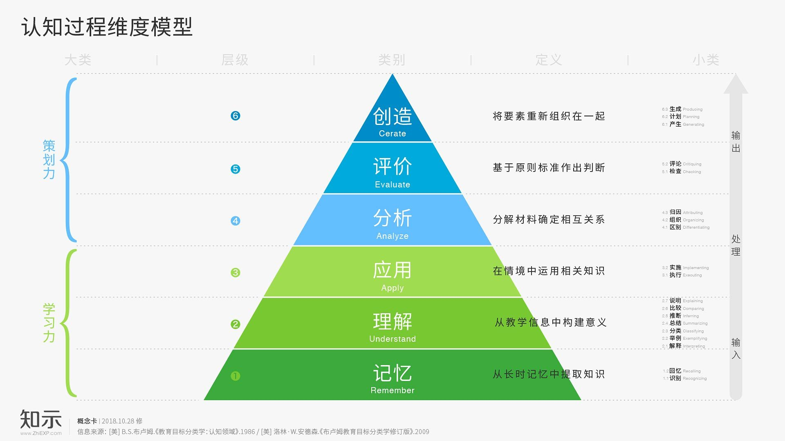
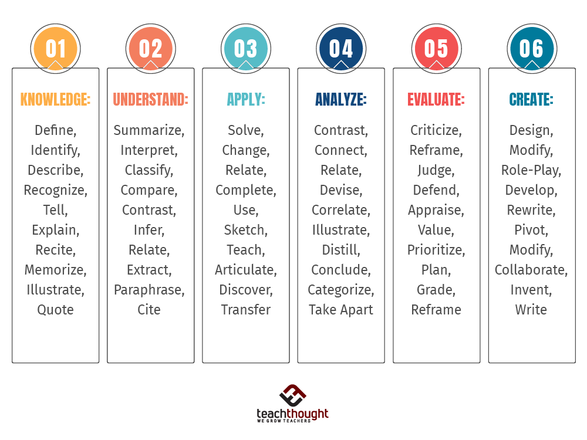
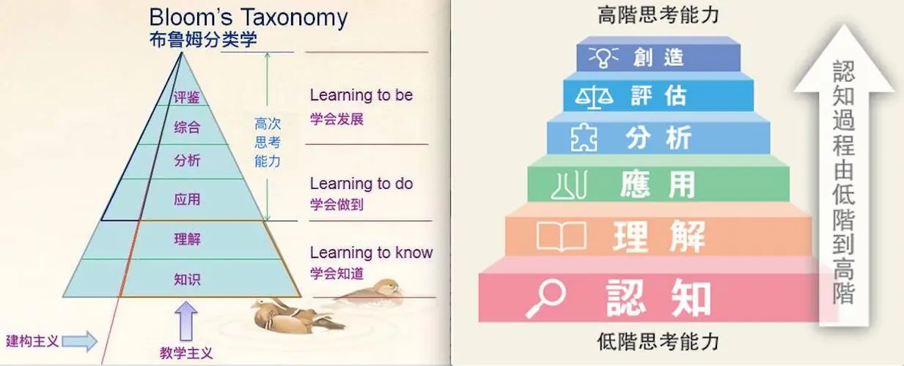
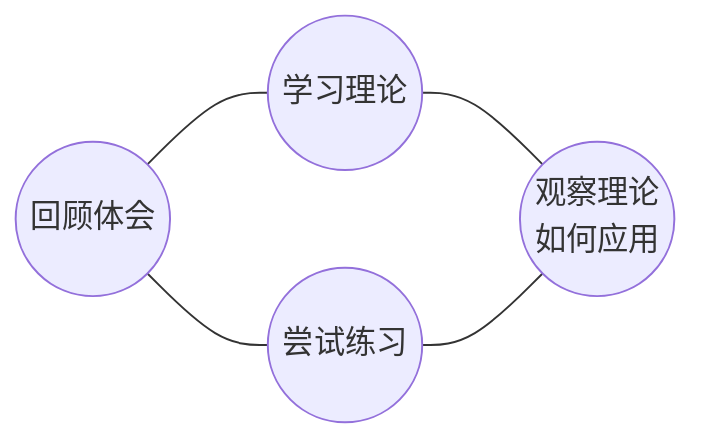
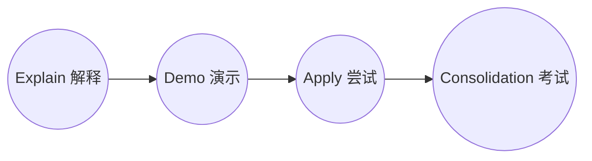
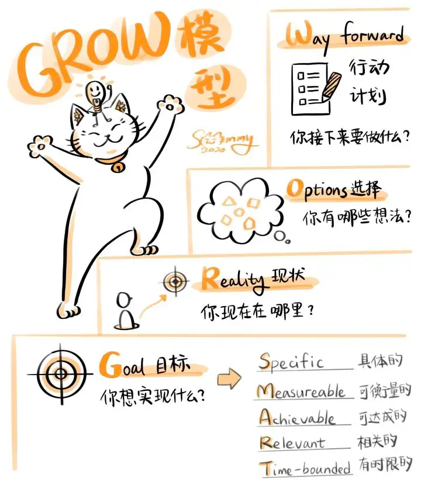

本文介绍如何辅导团队管理员工/下属的方法，在交流辅导方法之前，先聊一聊人的学习认知过程。因为只有了解人是怎么学习认知的，我们才能更好的去实施这个事情，达到更好的一个效果。

<!--more-->

## 认知过程

以上是著名的[**本杰明·布卢姆**](https://owly.wiki/en/Benjamin_Bloom/)认知过程维度模型，人的认知过程经过 `6` 个阶段：

1. 记忆（`Remember`）：从长时记忆中提取知识；记忆——记住所学材料，包括对具体事实、方法、过程等的回忆。
    1. 识别（`Recognizing`）：在长时记忆中查找与呈现材料相吻合的知识；例如：识别历史中重要事件的日期。
    2. 回忆 （`Recalling`）：从长时记忆中提取相关知识；例如：回忆历史中重要事件的日期。
2. 理解（`Understand`）：从教学信息中构建意义；领悟所学材料的意义，但不一定将其与其他事物相联系。
    1. 解释（`Interpreting`）：将信息从一种表示形式（如数字的）转变为另一种表示形式（如文字的）；例如：阐释重要讲演和文献的意义。
    2. 举例（`Exemplifying`）：找到概念和原理的具体例子或例证；例如：列举各种绘画艺术风格的例子。
    3. 分类（`Classifying`）：确定某物某事属于一个类别（如概念或类别）；例如：将观察到的或描述过的精神疾病案例分类。
    4. 总结（`Summarizing`）：概括总主题或要点；例如：书写录像带所放映的事件的简介。
    5. 推断（`Inferring`）：从呈现的信息中推断出合乎逻辑的结论；例如：学习外语时从例子中推断语法规则。
    6. 比较（`Comparing`）：发现两种观点、两个对象等之间的对应关系；例如：将历史事件与当代的情形进行比较。
    7. 说明（`Explaining`）：建构一个系统的因果关系；例如：说明法国18世纪重要事件的原因。
3. 应用（`Apply`）：在情境中运用相关知识；应用——将所学概念、规则等运用于新情景中的能力。
    1. 执行（`Executing`）：将程序应用于熟悉的任务；例如：两个多位数的整数相除。
    2. 实施（`Implementing`）：将程序应用于不熟悉的任务；例如：在牛顿第二定律适用的问题情境中运用该定律。
4. 分析（`Analyze`）：分解材料确定相互关系；将整体材料分解成其构成成分并理解其组织结构。
    1. 区别（`Differentiating`）：区分呈现材料的相关与无关部分或重要与次要部分；例如：区分一道数学文字题中的相关数字与无关数字。
    2. 组织（`Organizing`）：确定要素在一个结构中的合适位置或作用；例如：将历史描述组织起来，形成赞同或否定某一历史解释的证据。
    3. 归因（`Attributing`）：确定呈现材料背后的观点、倾向、价值或意图；例如：依据其政治观来确定该作者文章的立场。
5. 评价（`Evaluate`）：基于原则标准作出判断，是对材料作价值评判的能力，包括按材料内在标准或外在标准进行评判。
    1. 检查（`Checking`）：发现一个过程或产品内部的矛盾和谬误；确定一个过程或产品是否具有内部一致性；查明程序实施的有效性；例如：确定科学家的结论是否与观察数据相吻合。
    2. 评论（`Critiquing`）：发现一个产品与外部谁则之间的矛盾；确定一个产品是否具有外部致性；查明程序对一个给定问题的恰当性；例如：判断解决某个问题的两种方法中那一种更好。
6. 创造（`Create`）：将要素重新组织在一起，将所学的零碎知识整合为知识体系，强调创造能力，需要产生新的模式或结构。
    1. 产生（`Generating`）：基于准则提出相异假设；例如：提出解释观察的现象的假设。
    2. 计划（`Planning`）：为完成某一-任务设计程序；例如：计划关于特定历史主题的研究报告。
    3. 生成（`Producing`）：生产一个产品；例如：有目的地建立某些物种的栖息地。

记忆是属于低层级的认知。如果仅仅靠记忆去学习某方面的知识，那他对于其背后所蕴含的深刻含义在认知上必然会有局限性。

## 培训方法

只有通过多方面的，多种形式的学习、体验、应用，才能做到把一个东西掌握。通过知识性学习，了解基本原理，通过体验式的学习方法，通过探索操作让学习者去进一步“**记忆**、**理解**”，通过分析个人实践、应用去“**理解**”和“**分析**”，提出新的应用方向及目标，挑战去“**创造**”，多维度和多层级的认知，让学习者对知识有更深入的解析。

以下介绍两种培训方法：`EDAC` 培训技术，教练式辅导 `Groway`。下面就这两种辅导培训技术进行详细的沟通。

### EDAC

培训的目的是让培训者掌握的能力，尽量转化为被培训者的能力。人的认知学习记忆方式可以简化为如下图所示：

培训的时候需要遵循这一规律（**不断的重复，直到形成习惯**），对于上面提到的创造和评价，一般不作为培训的目的，因为创造需要对知识进行深度掌握，并熟练运用才可以触发。则培训一般希望达到记忆、理解、应用、分析则对应为培训的四个步骤：解释、演示、尝试、考试巩固。

+ `Explain`：培训者向被培训者进行解释——是什么，为什么，如何运作，直到明白为止。
+ `Demo`：培训者进行实际演示，按照标准的做法进行
+ `Apply`：被培训者进行尝试、练习，提供一定的反馈和指导，但以被培训者为主导，放弃控制欲望。
+ `Consolidation`：对掌握程度进行评估，考试，模拟对练等方式进行进一步的巩固学习成果。

实际中看培训的内容，如果是大家已经体验过的内容，则可以省略，如果是新人，或是培训未接触过的新东西，则可以引入体验流程，可以提高培训效果。

### GROWAY
`GROW` 模型是最基本的辅导模型，帮助员工理清现状，减少某些事情的干扰，使执行人从内心找到对应的办法，最终帮助员工成长。

+ `G`（Goal setting）：确认员工业绩目标。
+ `R`（Reality Check）：是现状，要搞清楚目前的现状、客观事实是什么，寻找动因。
+ `O`（Options）：代表寻找解决方案。
+ `W`（What、 When、 Who、 Will、What should be done）：制定行动计划和评审时间。

`GROW` 模型（成长模型）引进国内之后，发展为 `GROWAY` 模型（成长之道模型）。增加了：

+ `A`（ Accord）：调整，使目标与行动一致。
+ `Y`（ Yield）：获得收益。

#### GROWAY 模型的应用

**G：目标（Goal）**

首先要做的是确定目标，辅导员工的目的是让员工获得发展和成长，那么，必须明确你将带领下属去哪里，而且这个目标必须是和员工一致，否则目的地不一样，后面的工作根本没有办法进行。

典型问题：

+ 这个目标是否符合TA的总体职业目标？
+ 这个目标和团队的总体目标具有一致性吗？
+ 你如何知道团队成员已经实现了某个目标？
+ 你如何确定某个问题已经被解决了？

**R：现实状况（ Reality）**

第二步是分析现实的状况。分析一定要客观和全面，现在存在的问题，正面的、负面的，优点、缺点都必须包括在内。在这个环节，不能假设，也就是说，不能把期望说成现实。

典型问题：

+ 现在正在发生什么？（什么，何人，何时以及频繁程度）
+ 现状将会导致什么样的效果或结果？
+ 这个目标是否与其它目标有冲突？
+ 你已经朝目标迈出了几步？

**O：提出议案、方案（Options）**

第三步是设计方案。此时需注意你的目的是给员工指明正确的方向，而不是代替他们做出决策。这是实现目标的重要环节，要根据员工的发展目标，结合现实状况设计员工的成长方案。需要指出的是，通常这样的方案不止至少应该有两个，一个是最优方案，一个是次优方案。当最优方案出现问题的时候，可以实施次优方案。

典型问题：

+ 你能做些什么？
+ 如果把这些或那些约束条件去掉，问题会改变吗？
+ 每个选项的优点和缺点是什么？
+ 你需要用什么因素来衡量每个选项？
+ 为了实现该目标，我们需要停止做什么？
+ 在实现目标的道路上有哪些障碍？

**W：工作，实施（Work）**

第四步就是着手实施。这也是很重要的。What（是什么）? When（什么时候）? Who（谁来做）? Will（将会怎样）? What should be done（该做什么）? 这一步，是决定计划能否实现的最重要的一步。这一步是最难的，需要耐力。

典型问题：

+ 你现在会做什么？什么时候开始？你以后还可以做什么？
+ 什么东西阻止你前进？你将如何克服这一阻碍？
+ 你计划什么时候审查自己的进度？每日、每周还是每月？
+ 你将如何保持自己的斗志？

**A：调整，使一致（ Accord）**

计划在实施过程中肯定不会一帆风顺，因此要做出相应调整。

典型问题：

+ 现在进行到哪一步了？

+ 推进过程中发现了哪些问题？对计划产生了什么影响？

**Y：获得收益（ Yield）**

最后就是获取收益，计算成效，及时进行评估同时要享受成果，既包括最终的成果，也包括阶段性成果。一旦员工取得了成绩，就要及时回馈给员工认可和奖励。这样才可以促使员工继续努力，不断成长。

典型问题：

+ 这个阶段员工付出了哪些，该得到什么样的收益回报？
+ 整个过程中，员工该得到什么样收益回报？