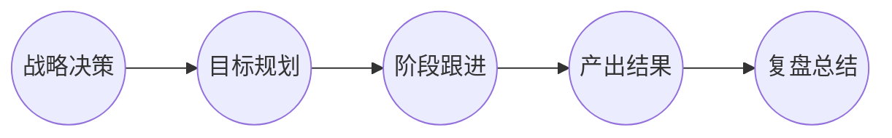
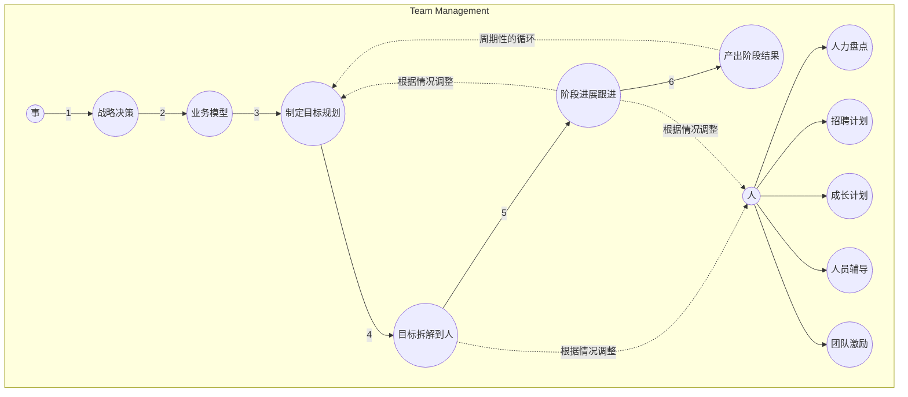

随着工作经验和阅历的提升，很多工作多年的朋友，已经开始逐步的开创团队或管理团队了；再不济也会或多或少的接触管理相关的工作，毕竟能力越大责任越大。

<!--more-->

那么怎么进行呢，这也是一直让我困惑的事情；在参与管理几个项目的完整流程后，期间不乏各种血的教训，然后我逐步的梳理了一下，总的来说分为管好**事**和**人**。

团队管理者不仅仅是管理自己，而是包含所领导的团队，需要团队管理者的原因就是希望他能够带领团队取得成果和产出。

团队管理者的工作有大部分是在分配人力、物力等资源，做分析、决策、传达指令等，针对每一项活动或者事情，都有投入。

团队管理者的产出公式可以表达为：`团队管理者的产出 = 他直接管辖部门的产出 + 他间接影响所及部门的产出 `。

各项管理活动所带来的产出就是管理的回报，产出与投入的比值就是团队管理者的回报率。

所以，`团队管理者的产出 = 回报率A * 管理活动A + 回报率B * 管理活动B ... + 回报率N * 管理活动N`。

那么该如何增加团队管理者的产出呢，也就是如何增加团队管理者每个单位时间的产出，可以通过以下3种方法来增加：

1. 提高速度：加快每一项管理进行的速度。
2. 合理调整：调整管理活动的组合，摒除低回报率的活动，代之以高回报率的活动；即只做或优先做重要的事情，高回报的事情。
3. 提升效率：提高每一项活动的回报率，即提高做单个事情的效率。

要达成高回报率，大致上有以下几种情况：

1. 增加人员基数，同时影响很多人时——扩大管理基数.
2. 提供技术、知识、信息、流程、方法、工具，对一群人进行进行科学化、制度化的管理。

就以上影响管理者产出或回报率的方法中，有些事情是管理者不太具有自主权，或者短期内不一定能达成的，是要随着业务发展或职位变化才能做的：比如不做某些事情，或者增加人员数量。

管理者能够自主的就是怎样用好手上的已有资源，更好科学化的管理好目前的团队，这样才能提高产出。

团队管理可以分为两方面：

1. 对于事情的一个管理，从决策到最终落实。
2. 对参与事情的人员管理。

一个公司的业务，从最顶层到实施，经历的阶段大致为：

如果中途发现有差异（其他不可抗力、干扰因素），应当立即进行调整并重新规划阶段和跟进，以结果为导向；

对人的管理就包括：

+ 根据业务的情况，招募、管理、扩大团队。
+ 对团队进行激励，制定激励政策；让团队成员产生自我规划和发展的意识。
+ 帮助团队成员成长，技术、知识、信息、流程、方法、工具等方面的培训。

针对**事**的管理与**人**的管理，下面提供一个思路方法，以帮助提高团队管理，最终达到提高产出的效果。

关系表示如下图所示：

