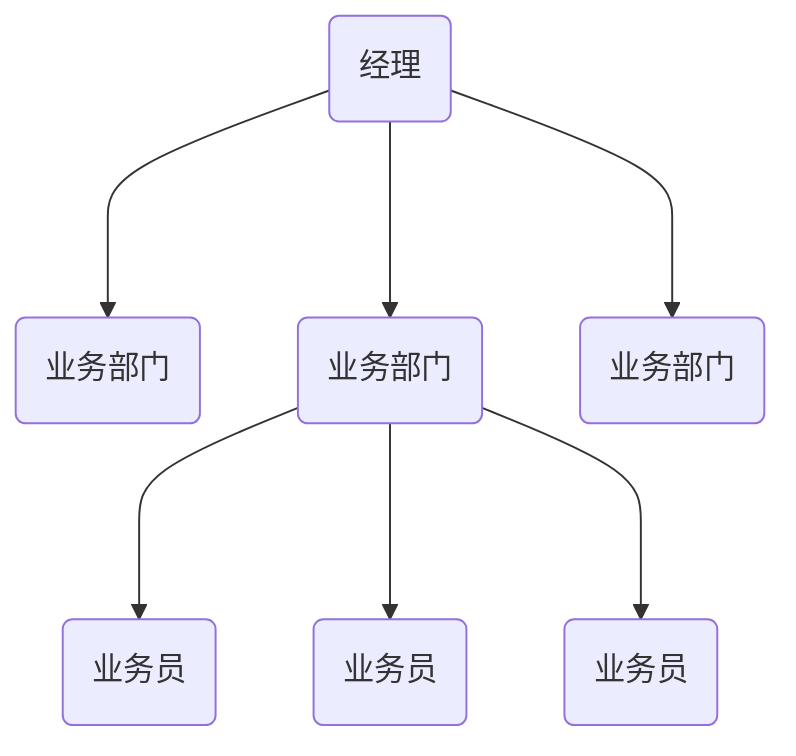
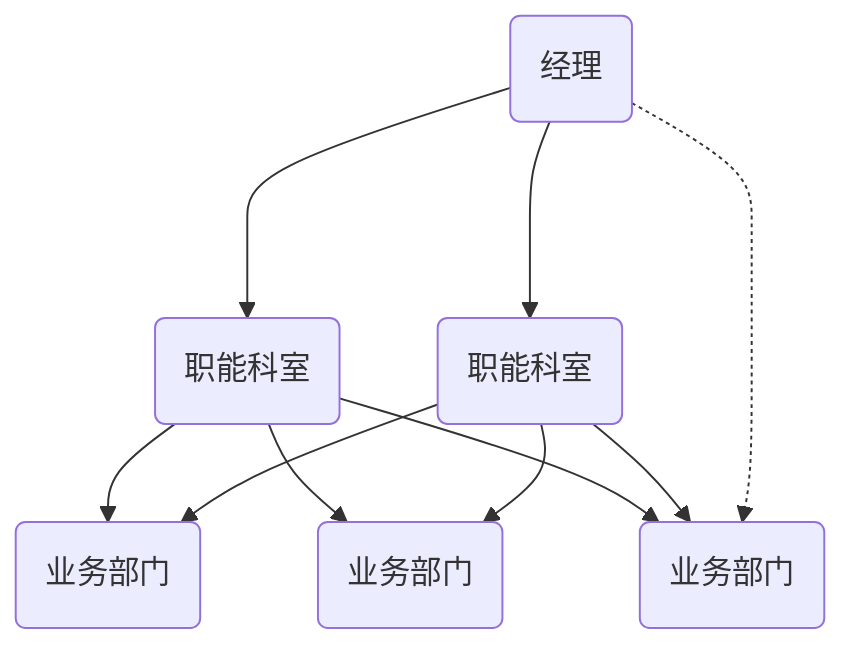
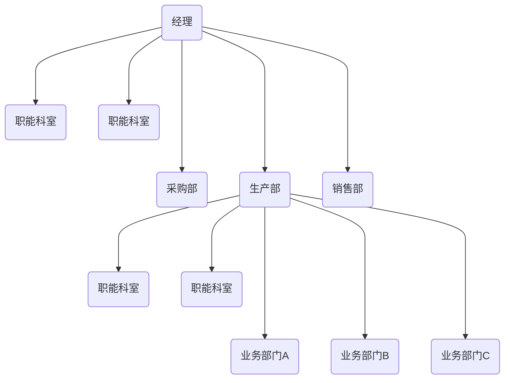
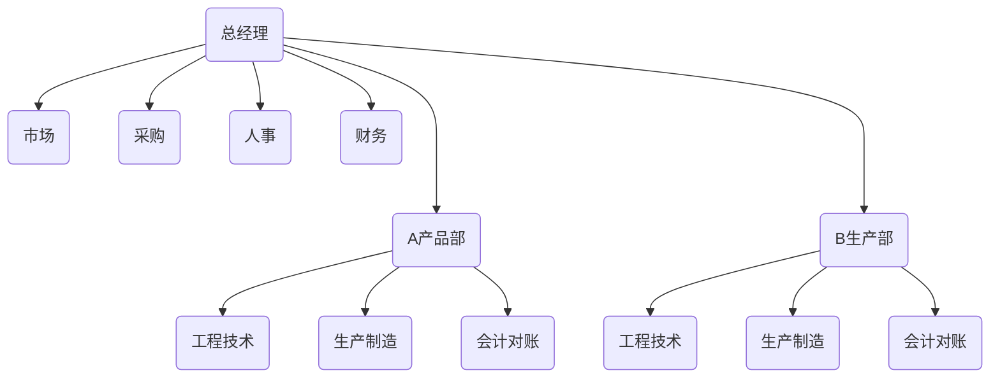
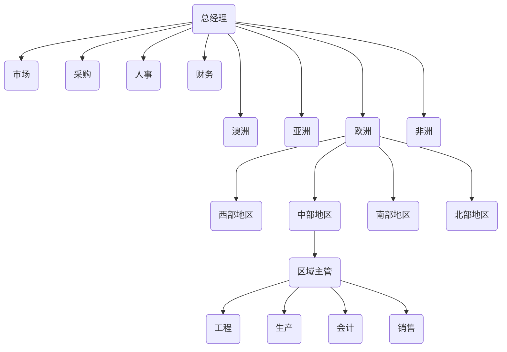
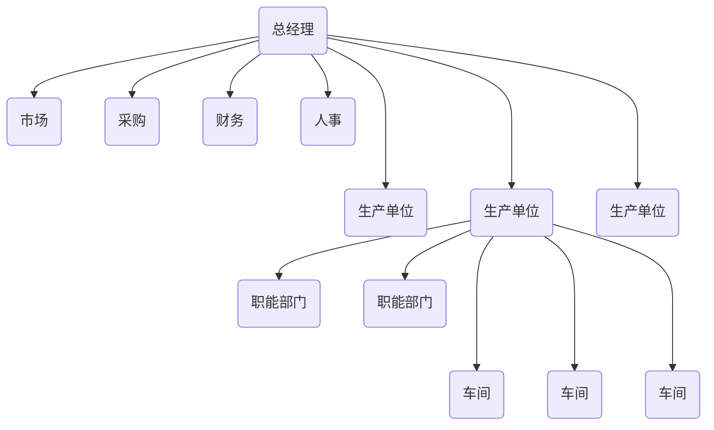
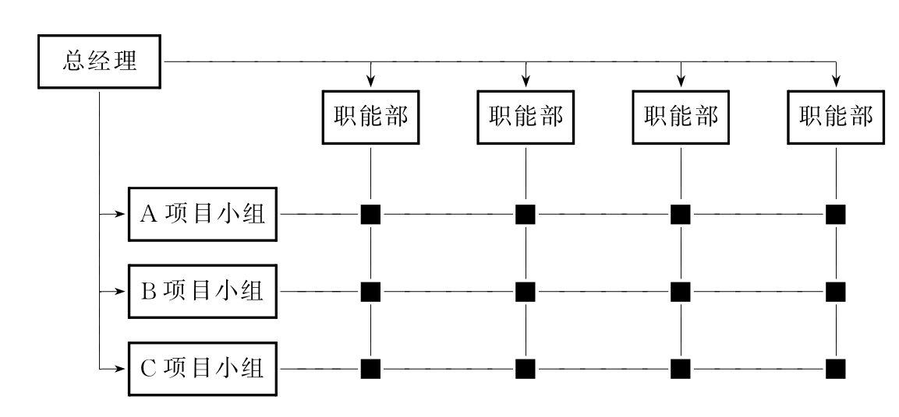
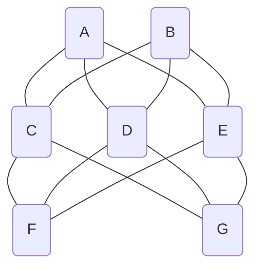

本文主要讲述企业组织架构大概有哪些形式，这些形式分别有什么优缺点，其适用范围是什么，企业组织架构的一个大概演化方式，对于最新的趋势的简单讲解。

<!--more-->

从企业来说，拟定战略，进行商业模式设计，梳理通了业务流程，然后就是设计组织架构来实现。

组织结构也就是企业组织人员，实现企业目标而进行的分工协作。组织架构包含：**职务范围**、**责任**、**权力**方面而形成的结构体系。该结构体系包括职能结构、层次结构、部门结构和职权结构。

了解一个公司的组织架构，能够知道这家公司的**业务类型**、**权力分布**、**层级关系**，**组织方式**等，能够为更好的工作做准备，也能够通过了解业务，商业模式，公司发展阶段，人员规模等再与组织架构综合分析，判断彼此之间是否匹配，是否存在问题。

另外通过对组织架构的了解，了解各组织架构的特点及权力结构，适用范围，也能够在自己的管理中，特别是在需要创建组织架构的时候，选择合适的组织架构，与业务发展、业务特点相匹配，充分发挥人员的潜能，创造好的业绩。

企业组织结构主要的形式有：**直线制**，**职能制**，**直线职能制**，**事业部制**，**模拟分权制**，**矩阵结构**等。

## 组织架构类型

### 直线制

直线制是一种最早也是最简单的组织形式。它的特点是企业各级行政单位从上到下实行垂直领导，下属部门只接受一个上级的指令，各级主管负责人对所属单位的一切问题负责。其结构如下图所示。

优点：

+ 结构简单，命令统一。
+ 责权明确。
+ 联系便捷,易于适应环境变化。
+ 管理成本低。

缺点：

+ 它要求行政负责人通晓多种知识和技能，有违专业化分工的原则。
+ 需要亲自处理各种业务。权力过分集中，易导致权力的滥用。

适用：

+ 直线制只适用于规模较小，生产技术、经营模式简单的企业，对生产技术和经营管理复杂的企业并不适宜。

### 职能制

职能制组织结构，是各级行政单位除主管负责人外，还相应地设立一些职能机构。如在负责人下面设立职能机构和人员，协助负责人从事职能管理工作。这种结构要求行政主管把相应的管理职责和权力交给相关的职能机构，各职能机构就有权在自己业务范围内向下级行政单位发号施令。因此，下级行政负责人除了接受上级行政主管人指挥外，还必须接受上级各职能机构的领导。

优点：

+ 管理工作分工较细。
+ 由于吸收专家参与管理，可减轻上层管理者的负担。

缺点：

+ 多头领导，不利于组织的集中领导和统一指挥。
+ 各职能机构往往不能很好配合。
+ 过分强调专业化。

适用：

+ 劳动密集，重复劳动的大中型企业，也就是业务模式较为简单，具有规模效应的企业。

### 直线职能制

直线职能制也叫生产区域制，或直线参谋制。直线职能制组织形式，是以直线制为基础，在各级行政领导下，设置相应的职能部门。即在直线制组织统一指挥的原则下，增加了参谋机构。

优点：

+ 保证了企业管理体系的集中统一。
+ 在各级行政负责人的领导下，充分发挥各专业管理机构的作用。

缺点：

+ 职能部门之间的协作和配合性较差，职能部门的许多工作要直接向上层领导报告请示才能处理，这一方面加重了上层领导的工作负担；
+ 造成办事效率低。
+ 为了克服这些缺点，可以设立各种综合委员会，或建立各种会议制度，以协调各方面的工作，起到沟通作用，帮助高层领导出谋划策。

适用：

+ 多头领导，中间层利益冲突，很容易导致混乱，一般现代大企业不采用，中、小型组织采用。

### 事业部制
  
事业部制最早是由美国通用汽车公司总裁斯隆于1924年提出的，故有“斯隆模型”之称，也叫“联邦分权制”，是一种高度〔层〕集权下的分权管理体制。

事业部制是在一个企业内对具有独立产品市场、独立责任和利益的部门实行分权管理的一种组织形式。

事业部制是**分级管理**、**分级核算**、**自负盈亏**的一种形式，即一个公司按地区或按产品类别分成假设干个事业部，从**产品设计**，**原料采购**，**本钱核算**，**产品制造**，一直到**产品销售**，均由事业部及所属工厂负责，实行**单独核算**，**独立经营**，公司总部只保存**人事决策**，**预算控制**和**监督大权**，并通过利润等指标对事业部进行控制。

事业部必须具有三个根本要素：即**相对独立的市场/产品**、**相对独立的利益**、**相对独立的自主权**。

#### 产品事业部

主要是以企业所生产的产品为根底，将生产某一产品有关的活动，完全置于同一产品部门内，再在产品部门内细分职能部门，进行生产该产品的工作。这种结构形态，在设计中往往将一些共用的职能集中，由上级委派以辅导各产品部门，做到资源共享。

#### 区域事业部制 

对于在地理上分散的企业来说，按地区划分部门是一种比较普遍的方法。那么是把某个地区或区域内的业务工作集中起来，委派一位经理来主管其事。

#### 优缺点及适用

优点：

+ 责权利划分比较明确，能较好地调动经营管理人员地积极性。
+ 事业部制以利润责任为核心，能够保证公司获得稳定地利润。
+ 通过事业部门独立生产经营活动，能为公司不断培养出高级管理人才。

缺点：

+ 需要较多素质较高地专业人员来管理事业部。
+ 管理机构多，管理人员比重大，对事业部经理要求高。
+ 分权可能架空公司领导，削弱对事业部地控制。
+ 事业部间竞争激烈，可能发生内耗，协调也较困难。

适用：

+ 它适用于规模庞大，品种繁多，技术复杂的大型企业。

### 模拟分权

有许多大型企业，如连续生产的钢铁、化工企业由于产品品种或生产工艺过程所限，难以分解成几个独立的事业部。又由于企业的规模庞大，以致高层管理者感到采用其他组织形态都不容易管理，这时就出现了模拟分权组织结构形式。模拟分权介于直线职能制和事业部制之间的结构形式，就是要模拟事业部制的独立经营，单独核算，而不是真正的事业部，实际上是一个个“生产单位”。

优点：

+ 调动各生产单位的积极性外，就是解决企业规模过大不易管理的问题。
+ 高层管理人员将部分权力分给生产单位，减少了自己的行政事务，从而把精力集中到战略问题上来。

缺点：

+ 不易为模拟的生产单位明确任务，造成考核上的困难。
+ 各生产单位领导人不易了解企业的全貌，在信息沟通和决策权力方面也存在着明显的缺陷。

适用：

+ 主要适用于大型的化工，原材料生产等工业企业，模拟分权制只是最后采用的一种手段，这是最主要的规则。不论有没有团队作为补充，只要职能制结构还能起作用，只要企业只是中等规模或规模比较小，就不应采用模拟分权制。而如果企业规模较大，首先应该考虑采用联邦分权制。

### 矩阵制

矩阵制组织是为了改良直线职能制横向联系差，缺乏弹性的缺点而形成的一种组织形式。它的特点表现在围绕某项专门任务成立跨职能部门的专门机构，是专门从事某项工作的工作小组形式。

优点：

+ 加强了横向联系，克服了职能部门相互胶节、各自为政的现象，专业人员和专用设备能得到充分利用；
+ 具有较大的机动性，任务完成，组织即解体，人力、物力有较高的利用率；
+ 各种专业人员同在一个组织共同工作一段时期，完成同一任务，为了一个目标互相帮助，相互激发，思路开阔，相得益彰。

缺点：

+ 成员不固定在一个位置，有临时观念，有时责任心不够强，人员受双重领导，出了问题，有时难以分清责任。

适用：

+ 一些重大攻关工程。企业可用来完成涉及面广的、临时性的、复杂的重大工程工程或管理改革任务。

### 虚拟组织

临时把人员召集起来，以利用特定的机遇，待目标完成后即行解散的一种临时组织，虚拟组织结构，也称为网络型组织。比如现在的自由职业者为了一个任务临时组成的一个组织团体。

优点：

+ 虚拟组织具有较大的适应性、在内部组织结构、规章制度等方面具有灵捷性。
+ 能够整合各成员的核心能力和资源，从而降低时间、费用和风险，提高服务能力。
+ 在开展多元化业务的同时降低成本。

缺点：

+ 彼此的信任是一个问题。
+ 协调合作难度较大。

## 组织架构演化

在工业经济时代，早期的手工作坊式工场，由于企业规模不大，采用的是高度的集权式直线制组织结构。

随着企业规模的不断扩大，这种集权式的组织结构很难适应企业的开展需要，于是就有了直线职能制组织结构、事业部制组织结构等等。

由于受限于管理幅度（直接而有效地领导下属的可能人数），形成了金字塔式的层级组织，它是一种纵向一体化的管理模式，随着企业规模的扩大，层级就要加大，其结果就愈容易产生上面不了解下面的脱节情形，以及公司决策必须花很长的时间，同时企业的营运成本也不断增加，机构臃肿、办事拖拉，形成官僚主义。 

但是随着计算机技术的发展，管理者可以管理的人员增加，层级结构可以减少，信息流转更加的高速，决策方式也逐渐从自上而下的方式，更多的要从市场的剧烈变化中抓住信息，进行决策，也即是让听到炮火的人拥有更多的决策权。这些因素都让企业必须要有更快的决策，更柔性的组织架构。

### 发展趋势

从近几年的趋势来看，网络型的架构会增多，企业内部的不同部门的人形成的矩阵结构也会增多。

之前的时候，蓝领劳动力的外包或者临时工会比较多。现在知识型的劳动力外包及临时工也会增多，这有两方面的原因：**一是因为供应增加**；**二是因为企业为了消减成本，同时为了适应灵活多变的项目需求，会临时雇佣顾问团，专人人士来完成任务，任务完成之后即进行解散**。

企业内部的矩阵结构增多，也是企业为了应对剧烈的市场变化，人员因不同任务原因聚合而又分散的以完成特定任务和项目的也会增多。

平台/中台型的组织架构，企业总部提供所有基础的能力，各业务部门只管做业务的事情，其它所有财务，人力，法务，物流配送等均由总公司/总部来解决。各业务部与总公司的基础服务部门，形成采购类似的关系，进行结算。这种方式能够进行快速的业务探索，应对变化的市场。

种种趋势，对管理者来说都比传统的管理方式有很大的变化。但是不变的就是，所有的组织架构，都是为公司的业务服务，而业务是为客户服务。客户需求变化，导致业务的发展与调整，业务调整决定组织架构的组织方式。

以前说的**铁打的营盘，流水的兵，会变成市场变化，业务变化，营盘变化，兵更变化**。