除了知道为什么做一个事情（如何做正确的事情），还需要知道如何把这个事情给做对，项目管理就是关于把事情做正确的方法。

<!--more-->
 
**项目在本质上是独特的、临时的非重复性工作，要求使用有限的资源，在有限的时间内为特定的人（或组织）完成某种特定目标（产品、服务或成果）。**

也就是说项目管理是临时性工作，通过周密的计划，管理好时间段内的人、事、物（资源），达成目标。可以将项目管理拆分为四个阶段：**项目开始阶段（启动）**、**组织与准备（规划）**、**执行控制（执行与过程监控）**、**结束（交付收尾）**，其概览图如下所示：

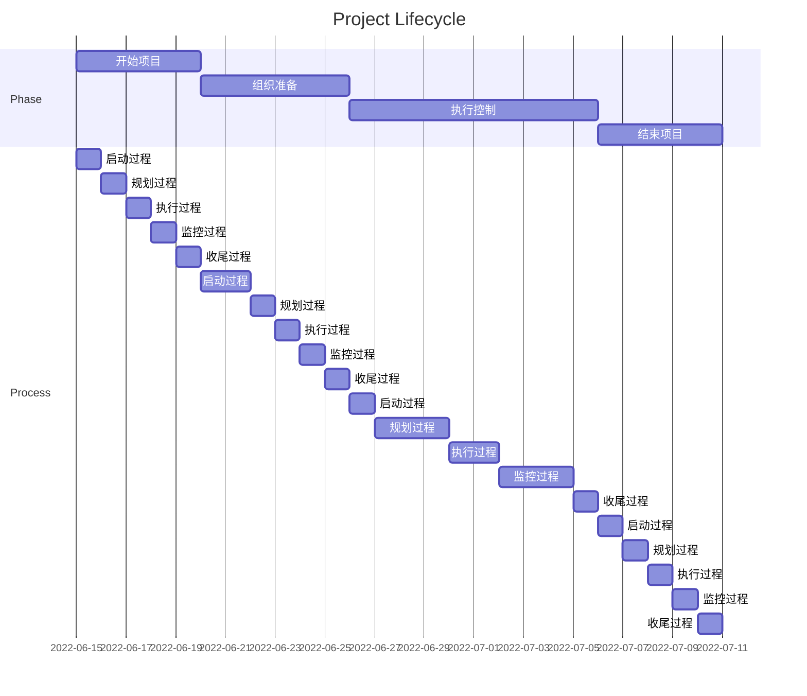

**每个阶段重复执行过程级别的管理，每个阶段的每个过程耗时是不尽相同的。**

## 启动阶段

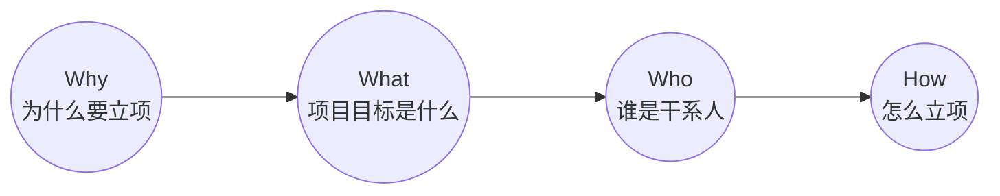

### 为什么要立项

这个部分基本是项目的前置步骤，需要经过市场调研，需求分析等搞明白项目的 `Why`。

在项目立项的时候，也需要进行确认，做一次过滤，将不靠谱的需求，事情等给拦住。通过多问几个为什么（[5W1H](https://wiki.mbalib.com/wiki/5W1H)方法，也叫六何分析法）来追溯本质，了解最真实的目的和需求，解决最核心的问题，做正确的事，识别真实的需求。

### 项目目标是什么
之前已经说过，项目实在有限的时间内，以一定的成本做一定范围的事情，并交付一定质量的结果，其逻辑如下图所示。

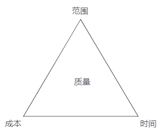

这就是项目的目标，也就是要达到的目的、要取得的成果、要生产的产品，或者准备提供的服务。拟定目标的时候，要遵循[SMART原则](https://wiki.mbalib.com/wiki/SMART%E5%8E%9F%E5%88%99)。

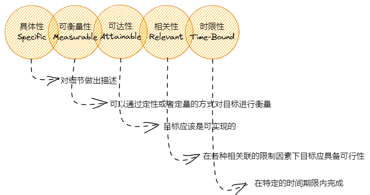

目标意味着：**为什么要做？要做什么？将于什么时间完成？需要哪些资源？如何评估它的效果？**

### 谁是干系人

干系人是指：**能影响项目决策、活动或者结果的人、群体或组织，以及会受到（主观或客观的）项目决策、活动或者结果影响的人、群体或组织。它包括所有项目团队成员，以及组织内部或外部与项目有利益关系的实体。**

简单说就是项目的利益攸关方，能影响项目成败的相关方。

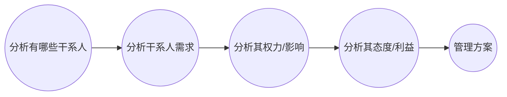

+ 哪些人或部门会受到该项目活动或结果的影响；
+ 由谁为项目提供资源——包括人员、经费、场地、时间等；
+ 常见的干系人有：发起人、高级管理人员、客户和用户（有的时候这两个角色是同一个人，有时候客户是购买者，用户是直接使用者）、供应商、组织内的团体、职能经理（支持团队）、合作伙伴等。

找到相关关系人，并对相关关系人的重要程度（对此项目）进行一个权重排序，以方便后期进行对接的时候，判断对接的方式，频率，信息通报多寡，形成干系人管理方案。

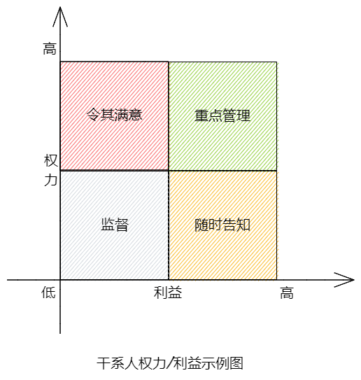

### 怎么立项

通过对项目目标的起源，目标的建立，干系人的沟通，可以有一个基本的项目认知，形成一个项目申请书，并由更高层级进行审批。

| 项目名称 |  |  |  |
| :-- | :-- | :-- | :-- |
| 立项申请人 |  | 项目来源 |  |
| 申请日期 |  | 项目编号 |  |
| 项目目的 |  |  |  |
| 项目内容 |  |  |  |
| 项目必要性分析 |  |  |  |
| 技术可行性分析 |  |  |  |
| 资源可行性分析 | 1. 项目成员 | 2. 项目资金 |  |
| 项目预期投入资源 |  |  |  |
| 项目预期收益分析 |  |  |  |
| 项目周期预期 |  |  |  |
| 申请人所在部门意见 |  |  |  |
| 立项评审结论 | 详见《立项评审会议纪要》。 |   |  |
| 备注 | 1. “项目来源”可填写领导指示、会议决策、外部反馈、内部员工等内容； 2. “立项申请人”是指提出项目的内部员工或者其所在的部门。  | 签名：  | 日期： |

项目审批通过之后，进行项目启动会议，邀请相关干系人参与会议，宣讲项目的相关情况，让信息同步，拉通各方的认识。从另一个方面讲，也是用一个仪式，宣告项目的诞生，改变大家的心理认知，就是这个事情确定是要做的，大家伙打起精神来，不是只是嘴上说说，纸上谈谈了，开始落实执行了。

## 规划

立项之后，则需要将概略性的，较为宏观的东西进一步分拆成为具体可执行的方案。可以通过将一个大东西进行分拆，并且将其排序，并拟定好实现路径，管理好风险来实现它。

### WBS

[WBS](https://wiki.mbalib.com/wiki/%E5%B7%A5%E4%BD%9C%E5%88%86%E8%A7%A3%E7%BB%93%E6%9E%84)是把项目可交付成果和项目工作分解成较小的、更易于管理的组成部分的过程。

工作分解结构（Work Breakdown Structure，简称WBS）跟因数分解是一个原理，就是把一个项目，按[MECE](https://wiki.mbalib.com/wiki/MECE%E5%88%86%E6%9E%90%E6%B3%95)（相互独立、完全穷尽）原则分解，项目分解成任务，任务再分解成一项项工作，再把一项项工作分配到每个人的日常活动中，直到分解不下去为止。

即：项目 > 任务 > 工作 > 日常活动，如下图所示　　　　　

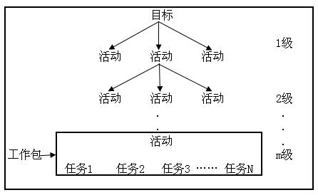

以一个婚礼的整个项目任务为例。婚礼整个过程大致包括：婚礼前期筹备，婚礼临近期准备，婚礼前一天准备，婚礼当天事项，婚礼后续。其大致的拆解如下图所示

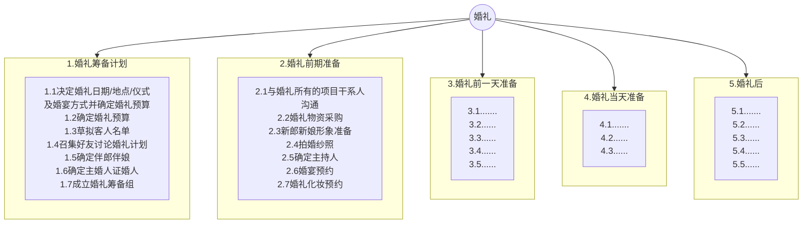

将拆分的任务，加上所需时间（或工作量）及人及对应资源，约束条件，大致如下：

| 婚礼任务拆解 |  |  |  |  |  |
| -- | -- | -- |-- |-- |-- |
| 级别 | 任务名称 | 工作量（天/人） | 人员数量 | 资源 | 约束条件 |
| 1.1 | 决定婚礼日期、地点、仪式及婚宴方式 | 2 | 2 | 电脑、纸、笔 | 新人双方一起协商 |
| 1.2 | 决定婚礼日期、地点、仪式及婚宴方式 | 2 | 2 | 电脑、纸、笔 | 新人双方一起协商 |

任务分解的原则：

+ 将主体目标逐步细化分解，最底层的日常活动可直接分派到个人去完成； 
+ 每个任务原则上要求分解到不能再细分为止； 
+ 日常活动要对应到人、时间和资金投入。 
+ 采用树状结构进行分解； 
+ 以团队为中心，自上而下与自下而上的充分沟通，一对一个别交流与讨论，分解单项工作。  

### 任务排序
通过[WBS](https://wiki.mbalib.com/wiki/%E5%B7%A5%E4%BD%9C%E5%88%86%E8%A7%A3%E7%BB%93%E6%9E%84)拆解方法，将一个大的项目拆解成为了可执行的小任务之后，不同任务会有其各自的先后关系，重要的，有逻辑关系的事情需要进行排列。

比如有 `A`、`B` 两个事情，有些是先做 `A`，做好了 `A` 才能做 `B`，有些是先做 `B`，`B` 做好了才能做 `A`，有些是可以同时启动。基本逻辑顺序如下图所示。通过梳理事情本身的逻辑关系，再对事情进行排序，这样能够保障事情的优先级，顺序关系合理。

可以使用关键路径规划方法来规划实现路径：

1. 识别关键路径：只有项目网络中最长的或耗时最多的活动完成之后，项目才能结束，这条最长的活动路线就叫关键路径（Critical Path），组成关键路径的活动称为关键活动。
2. 使用正推法（Forward Pass），计算每个活动的最早开始时间和最早完成时间。
3. 使用逆推法（Backward Pass），计算最晚开始时间和最晚完成时间，及活动的浮动时间。

下图标红线的即为关键路径，而且有两条（实线路径）：`V1 > V2 > V5 > V7 > V9`；`V1 > V2 > V5 > V8 >V9`；工作量/时间都为 `18`。

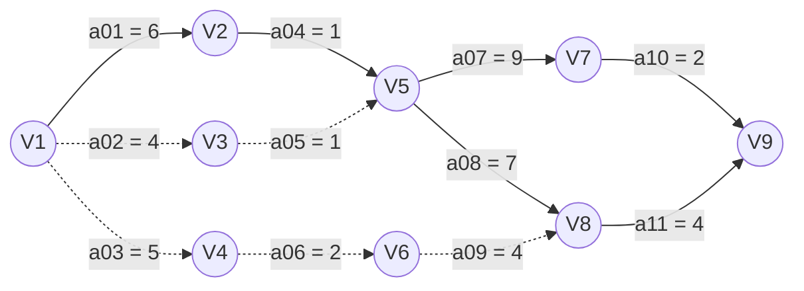

通过关键路径，可以计算出项目实施的最长时间，这个就是项目的最短执行时间；如果结合人员、资源、风险因素综合考虑，则项目的执行时间还会增加。

### 风险管理

通过任务分解及排序，实现路径规划得到了项目的执行方案，但任何项目的实施，都是有风险的；有风险，就需要识别风险，对风险进行评估，并给出解决方案。

### 识别风险

识别风险的目的是在已经划定的边界范围之内，把所有的威胁或机会一个一个找出来，整理在一张表格上，列成风险记录单。这个过程可以根据历史经验，还要专家的意见，以及团队的头脑风暴。

| 风险描述 | 发生原因 | 发生频率 P(1-10) | 影响程度I(1-10) | 风险度(P*I) | 负责人 | 应对措施 |
| -- | -- | -- | -- | -- | -- | -- |
| 预定不到场地 | 年终举办各大公司尾牙集中，场地需求火爆 | 10 | 10 | 100 | Supasaiyajin | 提前梳理场地需求并筛选场地，尽可能的保证场地到位，若无法预定到场地则尝试其他形式 |

风险评估：当识别出来一堆风险之后，要评估风险记录单中的每个风险，在风险评估的过程中，需要仔细地分析风险记录单中每个风险发生的概率和造成的影响，并尽量做到量化。

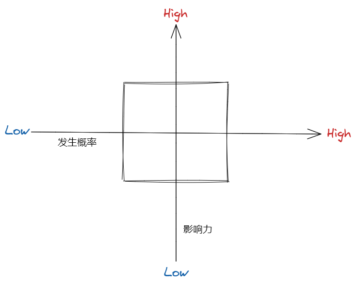

在评估风险概率和风险影响的时候，对所有的风险进行优先级划分，确定哪些风险是要优先处理的，哪些可以先放一放。由于资源有限，需要进行风险的优先级排列。

把风险找出来的目的不仅仅预警，更重要的是分析和选择风险应对措施，最大限度地降低风险对于项目目标的消极影响，提升积极的影响。

最终形成一个可行风险管理方案：

| 序号 | 风险点名称 | 类型（作业活动/设备设施） | 可能发生的事故类型 | 风险等级 | 风险主要控制措施 | 是否降到可接受风险 | 是否产生新危险源 | 是否最佳解决方案 | 是否可行性和有效性 | 是否改进控制措施 | 是否应用于实际工作中 | 评审结论 | 改进（增加）主要风险控制措施 |
| -- | -- | -- | -- | -- | -- | -- | -- | -- | -- | -- | -- | -- | -- | 
| 1 |  |  |  |  |  | □ 是 □ 否 | □ 是 □ 否 | □ 是 □ 否 | □ 是 □ 否 | □ 是 □ 否 | □ 是 □ 否 |  |  |

## 执行与控制

有了计划，根据计划来执行，在执行过程中，通过监控执行的实际情况与计划情况的偏差，看是否需要调整进度，增加资源，以达到最终产出成果的目的。

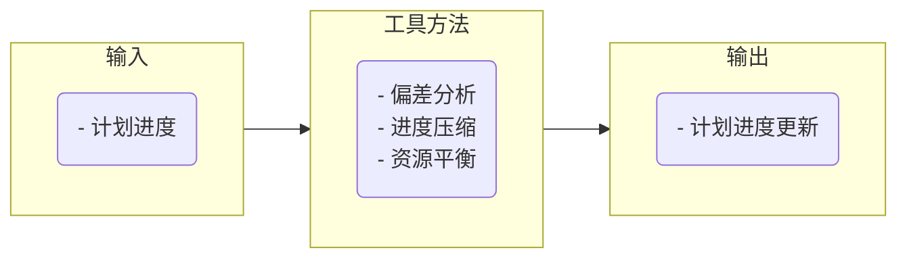

在执行中，通过过程跟踪，开例行项目会议沟通进度信息，对产出的阶段性交付物进行审核，里程碑进行节点报告。可以用到甘特图来对整个实施过程进行有效监控。

### 甘特图

当分解好任务，对子任务也进行了优先级排序，并且规划好了关键路径，计算了项目执行周期，将这些以甘特图的形式进行整合。

以图示的方式通过活动列表和时间刻度形象地表示出任何特定项目的活动顺序与持续时间。

基本是一条线条图，横轴表示时间，纵轴表示活动（项目），线条表示在整个期间上计划和实际的活动完成情况。

甘特图能直观地表明任务计划在什么时候进行，及实际进展与计划要求的对比。管理者由此可便利地弄清楚一项任务（项目）还剩下哪些工作要做，并可评估工作进度

甘特图如下所示，它展示项目的任务、负责人，进度，开始时间等，能够直观清晰的看到项目的进展。

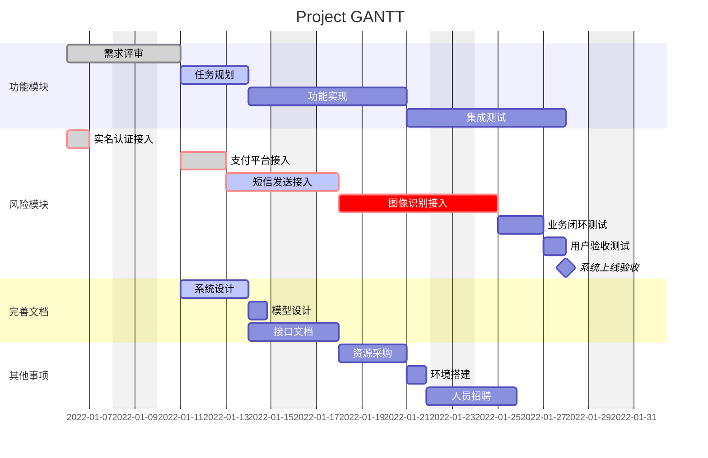

### 变更

任何一个项目，都存在变更，变更是不可避免的 要确保变更对项目有力，尽量防止不必要的变更，所有变更都要被管理，变更控制也包括积极主动地去影响引起变更的因素。 

变更的大致处置流程如下：

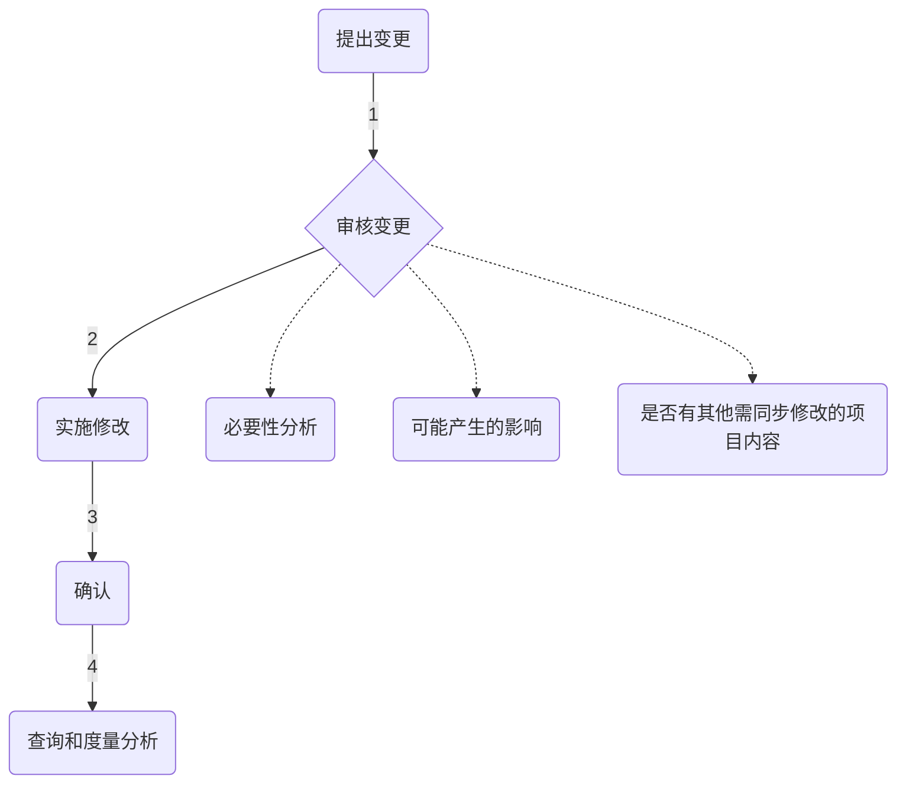

以下是一个变更的管理表，在提变更的时候，进行登记、审核，让团队成员知道每一个变更的来源、影响、重要程度、紧急程度、影响范围等。

| 项目变更管理表 |  |  |  |  |  |  |
| :-- | :-- | :-- | :-- | :-- | :-- | :-- |
| 一、项目基本情况 |  |  |  |  |  |  |
| 项目名称 |  | 项目编号 |  |  |  |  |
| 制作人 |  | 审核人 |  |  |  |  |
| 项目经理/项目负责人 |  | 制作日期 |  |  |  |  |
| 二、历史变更记录（按时间顺序记录项目以往的每一次变更） |  |  |  |  |  |  |
| 序号 | 变更时间 | 涉及项目任务 | 变更要点 | 变更理由 | 申请人 | 审批人 |
| 1 |  |  |  |  |  |  |
| 2 |  |  |  |  |  |  |
| 3 |  |  |  |  |  |  |
| ... |  |  |  |  |  |  |
| 三、请求变更信息（建议的变更描述以及参考资料） |  |  |  |  |  |  |
| 1. 申请变更的内容 |  |  |  |  |  |  |
| 2. 申请变更的原因 |  |  |  |  |  |  |
| 四、影响分析 |  |  |  |  |  |  |
| 受影响的基准计划 | 1、进度计划 | 2、费用计划 | 3、资源计划 |  |  |  |
| 是否需要成本/进度影响分析？ | □ YES | □ NO |  |  |  |  |
| 对成本的影响 |  |  |  |  |  |  |
| 对进度的影响 |  |  |  |  |  |  |
| 对资源的影响 |  |  |  |  |  |  |
| 变更程度分类 | □ 高 | □ 中 | □ 低 |  |  |  |
| 若不进行变更有何影响？ |  |  |  |  |  |  |
| 申请人签字 |  | 申请日期 |  |  |  |  |

## 项目交付

项目交付，大致分为：**前交付**，**交付中**，**交付后**，**完成**。

**前交付**：制定准备交付的标准、文档、清单，完成内部验收。比如互联网产品在投入技术开发之后，产品经理就需要准备给业务及运营的功能说明书、使用说明书、准备培训资料、常见问题文档。产品开发出来，需要进行产品验收。另外从项目启动之后，相关会议、更改、里程碑的相关文档资料，也需要收集汇总，为后期的资料归档做准备。
**交付中**：项目的实际交付，实际使用，并处理投诉问题，客户验收。
**交付后**：资料归档，复盘，收获及成功经验，团队成员绩效评定/庆功及表彰，项目人员安置调度。