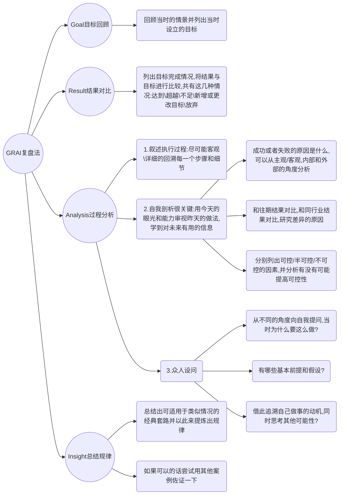
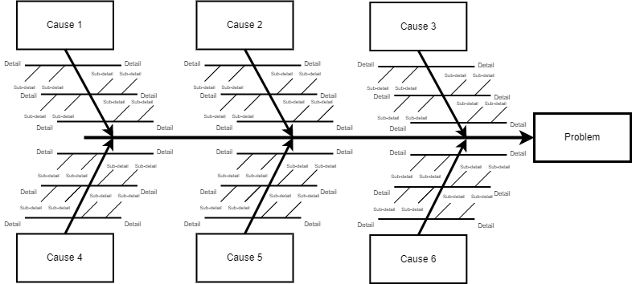
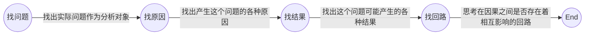
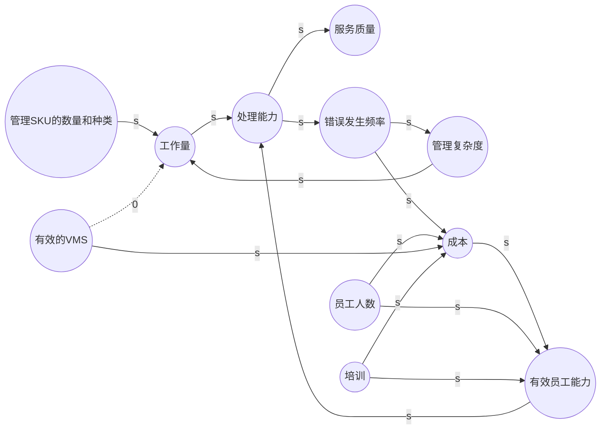

无论是对于企业还是个人来说，复盘都是一个能使其快速成长的方法，它的目的在于快速找到问题，总结经验的同时，找到工作的突破点，发现可以完善的方向。

<!--more-->

做过的事情，再从头过一遍，目的是不断检验和校正目标，不断分析过程中的得失，便于改进，不断深化认识和总结规律。

## GRAI复盘法
我们可以采用“GRAI”复盘法，这个方法共有四个步骤：

1. `Goal`（目标回顾）：当初的目的或期望是什么。
2. `Result`（结果陈述）：对照原来的目标，看完成情况如何。
3. `Analysis`（过程分析）：分析事情成功或失败的关键原因。
4. `Insight`（归类总结）：得失体会，经验是否可复用，下一步的执行计划。

## 复盘步骤

### 复盘筹备

确定是否开展复盘及参与人员：

1. 根据业务或项目的发展情况，确定是否召开复盘会，召开何种形式的复盘会。
2. 收集整理业务，项目相关资料。
3. 拟定参会人员，确定复盘议题，发起参会通知。

### 回顾目标

当初的目的或期望是什么：

1. 分清目的和目标的不同，目的是为什么（`Why`）要做这个事情，目标是要做成什么样（`What`）的结果。
2. 除了确定目的之外，最好能够确定出可量化（采用[SMART原则](https://wiki.mbalib.com/wiki/SMART%E5%8E%9F%E5%88%99)原则进行分析）的目标或者里程碑，无量化或不可考核的目标，很难保证目的的实现，也很难与结果进行对比评估。
3. 团队目标需要进一步拆解到个人，这个过程可以使用WBS工作拆解方法进一步分解任务，尽可能保证每个人目标是合理的，目标本身要是不合理的话，复盘得出的结论也很难有说服力，如果不合理就需要分析当初制定这个目标的原因，是哪里出了问题，之后需要进行注意。

### 评估结果

对照原来的目标，看完成情况如何：

1. 设定好“实事求是”的复盘氛围，比较结果与目标的差距处，找出成功处（亮点）和可提升处（不足），就是“定义问题”，以便迚入复盘的第三步骤——“分析原因”。
2. 清晰地将“目标”和“结果”之间的差异描述出来，这里先不管出现问题的原因以及解决方案，更不应是指责、抱怨和撇清责任等。
3. 亮点与不足同样重要，不能弱化亮点，过分谦虚要不得，忽略真本事更遗憾。
4. 数据数据、工作的结果数据，和原定目标相比有哪些亮点和不足，目标完成的怎样，对这样的结果是否满意，要把结果好坏，满意度等方面，都用数据表达出来。

### 分析原因

分析事情成功或失败的关键原因：

1. 事情成功和失败的根本原因，包括主观和客观两方面。
2. 分析成功因素时，多列举客观。
3. 分析失败原因时，多找主观原因。
4. 有时候原因的构成是很复杂的，需要我们进行层层剖析。这时候，我们可以通过画鱼骨图、或者采用[5W1H分析法](https://wiki.mbalib.com/wiki/5W1H%E5%88%86%E6%9E%90%E6%B3%95)、或者采用因果回路图进行分析。

#### 鱼骨图

[鱼骨图](https://wiki.mbalib.com/wiki/%E9%B1%BC%E9%AA%A8%E5%9B%BE)是一种非定量分析工具，可以帮助我们对问题的原因进行归类、逻辑化、条理化。鱼骨图的框架如图：

绘制鱼骨图的基本程序包括：

1. 定义主要问题（“鱼头”）；
2. 讨论确定主要的影响因素类别或框架（“骨架”）；
3. 采用头脑风暴法或团体列名法，依次对各主要原因进行细化（“鱼刺”）；
4. 修改和优化。

#### 因果回路图

也被称为“系统循环图”（Casual Loop Diagram），是用因果关系链的形式来描述系统的结构、表述系统的动态关联，倡导动态或环型思考，让人们看清影响系统行为的一些关键要素及其之间的相互连接，有助于把握关键、应对变化。绘制流程：

以下为一个系统循环图：

### 总结规律

得失体会，经验是否有规律性，可复用，下一步的执行计划。

1. 总结规律需要看的长远，寻求更广泛的规律，可复用性，不要局限于当前事件。
2. 总结经验要谨慎，不能把一时一地的认知当成规律，找到事物更有效、更符合本质的做法，比如需要实施哪些新举措，需要继续哪些措施等。
3. 把分析所得总结出来，并提炼成为规律分享出去，成为自己和团队以后工作的一个参考和经验。

### 复盘模板

通过以上几个步骤，基本能够将相关内容按照模板填写完成：

| 某某项目复盘 |  |
| :-- | :-- | 
| 项目时间： | 参与人员： |
| 复盘日期： | 复盘人员： |
| **回顾目标** | **评估结果** |
| *初始的目标是什么？* | *达成的结果是什么？（一致、不如、超过）* |
| 当初行动的意图是什么？   事件想要达到的目标是什么？ | 实际发什了什么事？   与目标相比，哪些地方做的好？哪些未达预期？ |
| *预期的里程碑计划* | *实际的里程碑计划* |
| 预先制定的计划是什么？   事先设想要发生的事情是什么？ | 实际执行的过程怎样？    达成的里程碑计划是什么样？|
| **总结规律** | **分析原因（客观、主观、偶发、普遍、内部、外部）** |
| *经验&规律* | *积极原因* |
| 我们从过程中学到了什么新东西？   如果有人进行同样的行动，我会给他什么建议？ | 成功的关键因素是什么？ |
| *行动计划* | *消极原因* |
| 开始做：  哪些事情是可以直接行动的？  哪些是其他层级才能处理的？  是否要向上级呈报？  停止做：  继续做： | 为什么会出现这些差异？  是由哪些因素造成？根本原因是什么？ |

对需要执行的计划，划分到人头，并且设置完成时间，预计的产出结果：

| 序号 | 行动 | 负责人 | 起止时间   （开始 - 结束） | 预期产出/成果 | 跟进负责人/时间 |
| -- | -- | -- | -- | -- | -- |
|  |  |  |  |  |  |
|  |  |  |  |  |  |
|  |  |  |  |  |  |
|  |  |  |  |  |  |

形成的复盘文档，知识文档存放在企业的内网知识库，或者飞书，语雀，Confluence，并且最好能够和具体对应的业务，项目做关联。企业内容可以共享相关知识，将属于一个业务，一个项目的知识经验能够转化为企业所有人员的知识经验，减少企业的试错成本和人员培训成本，提升团队成员的整体水平。

## 复盘原则

+ 开放心态：能够听得进意见，减少自我意识，充分收集各方不同意见，找到深层次的原因。
+ 坦诚表达：复盘要明确不是追责会，复盘也不是表扬会。复盘就只是复盘，就事论事，参加更要参与，到场要发言，鼓励说出真相。
+ 实事求是：复盘的目的是要弄清楚事情成功与失败的本质原因，不能带有强烈的主观意识和先见。只有实事求是才能真正知道哪里出了问题，哪些做对了，哪些是偶然因素，哪些是可以控制的，哪些经验可以复用。
+ 反思自我：领导需要以身作则，敢于否定自己，引导开放的讨论氛围，不仅仅关心客观原因，也需要从主观上找原因，寻求更好的处理方法和解决方案。
+ 集思广益：引入外部人员，也就是没有参与业务的人，有时旁观者能够有外部视角，提出更好的问题，打开思路，引发更多维度的思考。整个复盘过程，进行专人记录，最后输出成果，形成复盘报告，便于组织分享，打造企业知识库，进行经验传承。

## 复盘频率

+ 小事：行动结束后及时进行复盘并制定方案并落实。
+ 大事：
    + 阶段性：大项目在执行中，进行阶段性的复盘，以半个月或一个月为一个阶段，或者以里程碑，关键节点进行复盘，对目标或策略进行监控并及时调整。
    + 事后：大项目结束后，进行总复盘，总结经验教训，找到规律，形成知识库。

 复盘需要回顾“当初是怎么定目标的，定的什么目标”和“现在做成的结果”之间的差异，然后根据差异分析原因，寻找解决方案，不断地小步迭代，把做过的事情重新推演一遍，通过反思和总结，可以将经历转化为经验，目的总结起来可以分为以下几点：

1. 知其然和知其所以然
2. 防控风险
3. 同样的错误不要再犯
4. 总结规律和固化流程
5. 传承经验和提升能力
6. 提高学习能力，搭建学习组织