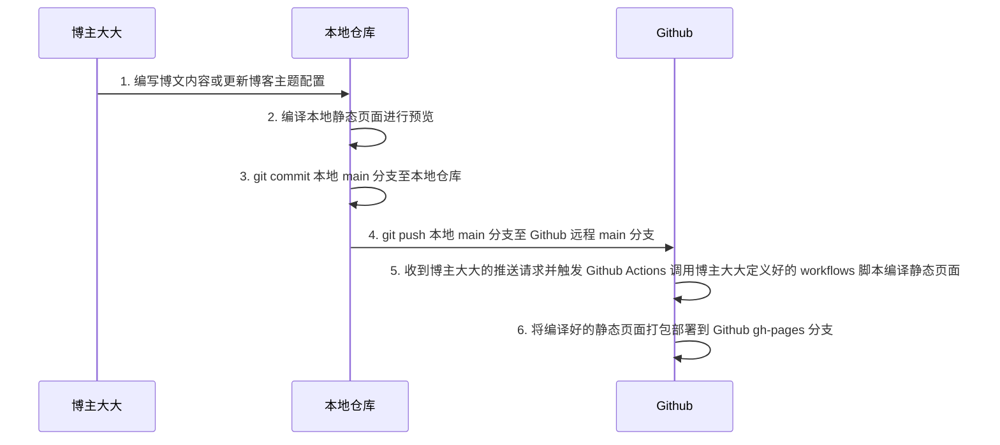
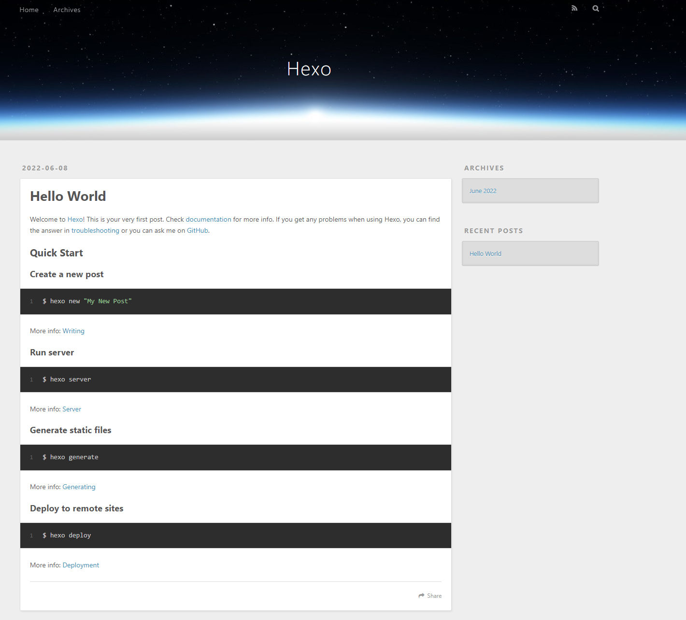
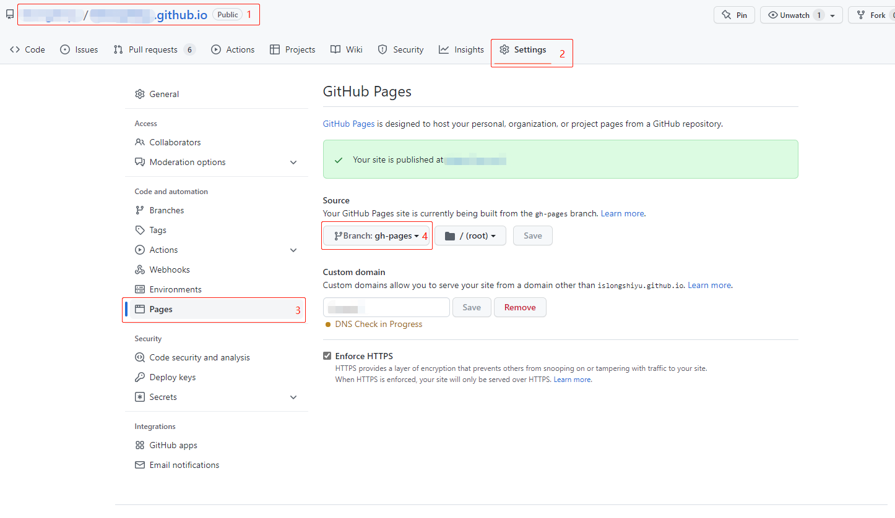
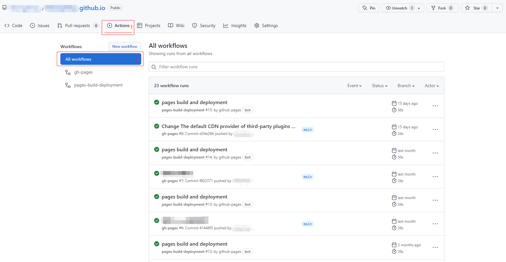
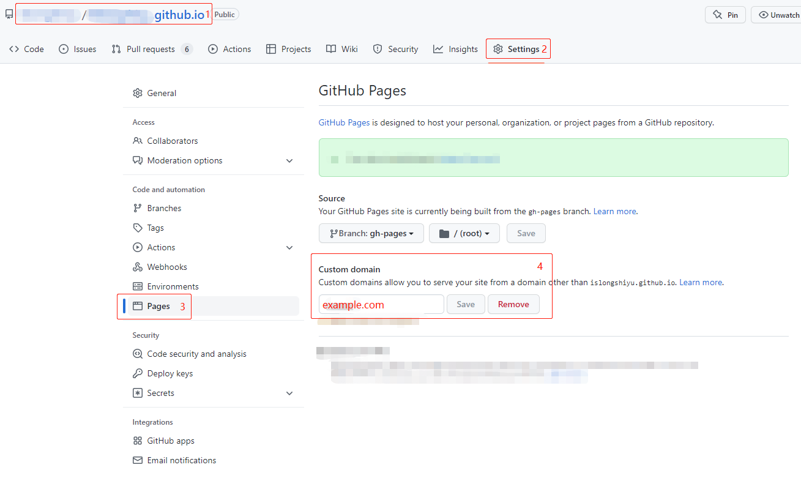
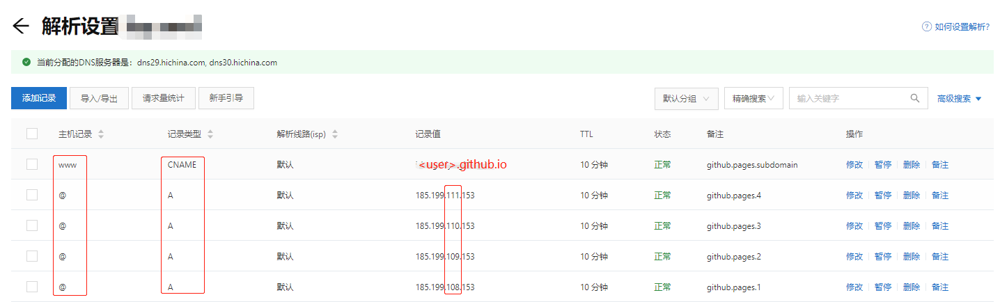
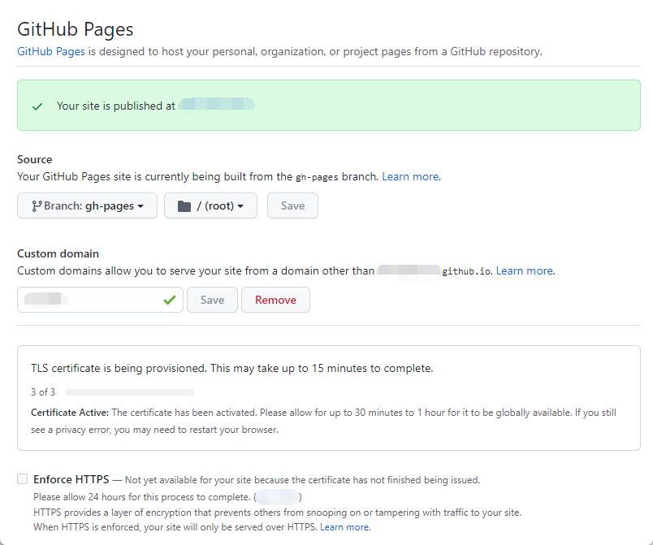
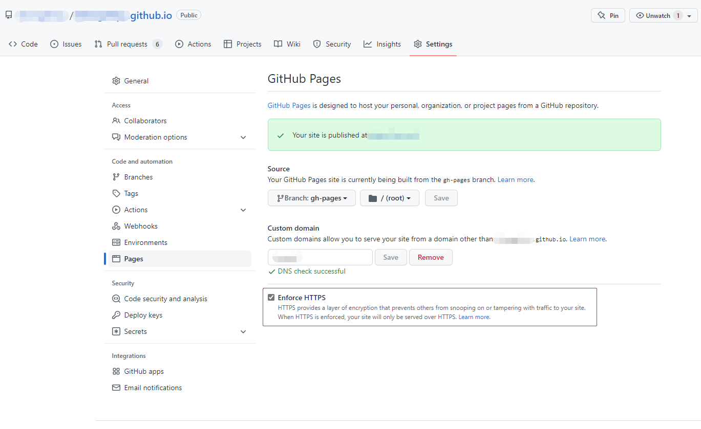

介绍本博客的详细搭建过程、博客配置及自动化部署流程。

<!--more-->

## 建站顾虑

我个人在搭建这个自有博客时有很多顾虑，比如以下几个主要的：

1. 费用成本：主要包括机器成本（服务器）、存储空间（图床、文章存储、磁盘开销）等。
2. 维护难度：是否需要经常运维，假设破站访问量激增导致博客系统宕机如何快速恢复；虽然基本没什么人访问，但这也正是搭建这个博客的初衷，喧扰世界中的小憩之地。
3. 内容发布：发布一篇文章是否需要花额外的精力去排版，早期的博客系统内容需要使用 `html` 标签对文章进行排版，当样式错乱时需要花费额外的精力去处理，久而久之就疲乏了。因此针对这一点，博客必然是要支持 `Markdown`。
4. ......

在阅读了大量的自有博客建站博文后，最终决定使用**静态博客框架** `Hexo` 作为个人博客的构建系统，并托管到 `Github`，同时也解决了上面的几点顾虑，并且将成本降到了最低。

1. 费用成本：因为使用 `Github` 服务器成本为 `0`；由于 `Github` 对个人用户无使用容量限制，存储空间费用也降到了 `0`。
2. 维护难度：不需要维护，`Github` 全托管，如果哪天博客无法访问，排除网络问题，就只剩下 `Github` 宕机了，这个可能性很小。
3. 内容发布：使用 `Hexo` 框架，每次发布新内容只需要编写 `Markdown` 文件。

本博客最终搭建完毕后，只花了 `217` 块购买 `5` 年的域名。

**静态博客框架**有很多，比如：`VuePress` 、`Hugo` 、`Jekyll` ，最终选择 `Hexo` 是因为它的主题非常之多，并且这些主题都极大程度的支持个性化配置。

其他废话就不在赘述了，下面是整个博客搭建的详细教程。

## 前置准备

文中涉及以下技术栈或工具或平台：

+ `Markdown`：[https://markdown.com.cn/basic-syntax/](https://markdown.com.cn/basic-syntax/)
+ `Git`：[https://git-scm.com/docs](https://git-scm.com/docs)
+ `Hexo`：[https://hexo.io/zh-cn/docs/](https://hexo.io/zh-cn/docs/)
+ `Nodejs`：[http://nodejs.cn/learn](http://nodejs.cn/learn)
+ `Github`：[https://github.com/](https://github.com/)
+ `Mermaid js`：[https://mermaid-js.github.io/mermaid/](https://mermaid-js.github.io/mermaid/)

1. 在个人 `PC` 上安装`Git` 和 `Nodejs`，下载地址如下：
    + `Git`：[https://github.com/git-for-windows/git/releases/download/v2.36.1.windows.1/Git-2.36.1-64-bit.exe](https://github.com/git-for-windows/git/releases/download/v2.36.1.windows.1/Git-2.36.1-64-bit.exe)
    + `Nodejs`：[https://npmmirror.com/mirrors/node/v16.15.0/node-v16.15.0-x64.msi](https://npmmirror.com/mirrors/node/v16.15.0/node-v16.15.0-x64.msi)
2. 注册 `Github` 账号，并创建名为 `<user>.github.io` 的仓库，`<user>` 替换为自己的 `Github` 用户名，当创建名称符合该命名规范的仓库时，`Github` 将为该仓库创建站点，可以使用仓库名称作为域名直接访问，而我们后续要做的就是将**博客内容源码**结合**静态博客框架**编译成**静态页面**后发布到这个站点上。
    这里用到的是 `Github` 的 `Pages` 功能。文档见：[https://docs.github.com/cn/pages](https://docs.github.com/cn/pages)
    
    > GitHub Pages are public webpages hosted and published through GitHub. The quickest way to get up and running is by using the Jekyll Theme Chooser to load a pre-made theme. You can then modify your GitHub Pages' content and style.

## 博客搭建

整个博客的搭建只需要搭建一个本地环境进行内容编写，供个人编写文章时预览、调整博客主题；文章内容推送到 `Github` 后使用 `Github Actions` 功能进行自动化构建。

对仓库的分支做如下规划：
 
+ `main`：创建仓库后的默认分支，用于存储博客源码，包含：博文源码，主题配置等。
+ `gh-pages`：使用 `Github` 的 `Pages` 功能后将自动创建该分支，用于发布编译后的静态页面。

整个博客的发布、编译、构建流程如下：



### 克隆博客仓库

将在 `Github` 上创建的名称为 `<user>.github.io` 的仓库克隆到本地开发环境（将 `<user>` 替换为你的 `Github` 用户名）。

```shell
git clone git@github.com:<user>/<user>.github.io.git
```

### 安装博客框架

在终端执行以下命令全局安装 `Hexo` 静态博客框架：

```shell
npm install hexo-cli -g
```

### 执行初始命令

执行如下命令（将 `<user>` 替换为你的 `Github` 用户名）：

```shell
cd <user>.github.io && hexo init .
```

输出结果如下：

```shell
INFO  Cloning hexo-starter https://github.com/hexojs/hexo-starter.git
INFO  Install dependencies
INFO  Start blogging with Hexo!
```

### 预览本地站点

执行如下命令：

```shell
hexo server
```

输出结果如下：

```shell
INFO  Validating config
INFO  Start processing
INFO  Hexo is running at http://localhost:4000/ . Press Ctrl+C to stop.
```

`Hexo` 默认使用 `4000` 端口；此时访问 [http://localhost:4000/](http://localhost:4000/) 即可预览本地站点，默认的博客主题如下图所示：



至此，最简单的基本入门级 `Hexo` 博客就搭建完毕了。

### 博文写作示例

在博客根目录下使用如下命令创建文章：

```shell
hexo new [layout] <title>
```

+ `layout`：文章布局（详细说明见官方文档）；默认为 `post`，可以通过修改 `_config.yml` 中的 `default_layout` 参数来指定默认布局。
+ `title`：标题。

示例如下：

```shell
hexo new first
```

输出结果：

```shell
INFO  Validating config
INFO  Created: ~\source\_posts\first.md
```

随便加入一些内容，再使用 `hexo server` 命令即可在本地站点中预览博文。

更多的写作和其他 `hexo` 命令查看官方文档即可：[https://hexo.io/zh-cn/docs/](https://hexo.io/zh-cn/docs/)

## 拓展配置

默认的主题比较简单；如果有个性化需求可以自己开发博客主题，或者使用社区的一些主题 [https://hexo.io/themes/](https://hexo.io/themes/)，按照主题文档进行自定义配置即可，这里我推荐 `Next` 主题。

+ `Next` 主题官网：[https://theme-next.js.org/](https://theme-next.js.org/)
+ `Next` 主题文档：[https://theme-next.js.org/docs/](https://theme-next.js.org/docs/)

由于 `Hexo` 的某些使用方面的不变，下文中做了一些增强性的额外配置，便于提升写作体验和降低内容管理复杂度，尽量做到纯 `Markdown` 语法写作。

需要注意的是，`Hexo` 的配置文件分为两种：

+ 站点配置文件：`_config.yml`
+ 主题配置文件：`_config.<theme>.yml`

### 资源文件夹处理

`Hexo` 资源文件夹官方文档：[https://hexo.io/zh-cn/docs/asset-folders](https://hexo.io/zh-cn/docs/asset-folders)

如果只有少量图片，直接放在 `source/images` 文件夹中然后使用 ``引入；但是不适用于针对文章级别的资源控制。

参考文档，在站点配置文件 `_config.yml` 添加如下配置：

```shell
post_asset_folder: true
```

开启该配置后，使用创建文章命令会自动创建和文章源码文件相同的文件夹，比如：执行 `hexo new first`,将在 `source/_posts` 目录下创建如下的文件和文件夹：

```shell
└── source/
    └── _posts/
        ├── first.md
        └── first/
```

将图片或其他资源放在和文章源码文件同名的目录下即可；虽然降低了文章级别的资源管理复杂度，但是 `Hexo` 使用如下方式引入这种资源：

```shell



```

这种是 `Hexo` 的标签插件方式引入资源，而非 `Markdown` 语法方式引入；虽然在本地或线上站点上能正常展示图片，但是在 `Markdown` 编辑器中却无法正常展示。

安装如下插件后使用 `Markdown` 语法插入图片语法既可满足站点上正常展示图片，又可以在本地 `Markdown` 编辑器中正确显示。

在博客站点根目录执行如下命令安装插件：

```shell
npm install hexo-asset-image-for-hexo5 --save
```

最后，如果文章在首页展示，还需要在站点配置文件 `_config.yml` 添加如下配置才能在首页正常展示文章图片：

```shell
post_asset_folder: true
marked:
  prependRoot: true
  postAsset: true
```

最终在文章中使用 `Markdown` 图片语法插入图片就可以了，如：``。

### 代码块图表插件

`Hexo` 默认的 `Markdown` 渲染并不支持 `Mermaid`（代码块图形渲染），`Next` 主题针对这个做了相关的拓展，若要支持 `Mermaid` 需要做如下配置：

1. 在 `Next` 主题配置文件 `_config.next.yml` 中开启如下配置：
    ```shell
    # Mermaid tag
    mermaid:
    enable: true
    # Available themes: default | dark | forest | neutral
    theme:
        light: default
        dark: dark
    ```
2. 在博客站点配置文件 `_config.yml` 中开启如下配置：
    ```shell
    highlight:
      exclude_languages:
        - mermaid
    ```
3. 安装增强插件
    ```shell
    npm install hexo-filter-mermaid-diagrams --save
    ```

4. 然后就可以使用 `Markdown` 代码块的 `Mermaid` 语法画流程图了。

## 构建配置

`Hexo` 支持使用命令部署方式 [https://hexo.io/docs/one-command-deployment](https://hexo.io/docs/one-command-deployment) 将编译好之后的静态页面文件部署至 `Github` 仓库：

```shell
hexo deploy
```

但要使用该命令还需要**额外的插件安装和站点配置**（见官方文档），但我**极不推荐**使用这种方式！！！

下文将结合 `Github Actions` 功能实现通过 `git` 提交和推送命令调用远程仓库 `Github Actions` 脚本自动编译构建站点静态页面和自动部署：

1. 在 `Github` 上修改 `<user>.github.io` 仓库的 `Github Pages` 配置。
    
2. 使用如下命令在本地博客站点源码根目录下添加 `Github Actions` 配置文件。
    ```shell
    mkdir -p .github/workflows && touch .github/workflows/gh-pages.yml
    ```
3. 在第二步创建的 `.github/workflows/gh-pages.yml` 文件中添加如下内容（如果使用过 `CI/CD` 系统，下面的脚本很容易理解）：
    ```shell
    name: gh-pages

    on:
      push:
        branches:
        - main # default branch

    jobs:
      pages:
        runs-on: ubuntu-latest
        concurrency:
        group: ${{ github.workflow }}-${{ github.ref }}
        steps: #
        - name: Checkout 
            uses: actions/checkout@v2 
        - name: Use Node.js 17.x 
            uses: actions/setup-node@v2
            with:
            node-version: '17.x'
        - name: Cache NPM dependencies
            uses: actions/cache@v2
            with:
            path: node_modules
            key: ${{ runner.OS }}-npm-cache
            restore-keys: |
                ${{ runner.OS }}-npm-cache
        - name: Install Dependencies
            run: npm install
        - name: Build
            run: npm run build
        - name: Deploy
            uses: peaceiris/actions-gh-pages@v3
            with:
            github_token: ${{ secrets.GITHUB_TOKEN }}
            publish_dir: ./public
            publish_branch: gh-pages
    ```
3. 忽略不必要的构建目录或文件，保持远程仓库的干净整洁。
    +  本地站点根目录下添加 `.gitignore` 文件，并添加如下内容：
        ```shell
        _site/
        .sass-cache/
        .jekyll-cache/
        .jekyll-metadata
        themes/*
        public/*
        resources/*
        node_modules/*
        db.json
        ```
    +  本地站点根目录下添加 `.mpmignore` 文件，并添加如下内容：
        ```shell
        .DS_Store
        Thumbs.db
        db.json
        *.log
        node_modules/
        public/
        .deploy*/
        ```
4. 执行 `git add --all && git commit -m 'comment some words' && git push` 提交并推送代码后将自动执行上面的 `Github Actions` 脚本；同时也可以在 `Github` 上查看 `Github Actions` 的执行流程和详细日志。
    

至此，整个博客的搭建及编译部署已经完成，后续写作只需要一个 `Markdown` 编辑器，编写完毕后通过 `git` 推送即可实现自动化编译部署。 

## 域名配置

访问 `https://<user>.github.io` 即可访问博客，这是 `Github` 提供的默认的子域名；若需要绑定自有域名按照如下步骤进行配置即可：

1. 购买一个自己喜欢的个性域名：各大云平台（如：阿里云，腾讯云等）都有域名购买托管服务，我使用的是阿里云。
2. 配置自定义域名。
    
3. 域名解析配置（我使用的时阿里云的域名解析，其他平台的也差不多）。
    
    说明：
    + 主机记录为 `www` 记录类型为 `CNAME` 的解析是**自有 `www` 子域名**和 `Github Pages` 子域名 `<user>.github.io` 的映射，生效后将可以通过 `www.<你的根域名>`（`www` 可以更换为你喜欢的字符串，比如：`blog`、`tech`） 访问博客网站。
    + 主机记录为 `@` 记录类型为为 `A` 的解析是**自有根（Apex）域名** 和 `Github Pages` 服务器 `IPV4` 地址的映射，这里需要将 `185.199.10[8-11].153` 的 `4` 个域名全部解析。
    
上述实现了 `Github Pages` 的子域名和根域名（Apex） 的自定义；假设你的根域名为 `4396.com`，上面的解析配置生效后，将可以通过下面两个地址访问部署好的博客网站：

+ http://4396.com
+ http://www.4396.com

官方参考文档见：[https://docs.github.com/cn/pages/configuring-a-custom-domain-for-your-github-pages-site](https://docs.github.com/cn/pages/configuring-a-custom-domain-for-your-github-pages-site)。

## 证书配置

当为你的个人 `Github Pages` 仓库配置好自定义域名后，`Github` 将自动为该仓库申请免费的 `SSL` ，并且自动续期，完全无需人工操作（真贴心）。

当域名配置好后，自定义域名配置处将显示如下提示：



大约 30 - 60 分钟生效，当证书生效后可以开启强制使用 `https` 使用 `http` 访问将跳转至 `https` 。

